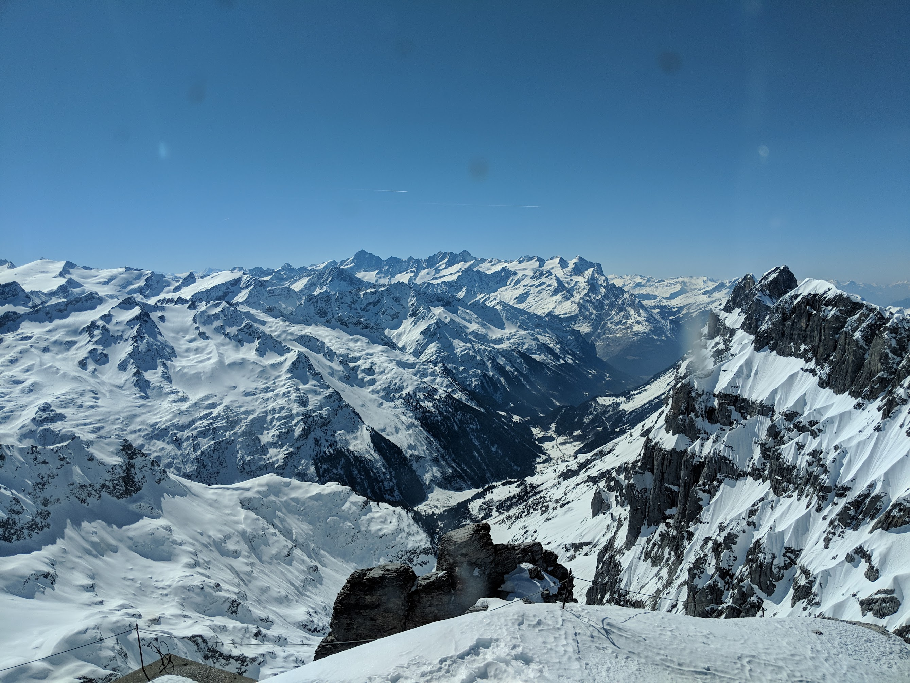
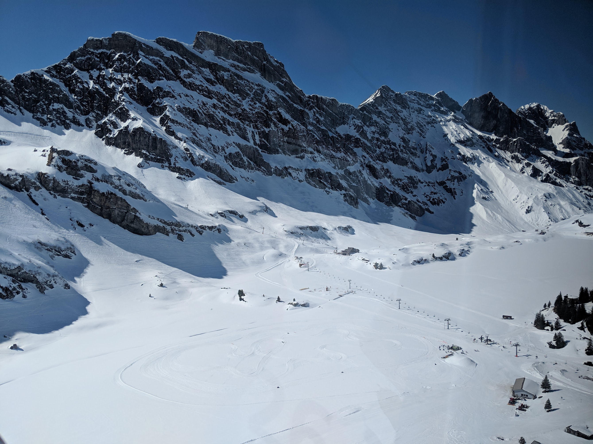
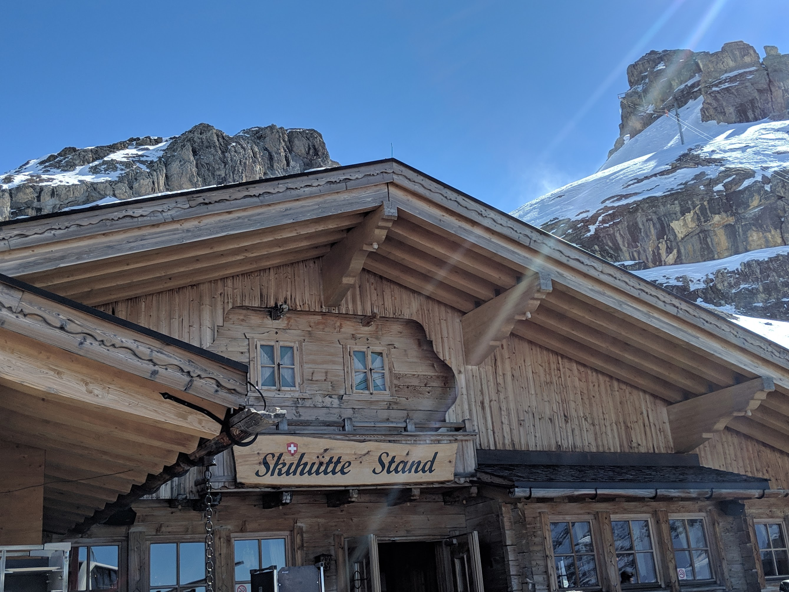
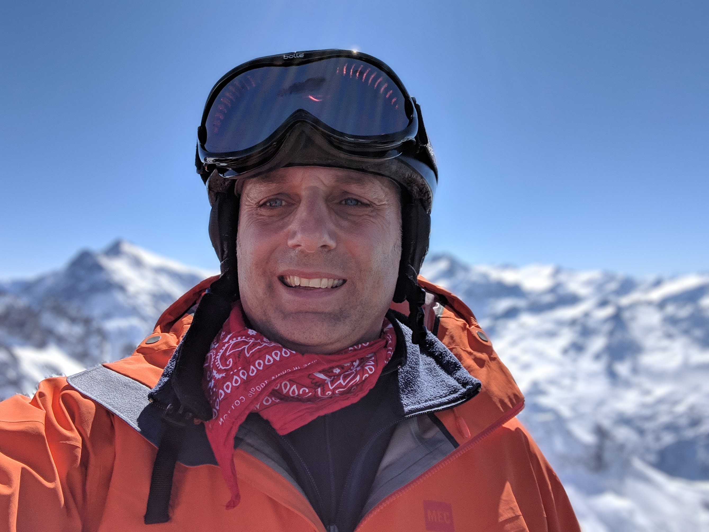
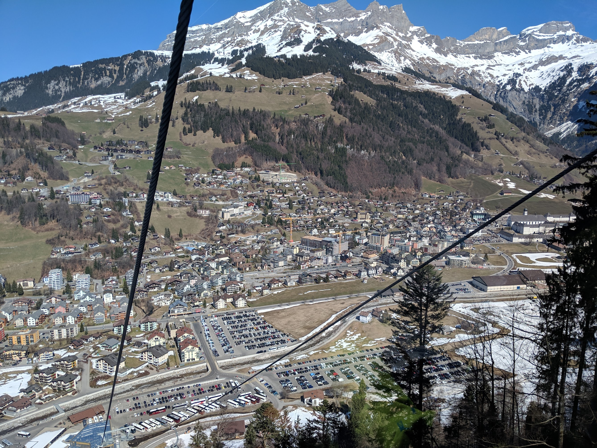

Just recently, I experienced the kind of day that every ski enthusiast dreams about. My friend Jochen and I embarked on a day trip to Engelberg, Switzerland, to ski at the breathtaking Titlis Mountain in the Alps. It was a spring skiing adventure that combined perfect weather, excellent snow, and the unmatched beauty of the Swiss Alps.

**Early Start from Karlsruhe**

Our day began early on Sunday, with the excitement of the trip making it easy to wake up. We left Karlsruhe, Germany, in the cool, early morning hours and set out on the road to Engelberg. The drive itself was smooth and enjoyable, taking just over three hours, but filled with anticipation and scenic views as we approached the heart of the Alps.

**Arrival at Titlis Mountain**

As we arrived at Titlis Mountain, we were greeted by what skiers fondly call a "bluebird day" – not a cloud in the sky, with the sun shining brightly over the pristine slopes. The mountain's high elevation ensured that the snow conditions were ideal, despite it being spring.

**Wonderful Skiing Experience**

The skiing was nothing short of wonderful. Each run offered breathtaking views and exhilarating descents. The snow, crisp and fresh, made for some fantastic skiing. We zipped down the slopes, carving turns and enjoying every moment of our alpine adventure.

**A Delightful Snack at the Skihütte**

Around midday, we took a break at a cozy Skihütte stand. Here, we enjoyed a well-deserved snack, refueling for the afternoon’s skiing. The atmosphere was jovial and quintessentially Swiss, with other skiers sharing their stories and the Skihütte offering a warm and welcoming respite.

**Afternoon Ski and Scenic Surroundings**

As the afternoon unfolded, we continued to enjoy the slopes. The beauty of Engelberg and the surrounding Alps was mesmerizing. Skiing with the backdrop of towering mountains and panoramic vistas was an experience I’ll always cherish.

**Reflections on a Perfect Ski Day**

As we drove back to Karlsruhe later that day, we were tired but elated. This day trip to Engelberg and Titlis Mountain was more than just a skiing excursion; it was a journey into the heart of Alpine beauty and the joy of spring skiing. It's a day that will be etched in my memory as a perfect blend of adventure, friendship, and the unmatched beauty of the Swiss Alps.
