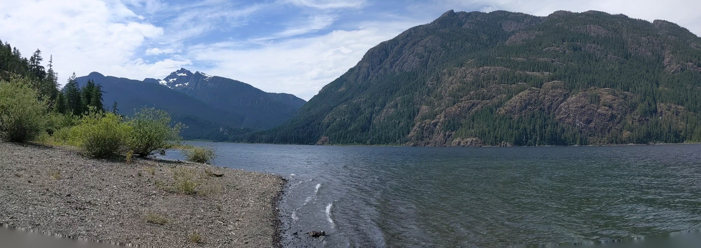
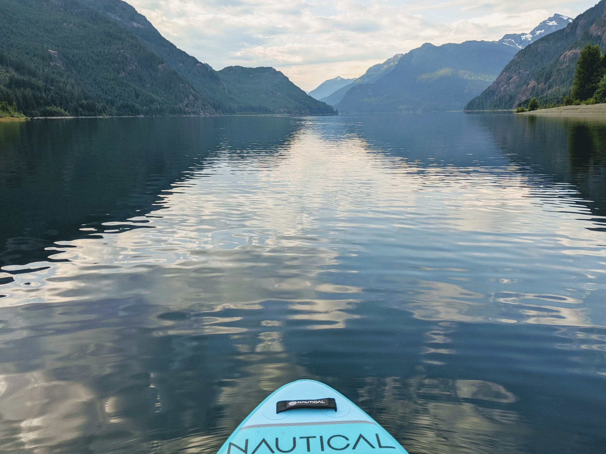
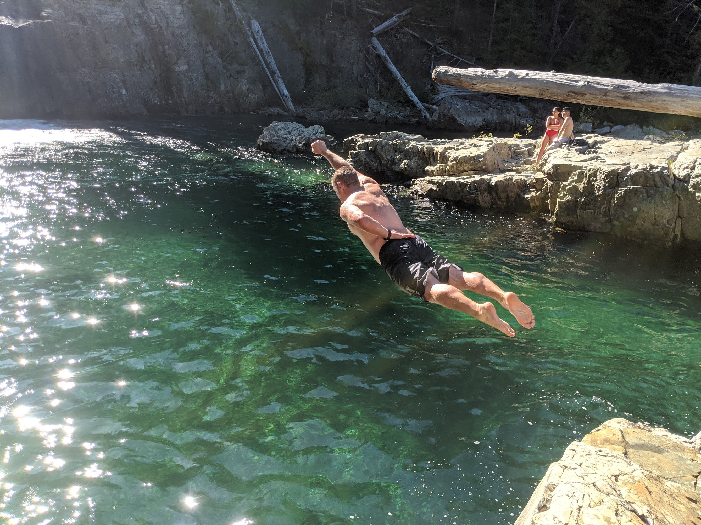
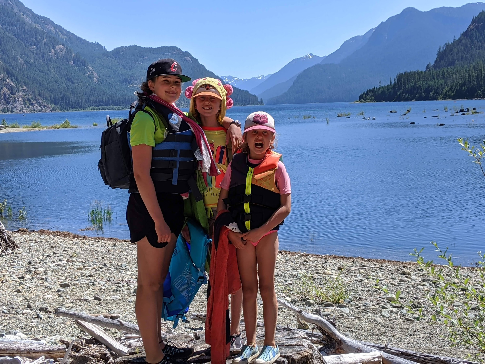
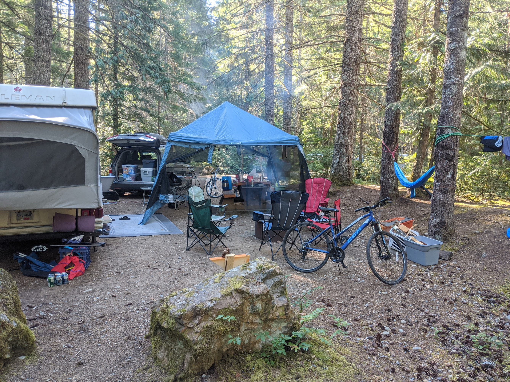

This summer, when our plans to travel back to Ontario were thwarted by Covid-19, my family - my wife Tricia, and our daughters Sadie, Lily, and Maggie - found adventure much closer to home. We decided to explore the pristine beauty of Buttle Lake in Strathcona Park on Vancouver Island, a gem in our own backyard.

**Paddle Boarding Adventures on Buttle Lake**

Our days at Buttle Lake were filled with serene moments paddle boarding on the calm, crystal-clear waters. Each stroke through the lake offered stunning views of the surrounding mountains and forests, creating a sense of peace and connection with nature. It was especially delightful watching the girls find their balance and glide effortlessly over the water, their laughter echoing across the lake.

**Reconnecting with The Lacey's**

One of the highlights of our trip was hanging with, The Lacey's. Camping alongside close friends added an extra layer of joy and camaraderie to our outdoor adventure. Our evenings were spent sharing stories, roasting marshmallows, and simply enjoying each other's company under the starry sky.

**Thrilling Hikes and Cliff Jumping**

Our adventurous spirits were satisfied with hikes through the lush trails of Strathcona Park. The trails led us to hidden spots perfect for cliff jumping - an exhilarating experience for all of us. The thrill of leaping into the cool, refreshing waters below was a true highlight, filling us with a sense of freedom and excitement.

**Sleeping Under the Stars**

Opting for a more immersive experience, we spent a night sleeping outdoors in hammocks. Drifting off to sleep under the open sky, surrounded by the sounds of nature, was both peaceful and grounding. It was a unique way to connect with the environment and each other.

**Relaxation on the Beach**

Our days were also spent lounging on the beach, where we embraced the art of relaxation. The tranquil beach setting was perfect for sunbathing, reading, and building sandcastles with the girls. It was these moments of leisure, with the gentle lapping of lake waves in the background, that reminded us of the simple joys of life.

**Embracing the Unexpected**

This camping trip to Buttle Lake was a reminder that sometimes the most memorable adventures are the ones closest to home. In a time when the world felt uncertain, we found solace and joy in the natural beauty of Vancouver Island. It was an unexpected turn of events, but one that brought our family closer and allowed us to create lasting memories.

As we packed up our campsite, we were grateful for the unexpected journey that this summer brought us. Here’s to finding adventure in every situation and cherishing the moments we have with loved ones.

