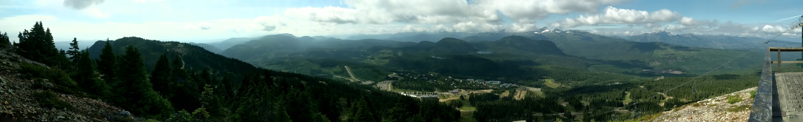
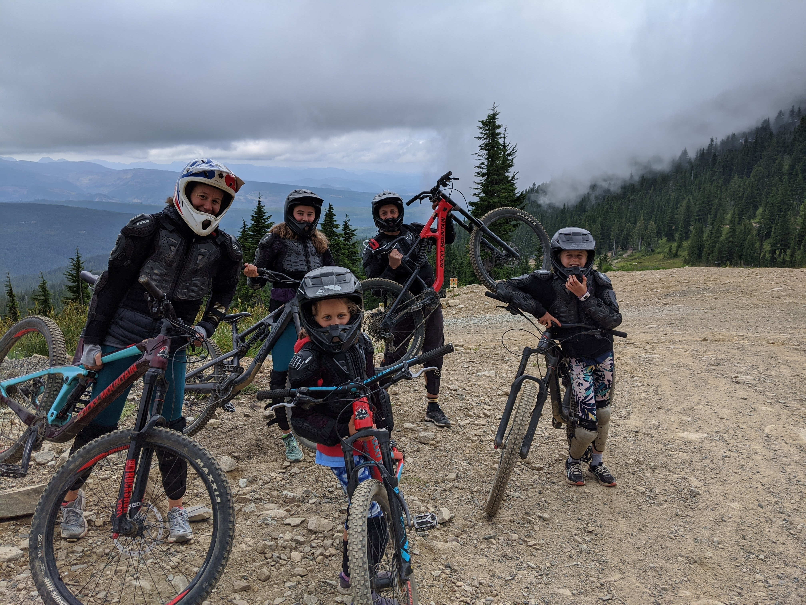
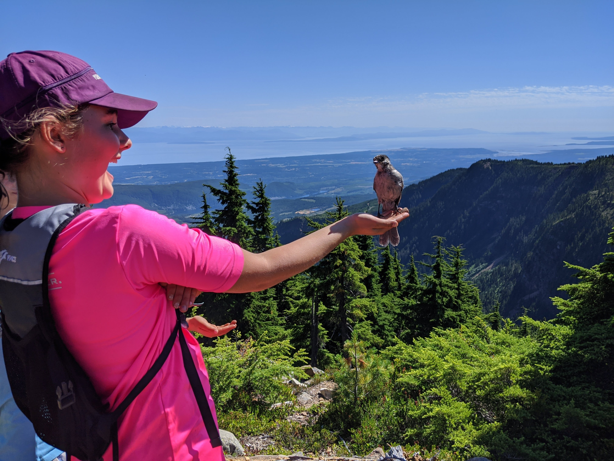
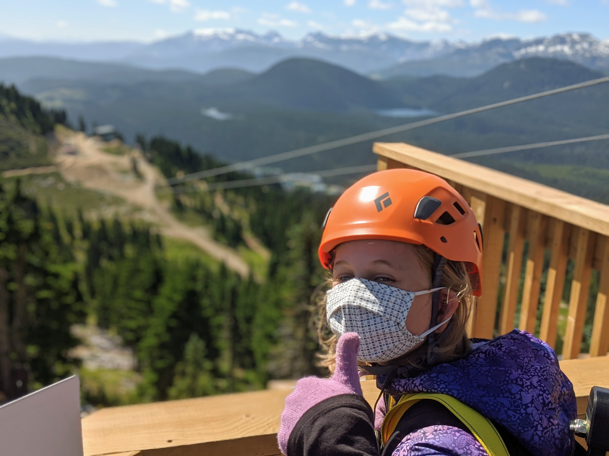

This summer, when our usual plans to travel to Ontario were sidelined by Covid-19, my family and I seized the opportunity to explore the wonders closer to home on Vancouver Island. Our destination? The majestic Mt. Washington, a haven for outdoor enthusiasts like us.

**Downhill Thrills on Two Wheels**

One of our first adventures was renting bikes for a downhill biking lesson. This was a new experience for all of us, full of adrenaline and laughter. Maggie, our youngest, showed incredible resilience; despite taking a tumble over her handlebars, she dusted herself off and continued with a brave smile. Her courage was truly inspiring.

**Daily Hikes and Whiskeyjack Encounters**

We hiked the mountain trails daily, embracing the natural beauty of Mt. Washington. During one of our hikes, a friendly whiskeyjack bird landed on Sadie, our oldest daughter, creating a memorable moment that we all cherished. It was encounters like these that made our hikes more than just exercise; they were an opportunity to connect with nature.

**Soaring High on the Zip Line**

The Mt. Washington zip line was a highlight, with a four-part course that took us over 100 meters above the ground. Lily, our middle daughter, was a natural, soaring through the course with fearless enthusiasm. The zip line adventure brought us breathtaking views and heart-pounding excitement.

**The Trek to Helen McKenzie Lake**

One of our more challenging adventures was the hike out to Helen McKenzie Lake. Clocking in at almost 18 kilometers, this trek tested our endurance but rewarded us with stunning vistas and a sense of achievement.

**Relaxing with Mountain Views**

After our days full of activities, we unwound on the patio, enjoying drinks and the fresh mountain air. These moments of relaxation were just as precious as our adventurous exploits, allowing us to reflect on our experiences and appreciate the beauty of Mt. Washington.

**Embracing the Unexpected**

This summer taught us the value of embracing the unexpected. Unable to travel far, we discovered adventures right in our backyard. Mt. Washington offered us a summer filled with new experiences, family bonding, and the beauty of Vancouver Island.

As we look back on this summer, we are reminded that adventure doesn’t always mean going far; sometimes, it’s just about seeing the familiar through new eyes.
