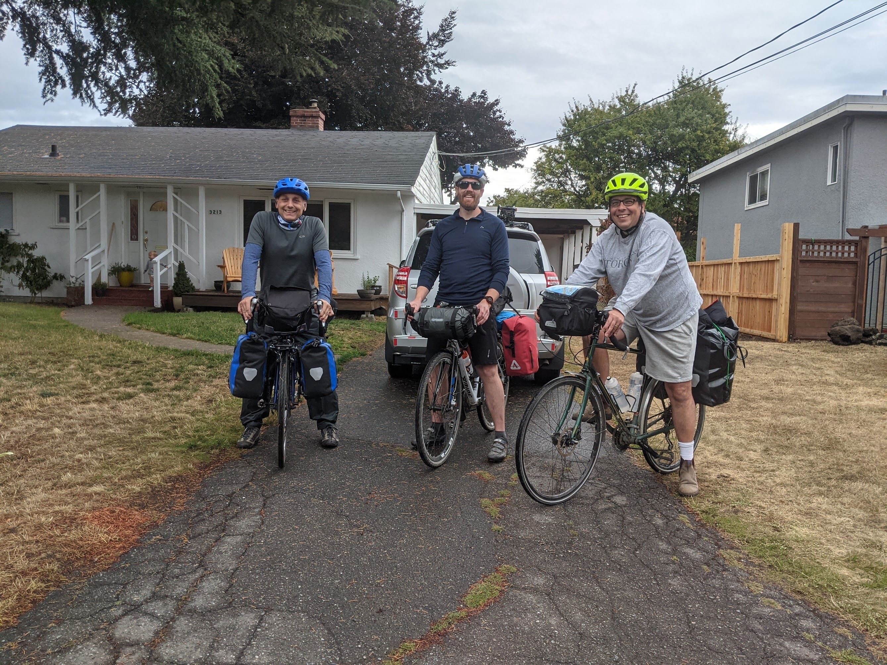
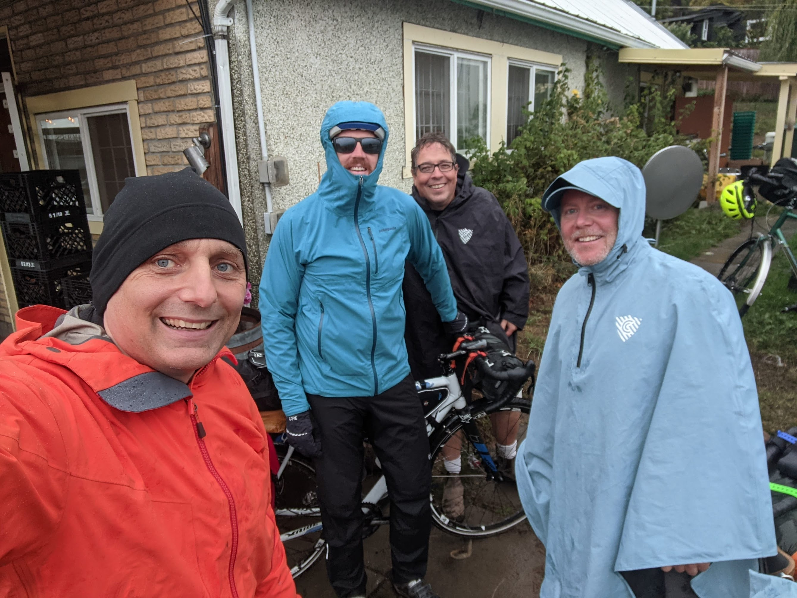
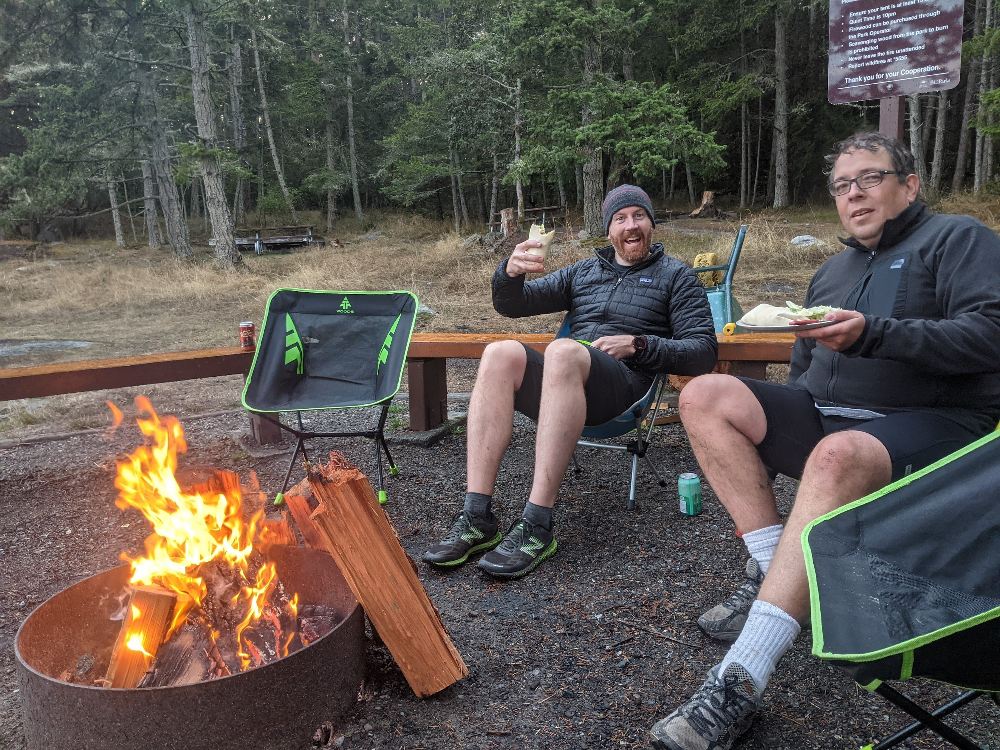
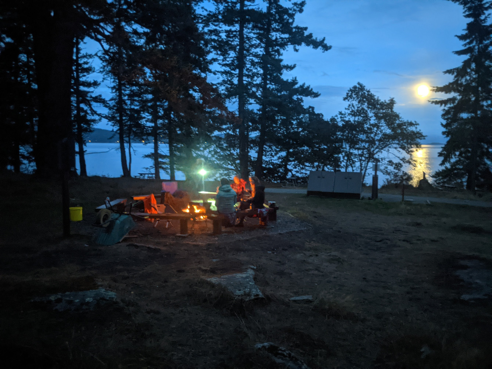

#### **The Journey Begins**

Last weekend, my buddies Dave, Eric, Todd, and I embarked on a much-anticipated bike camping trip. Our initial plan was to explore the Gulf Islands near Vancouver Island through island hopping. However, the unpredictable weather had other ideas for us.

On Friday, Todd, Eric and I peddled our way towards Sidney, joining Dave on the scenic Lochside Trail. The ride to the ferry terminal was invigorating, filled with anticipation and the fresh scent of the surrounding wilderness. Boarding the ferry to Salt Spring Island, we eagerly watched as the clouds gathered overhead, hinting at the impending weather change.

#### **Welcomed By the Rain**

As the ferry docked, a light drizzle began to fall, gradually transforming into a persistent rain. Unperturbed, we biked towards our campsite at Ruckle Provincial Park, the rain intensifying with every pedal stroke. Despite the pelting rain, our spirits remained high, driven by the thrill of adventure and the beauty of our surroundings.

#### **A Royal Feast in the Rain**

Our evening at the campsite was nothing short of majestic. Amidst the rain, we cooked up a wonderful steak dinner, savoring each bite as we dined like kings in the heart of nature. The highlight of the night was meeting two fellow bikers at the campsite. Together, we gathered around a comforting campfire, sharing stories and experiences, a testament to the camaraderie that thrives among outdoor enthusiasts.

#### **Exploring Salt Spring Island**

With the weather continuing to be a damp companion, we decided to remain on Salt Spring Island for Saturday. The island, known for its vibrant community and stunning landscapes, did not disappoint. We biked across the island, soaking in the lush greenery and the occasional glimpses of wildlife. A stop in Ganges, the main town, offered a delightful culinary break. The local flavors and warm hospitality were a perfect treat after a day of exploration.

Later, we ventured to the northern part of the island, each turn revealing breathtaking views and hidden gems. As evening approached, we returned to our campsite. Thankfully, the rain had eased, allowing us a chance to dry out and enjoy another splendid meal by the fire.

#### **Homeward Bound**

Sunday greeted us with a pleasant surprise – clear skies and sunshine. After a hearty breakfast and a few more laughs, we packed up, our hearts full of unforgettable memories. We caught the 11 am ferry back to Victoria, the ride home offering a time for reflection.

As we peddled back, I couldn't help but think about the resilience and adaptability we had shown. The trip may not have gone as planned, but it was a reminder that sometimes, the best experiences come from the unexpected. This adventure was more than just a bike camping trip; it was a celebration of friendship, nature, and the simple joys of life on two wheels.

#### **Conclusion**

This bike camping trip was a testament to the spirit of adventure and the bonds of friendship. Despite the weather's challenges, we created memories that will last a lifetime. Salt Spring Island, with its enchanting landscapes and welcoming community, was the perfect backdrop for our escapade. It's not always about the destination but the journey, and ours was nothing short of extraordinary.
