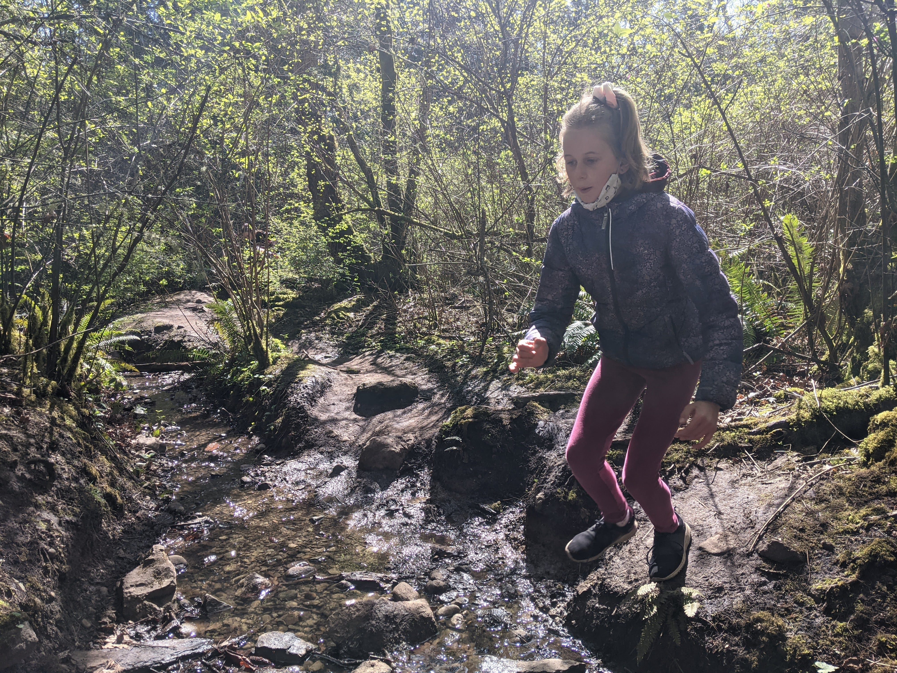

On a bright, sunny day in April, my family embarked on an adventure to hike Mount Finlayson, a renowned trail in Victoria's Goldstream Provincial Park. This wasn't just any hike; it was a special experience amidst the challenging times of Covid-19.

**Preparation and Safety First** Understanding the importance of safety during the pandemic, we all had masks around our necks, ready to be pulled up whenever we encountered other hikers. This simple yet crucial measure ensured we could enjoy our hike responsibly.

**The Steep Ascent to Stunning Views** Mount Finlayson, known for its steep trails, did not disappoint. As we navigated the 4-kilometer round trip, we were constantly in awe of the lush forest that enveloped the path. The trail, with an elevation gain of 410 meters, offered a rewarding challenge. We found ourselves occasionally scrambling up steep sections, using our hands for support – a fun challenge for the family!

**Navigating Small Streams and Enjoying Nature** One of the highlights of the hike was navigating small streams that crossed our path. The gentle sound of flowing water added a serene backdrop to our journey, and hopping over these little streams was a delight, especially for the younger ones.

**A Summit Snack with a View** Reaching the summit was a moment of triumph. We were greeted with a breathtaking view of the Langford area and the Bear Mountain Golf Resort. It was here, at the peak, that we sat down for a well-deserved snack. Enjoying our food with such an incredible view made it all the more delicious.

**The Descent and Reflections** As we made our descent, careful to follow the trail markers, we reflected on the beauty of the hike and the importance of such experiences, especially during times of social distancing and limited interactions. The hike was not just about reaching the top but about the journey, the challenges we overcame, and the shared experience as a family.

**A Day to Remember** This hike up Mount Finlayson wasn't just a physical activity; it was a much-needed escape and a bonding experience for us. It reminded us of the beauty of nature and the resilience we all possess. As we left Goldstream Provincial Park, we carried with us not just memories of a beautiful day but also a sense of accomplishment and a renewed appreciation for the simple joys of life.
