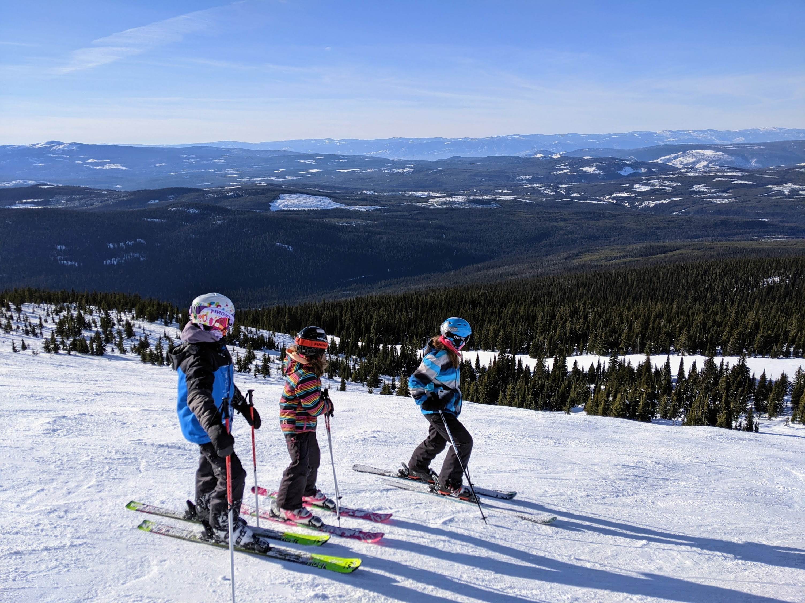
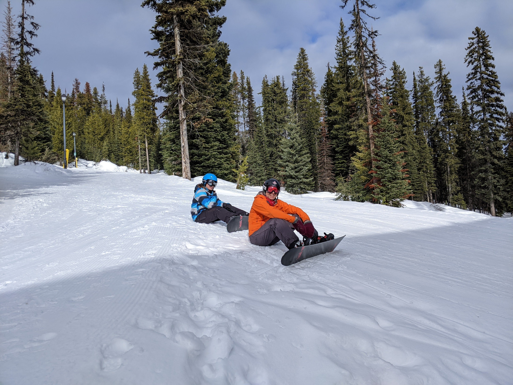
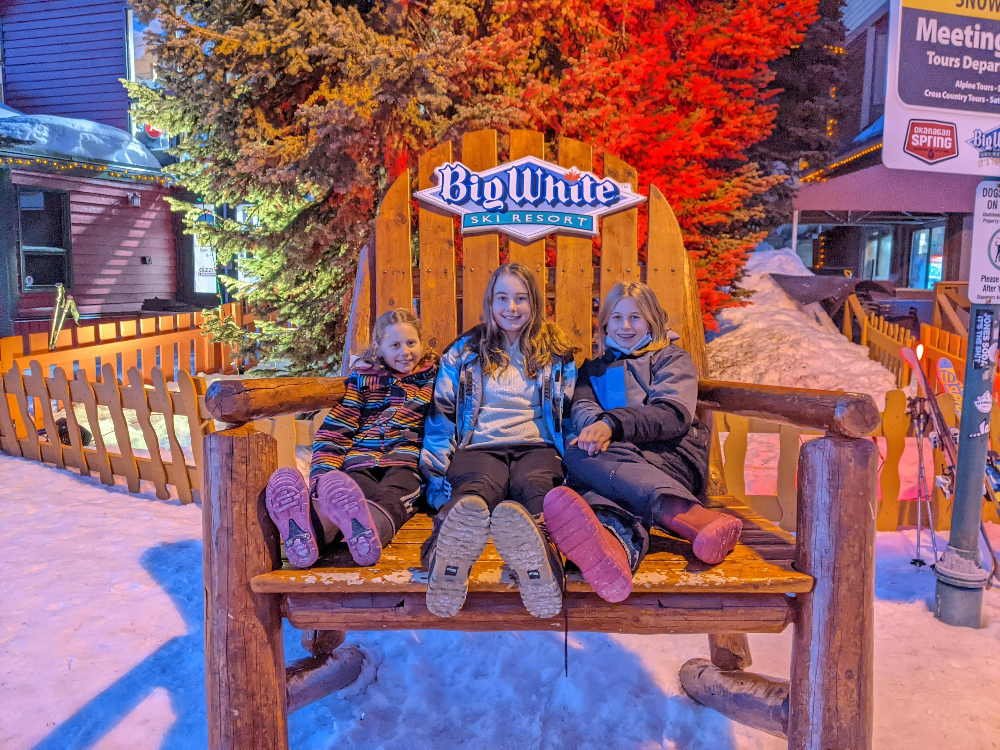

Our family's recent ski trip to Big White was the perfect blend of winter fun and cozy mountain living. My wife Tricia, our three girls - Sadie, Lily, and Maggie, along with my in-laws, embarked on this snowy adventure, and it was a trip to remember!

**Chalet Living on the Slopes**

We rented a charming chalet right on the mountain, which was a dream come true for any ski enthusiast. The highlight? It had a hot tub! Imagine soaking in warm, bubbling water while surrounded by a winter wonderland - it was as magical as it sounds. The convenience of skiing right from our front door each morning was something we all relished.

**Snowboarding Shenanigans**

Sadie and I decided to shake things up a bit by trying our hands (or feet) at snowboarding. Let's just say we weren't destined to be snowboarding pros! Our attempts led to a lot of laughter and some memorable tumbles in the snow. It was a humbling, yet incredibly fun experience.

**Skating and Sweet Treats**

One of our trip highlights was the time we all spent skating. There's something special about gliding over ice surrounded by snow-capped mountains. And, of course, no winter activity would be complete without indulging in some Beaver Tails. These sweet, fried pastries were the perfect treat to warm us up after a day on the ice.

**Celebrating Tricia's Birthday**

The trip was made even more special as we celebrated Tricia's birthday. Surrounded by family, the beauty of Big White, and the warmth of our chalet, it was a birthday to remember. We shared laughter, stories, and toasted to many more adventures together.

**Final Thoughts**

This trip to Big White was more than just a skiing holiday; it was a reminder of the joy of spending quality time with family. From the slopes to the hot tub, from the skating rink to the dining table, each moment was a treasure.

Here’s to more family adventures in the snow!
