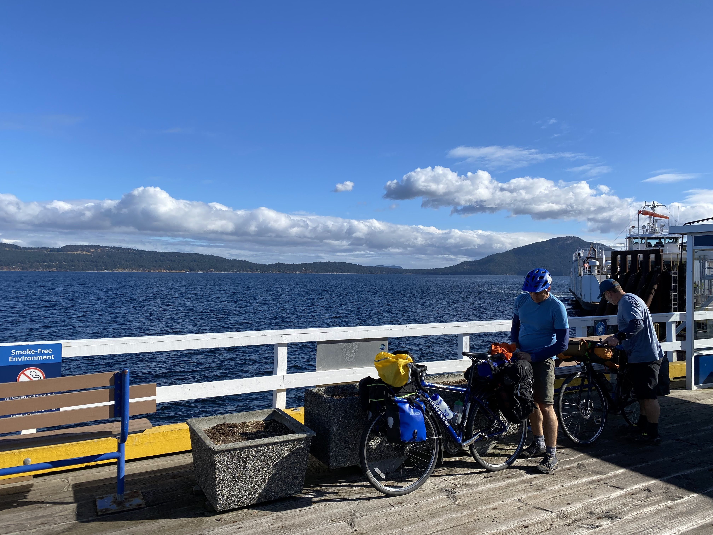

There's something incredibly freeing about packing your life onto two wheels and setting off into the unknown. This past weekend, my buddies Dave, Todd, and I embarked on a three-day bike camping adventure that took us from the urban sprawl of Victoria to the serene landscapes of Salt Spring Island.

**Day 1: Off to a Rolling Start**

Our journey kicked off on Friday after work. I peddled to Dave's workplace, where our adventure began. Together, we cycled to meet Todd at the Brentwood Bay ferry terminal. The ferry ride to Mill Bay was a perfect transition from our daily grind to adventure mode.

Our first night was spent camping at Bamberton Provincial Park near Mill Bay. Setting up camp with the sound of the ocean as our backdrop was surreal. The night was spent sharing stories, laughter, and anticipation for the days ahead.

**Day 2: From Mill Bay to Salt Spring Island**

Saturday morning greeted us with a hint of ocean mist and the promise of an exciting ride. We biked from Mill Bay to Crofton, a route that treated us to stunning views and challenging hills. Coffee and treat stops along the way kept our spirits and energy high.

The highlight of the day was catching the ferry from Crofton to Salt Spring Island. There's something about ferry rides that amplify the sense of adventure, and this one was no exception.

We spent our second night at Ruckle Park on Salt Spring Island. The park, known for its rustic beauty, was the perfect setting for our night under the stars. We watched ferries glide past the island in the distance, their lights twinkling like stars on the water.

**Day 3: The Journey Home**

Sunday's dawn beckoned us to our final leg of the trip. We biked to the Salt Spring Island ferry terminal and took the ferry back to Victoria. The ride home along the Lochside Trail was a mix of reflection and appreciation for the journey we had undertaken.

**Reflections on Two Wheels**

As we peddled our way back home, it struck me how much we had experienced in just a short time. The trip was more than just about biking and camping; it was about the camaraderie, the connection with nature, and the simple joys of exploring our backyard.

Bike camping with Dave and Todd was not just an adventure; it was a reminder of the freedom and simplicity that life can offer when you're willing to hop on a bike and see where the road takes you.

Until the next ride
