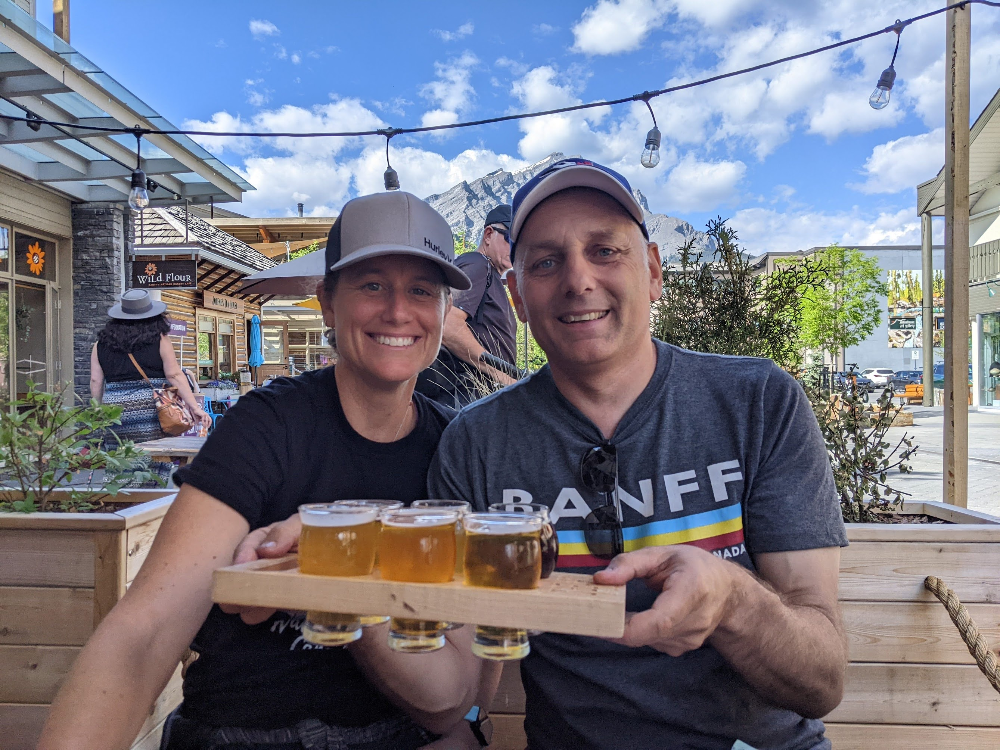

There's something about the open road that beckons to the soul, and our recent family camping trip to Banff, as part of our cross-Canada journey in our new RV, was a testament to this. Banff National Park, with its awe-inspiring scenery, was our home for four nights, and every moment was filled with wonder.

**Settling into Tunnel Mountain**

Our base was the Tunnel Mountain Campground, nestled amidst towering pines and offering stunning views. This campground, with its blend of nature and convenience, was the perfect spot for our family. From the moment we parked our RV, the excitement was palpable. The kids couldn’t wait to explore, and neither could we.

**Conquering Sulfur Mountain**

One of our trip's highlights was hiking up Sulfur Mountain. The trail wound its way through dense forests and over bubbling streams, with each step offering a new view more breathtaking than the last. Reaching the summit was a mix of triumph and awe. The panoramic views of the Canadian Rockies were simply unforgettable.

The descent was an adventure in itself – we took the gondola down, which provided a different perspective of the mountain's beauty and a well-deserved rest for our legs.

**Biking to Lake Louise**

A trip to Banff would be incomplete without visiting the iconic Lake Louise. We decided to bike up to the lake, a challenging but exhilarating experience. As we pedaled through the winding mountain roads, the anticipation grew. And then, there it was – Lake Louise in all its turquoise glory, a jewel set against the backdrop of majestic mountains.

**Exploring the Town of Banff**

Banff town itself was a delightful experience. We spent our days wandering through its quaint streets, browsing local shops, and soaking in the mountain town vibe. A family favorite was Cows Ice Cream – their flavors were a hit with the kids, and the whimsical cow-themed decor added to the fun.

**Final Thoughts**

Our time in Banff was more than just a stop on our cross-Canada RV trip; it was a journey into the heart of nature. It reminded us of the beauty that lies in our backyard and the joy of exploring it together as a family.

As we left Banff behind, driving towards our next destination, we carried with us memories of mountain trails, lake views, and the laughter that filled our RV. Here’s to many more miles and many more memories.
