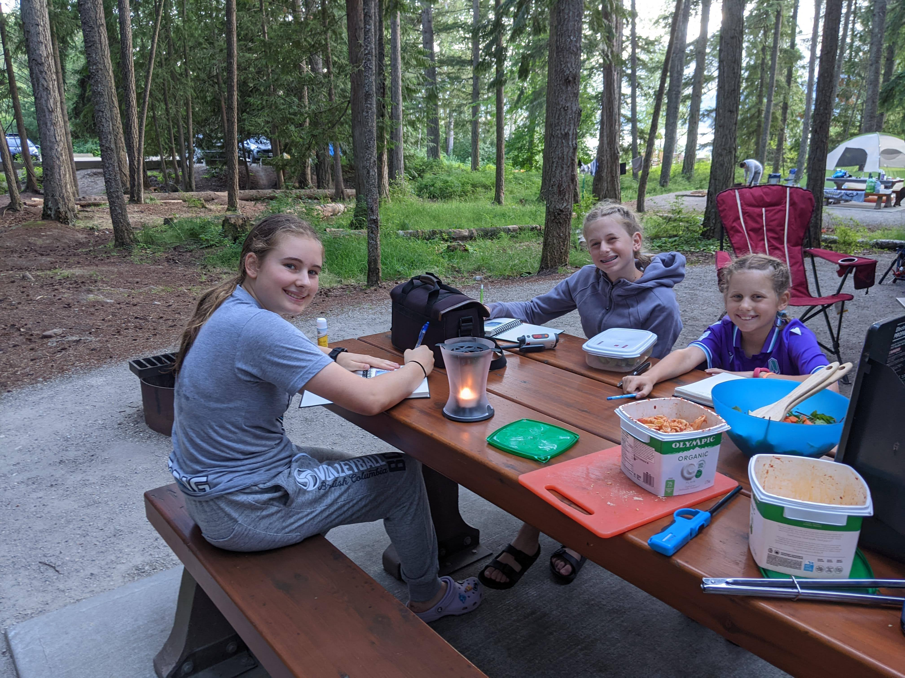

It was a day marked by excitement and the promise of adventure - the day we left Victoria BC in our RV, embarking on our cross-Canada journey. The day began early, filled with anticipation, as we caught the 7:00 am ferry off the island, bidding farewell to the familiar and setting our sights on the vastness of Canada.

**Morning Farewell: Victoria to the Mainland**

The morning was crisp and the ferry ride peaceful, offering stunning views of the coast as we made our way to the mainland. There's always something bittersweet about leaving the comfort of home, but the thrill of adventure was undeniable.

**Through the Lower Mainland to the Interior**

Once on the mainland, we navigated through the bustling lower mainland, gradually making our way to the interior. The landscape shifted as we traveled, urban views giving way to the rugged beauty of British Columbia's heartland.

**The Coquihalla Highway: A Scenic Route**

Our route took us along the Coquihalla Highway, through Merritt, where the scenic beauty of the highway unfolded with each kilometer. This stretch of our journey was a reminder of the diverse landscapes that make up this beautiful country.

**Kelowna: A Quick Stop for Supplies**

In Kelowna, we paused to stock up on supplies. The city was bustling, a vibrant hub in the midst of BC's wine country. The brief stop was also a welcome break from the drive, allowing us to stretch our legs and prepare for the journey ahead.

**Arriving at Mable Lake Provincial Park**

As we continued to Mable Lake Provincial Park, the temperature began to climb, reaching over 35 degrees. The heat was intense, but it only added to the summer adventure vibe. Arriving at our camp site at Mable Lake Provincial Park was a moment of triumph and relief. The park, with its lush surroundings and tranquil lake, was the perfect first stop on our journey. The heat of the day dissolved into a warm evening, ideal for a refreshing swim in the lake. As we splashed and played in the cool waters, the stress of packing and preparation melted away.

**Our First Night: A Starlit Beginning**

Our first night on the road was everything we had hoped for. Under a canopy of stars, we set up camp, cooked our first meal on the road, and gathered around to share our excitement and plans for the days ahead. The warmth of the night, the sound of laughter, and the soft glow of our campfire created an ambiance of pure contentment.

**Anticipating Banff National Park**

As we settled into our beds, the anticipation for the next day's journey to Banff National Park was palpable. Known for its stunning mountainous terrain, pristine lakes, and abundant wildlife, Banff was a destination we all looked forward to with great enthusiasm.

**Reflections on Day One**

Lying in our RV that night, I reflected on the day's journey. From the early morning ferry ride to our swim in Mable Lake, it was clear that this trip was about more than just the destinations. It was about the journey, the experiences, and the family memories being created.

We closed our eyes, not just to rest but to dream of the adventures that awaited us as we continued our cross-Canada RV adventure.
