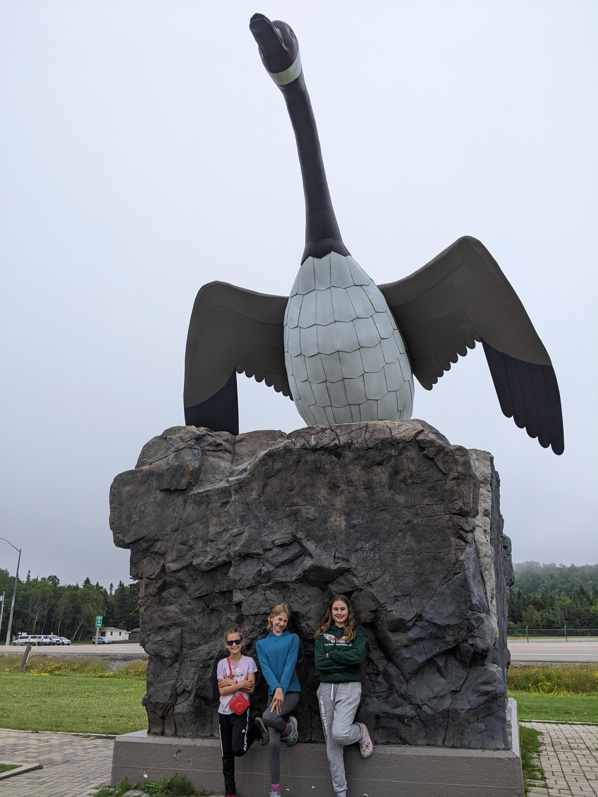

Continuing our cross-Canada RV journey, we found ourselves venturing into the vast and beautiful expanse of Northern Ontario. This leg of our trip was a mix of awe-inspiring nature, fascinating history, and the kind of unexpected adventures that make road trips memorable.

**Sleeping Giant Provincial Park: A Nature’s Paradise**

Our first stop in Northern Ontario was Sleeping Giant Provincial Park, near Thunder Bay. This park, known for its majestic natural formations that resemble a sleeping giant, was a feast for the eyes and the soul. We spent our days there hiking through the lush forests and along the rugged cliffs. The views of Lake Superior from the park were simply breathtaking, offering a serene backdrop for our family adventures.

**Pancake Bay Provincial Park: Beachside Bliss**

Next, we headed to Pancake Bay Provincial Park. The park's stunning beachfront was perfect for swimming and relaxing. It was here that we delved into the history of the Edmund Fitzgerald, the legendary shipwreck that Lake Superior is known for. This educational experience added a layer of depth to our appreciation of the Great Lakes.

**Encounter with the Giant Goose in Wawa**

On our way to the parks, we stopped in Wawa to see the giant Goose statue, a quirky and iconic symbol of the town. It was one of those perfect road trip moments where you embrace the unique and unexpected.

**Rainstorm Laughs and Lake Superior Swims**

Our journey wasn't without its challenges, though. We got caught in a torrential rainstorm that tested our spirits and our RV. But instead of letting it dampen our spirits, we laughed it off, making the most of the moment - a true testament to the family's adventurous spirit.

Swimming in Lake Superior was another highlight. The lake's vastness and the water's refreshing touch were a much-needed respite after our biking and hiking expeditions.

**Reflections on Our Northern Ontario Adventure**

As we continued our journey through Northern Ontario, what stood out was not just the natural beauty but also the richness of experiences. From hiking and biking to learning about shipwrecks and laughing through storms, these days were a reminder of the joy of exploring, learning, and simply being together as a family.

The road beckons us forward, and we're ready for more adventures as we roll on in our trusty RV.
