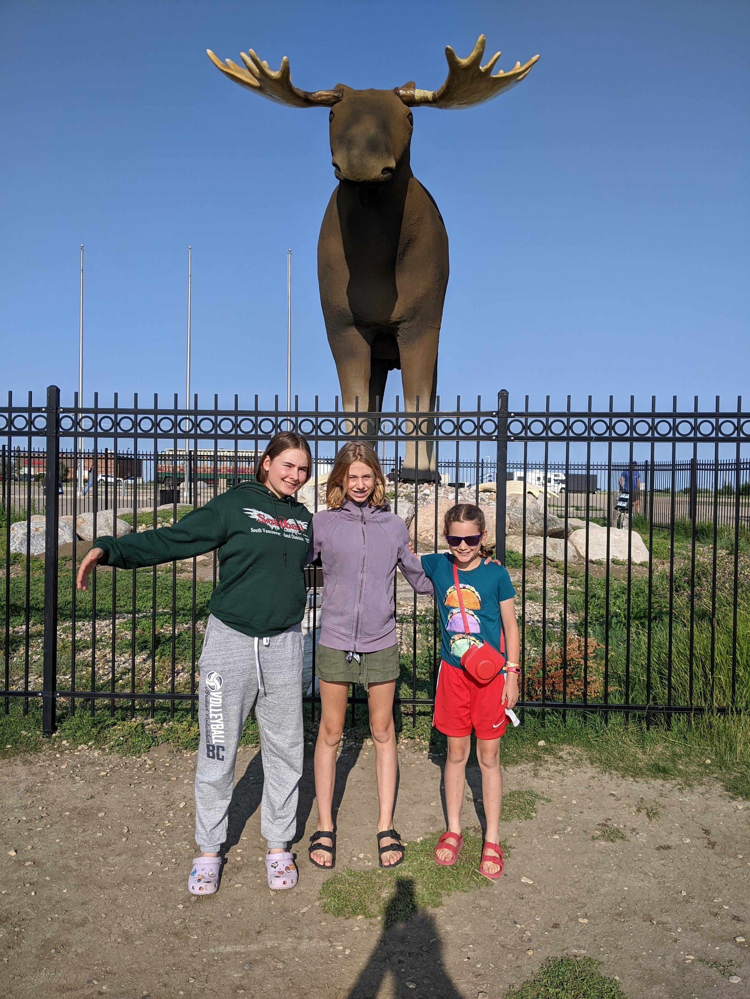

Our family is continuing on an RV journey, traversing the vast and varied landscapes of Canada, an adventure taking us from the rugged beauty of Banff to the iconic landscapes of Ontario. As we head east through the Canadian prairies, each stop is a chapter in our unforgettable cross-country story.

**Alberta to Saskatchewan: The Prairie Experience**

Leaving the Rockies behind, we first pause in Medicine Hat, Alberta, immersing ourselves in the prairie spirit. Then, moving into Saskatchewan, we are greeted by the playful giant, Mac the Moose, in Moose Jaw. Our night at Buffalo Pound Provincial Park envelops us in the tranquility of the Saskatchewan landscape.

**Manitoba’s Birds Hill Provincial Park**

In Manitoba, Birds Hill Provincial Park provides a serene setting with its lush forests and diverse wildlife, offering us a refreshing pause in our travels.

**Ontario: A Journey of Icons**

Upon reaching Ontario, our first stop is in Kenora, where Husky the Muskie stands proudly, a testament to Canada's rich fishing heritage and natural beauty.

Continuing our journey, we find ourselves at the Terry Fox Monument outside Thunder Bay. This solemn and inspiring monument, overlooking Lake Superior, pays homage to one of Canada's most enduring heroes. It is a moment of reflection on the resilience and determination embodied by Terry Fox during his Marathon of Hope.

**Concluding Thoughts on Our Cross-Canada RV Trip**

This journey across Canada in our RV is more than just a road trip; it is an exploration of the country's heart and soul. From the prairies to Lake Superior, each destination offers a unique perspective on Canada's diverse beauty and history. Our family is not only experiencing the physical landscapes but also connecting with the stories and legacies that make Canada what it is today.

As we continue on our travels, the memories of this trip - from the vast prairies to the iconic landmarks of Ontario - will remain a cherished part of our family's story.
