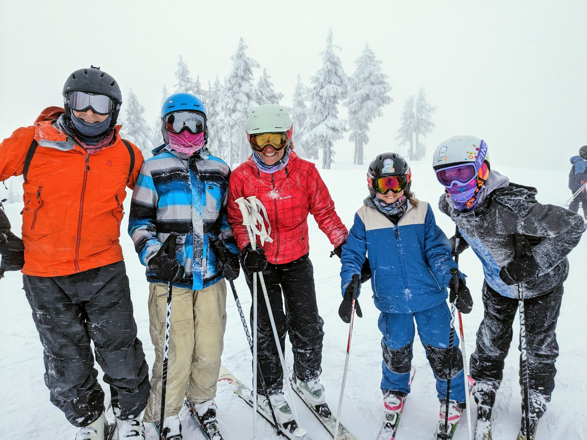

Just last week, our family embraced the winter wonderland that is Mt. Washington for a few snowy days of skiing. Despite the thick snowflakes and a white curtain of low visibility, the excitement was palpable – it was the kind of day where every turn sprayed up a cloud of powder and laughter was the soundtrack.

**Maggie and Reese's Snowy Adventures**

The slopes were a fresh canvas for Maggie and her friend Reese, who weaved a path of friendship and fun through the snowy maze of trails. Their giggles were muffled by the falling snow, but their joy was as clear as a sunny day.

**Lily and Serena's Icy Escapade**

Lily met up with Serena, and together they tackled the mountain with a spirit that only the best of ski buddies share. They skied in sync, sharing the thrill of chilly air against their faces and the satisfaction of perfect turns in perfect powder.

**Sadie's Day with the 'Old Folks'**

Meanwhile, Sadie, our eldest, had the 'misfortune' of skiing with her old mom and dad. But truth be told, we treasured every chairlift ride and every run we got to share with her. It's not every day that we get to steal moments like these as she grows older and more independent.

**The Unseen Beauty**

The beauty of skiing isn't always in the views; sometimes, it's in the unseen – the feeling of the snow, the sound of skis carving, the shared moments. Even as the snowstorm stole the scenery, it gave us something else, a reminder that fun doesn't need a perfect backdrop.

**Final Thoughts**

Skiing at Mt. Washington was more than just a series of downhill runs; it was a gathering of friends, old and new, a mix of generations, and a collection of moments that we’ll all remember. We skied, we laughed, and we lived the mountain life to the fullest. And as we left, it wasn't just the snowflakes that clung to us, but the memories too.

Until next time, may your slopes be snowy and your company warm.
