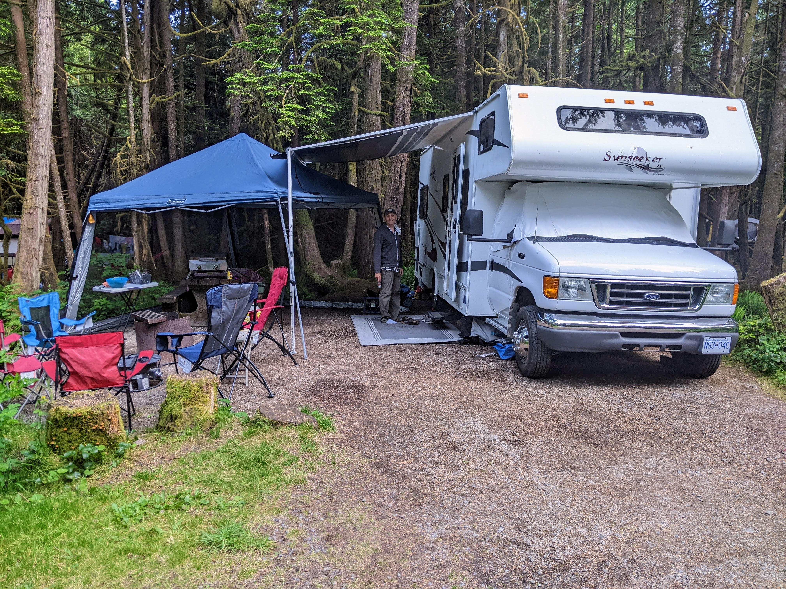
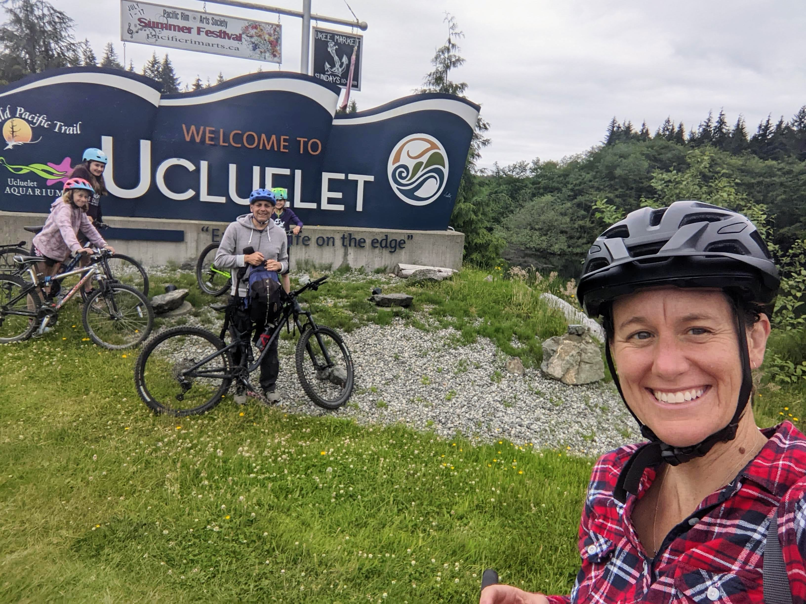
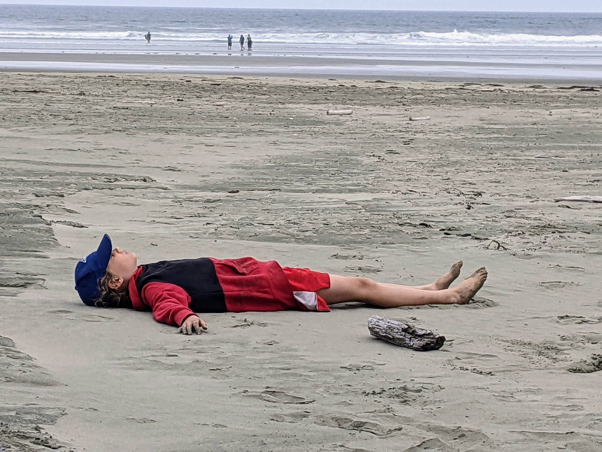
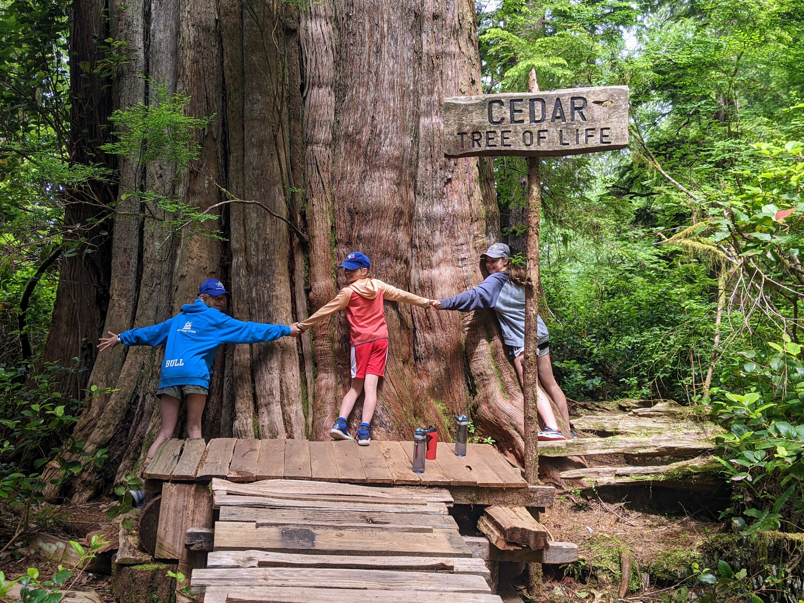

If there's a place where the spirit of adventure merges with the tranquility of nature, it's Tofino. This trip wasn't just another check on our travel bucket list; it was the maiden voyage in our new RV, a journey that took us to the rugged beauty of Green Point in Pacific Rim National Park.

**Home on Wheels at Green Point**

Our first stop was Green Point Campground, where we parked our home-on-wheels amidst the lush coastal rainforest that meets the expansive Pacific. Waking up to the sound of the ocean's breath and the sight of towering cedars was nothing short of magical. It’s here where you feel the true essence of the wild west coast.

**Two-Wheeled Trek to Ucluelet**

Eager to explore further, we took our bikes on the scenic route to Ucluelet. The winding trails and the fresh, salty air made for an invigorating ride. Ucluelet, a gem nestled on the edge of Vancouver Island's western coast, greeted us with its quaint charm and friendly locals.

**Beach Hopping in Tofino**

No trip to Tofino is complete without beach hopping, and we did plenty of that. Each beach had its own personality – from the surfer's paradise at Long Beach to the serene, shell-laden shores of Chesterman Beach. The kids played in the sand, Tricia captured the sunset on her camera, and Maggie... well, Maggie mastered the art of relaxation.

**Meares Island's Majestic Giants**

The pinnacle of our trip was the adventure to Meares Island. We hiked the Big Tree Trail, marveling at the ancient giants that stood guard over the land for centuries. The sheer size of the trees was humbling, a testament to the untouched beauty of this place.

**Reflections by the Campfire**

As we sat by the campfire under a blanket of stars, I reflected on the trip. Tofino, with its wild beaches and ancient forests, had given us a treasure trove of memories. It was our first journey in the RV, but it felt like we had been doing this forever.

This trip was a reminder that sometimes, you don't just travel to see new places. You travel to see the world – and yourself – with new eyes.

Until our next adventure
