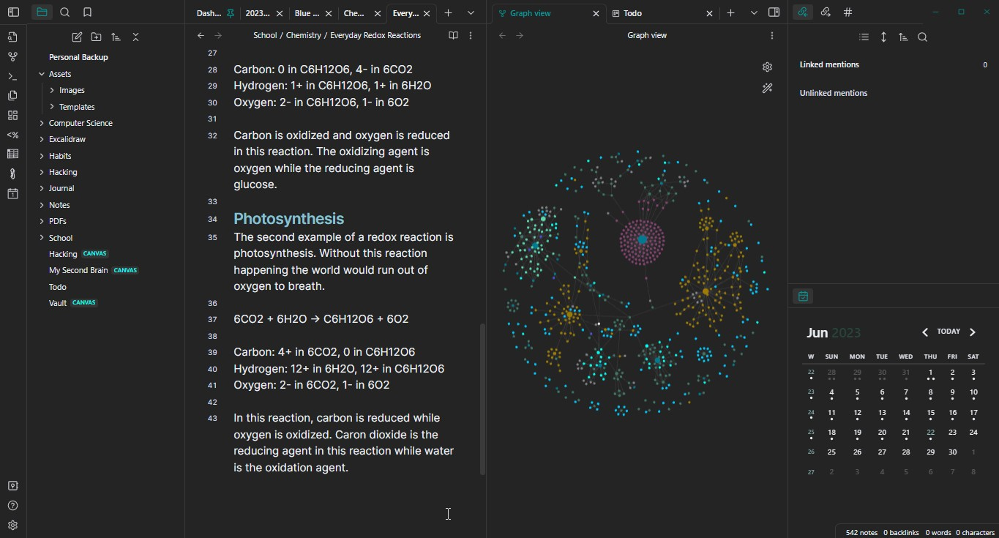
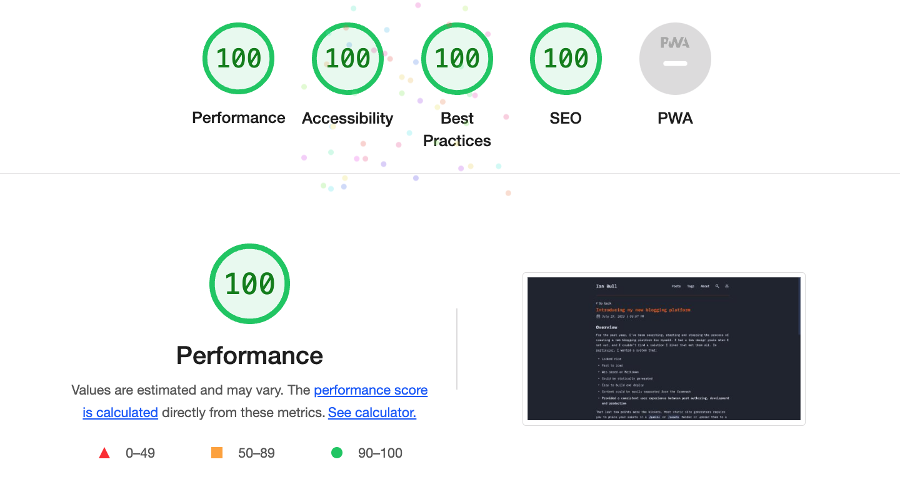

## Table of Contents

## Overview

For the past year, I have been searching, starting, stopping and restarting the process of creating a new blogging platform for myself. I had a few design goals when I set out, and I couldn't find a solution that I liked that met all of them. In particular, I wanted a system that:

- Looks nice and is fast to load
- Is based on markdown
- Can be statically generated
- Easy to build and deploy
- Content can be easily separated from the framewok
- **Provides a consistent user experience between post authoring, development and production**

Those last two points were the kickers. Most static site generators require you to place your assets in a `/public` or `/assets` folder or upload them to a CDN first, meaning common markdown editors couldn't easily reference them. I spend my day in [Obsidian.md](https://obsidian.md/) and I wanted to author my blog posts there too.

## 🧠 Obsidian

If you haven't heard of Obsidian and need to keep track of notes, then Obsidian is the best tool you've never used. Obsidian is a private and flexible note-taking app. It stores all notes on disk in Markdown, ensuring no vendor lock-in. At the least, it’s a great Markdown editor, while at its most, it’s a second brain.

I use Obsidian to write a daily note about the work I complete each day. Additionally, I use it to draft notes/emails, summarize articles I've read, track the work I need to do, and keep fleeting thoughts. It only made sense to use Obsidian to author my blog posts.

To effectively use Obsidian for writing my articles, the entire content of the articles needed to be self-contained. This means that if I referenced an image or another asset in my post, I wanted it to render the same way in:

1. Obsidian
2. A local development server
3. My production blog

I didn't want the entire site in Obsidian, but I wanted to author my blog in the same place where I write my daily notes. Also, by only keeping the content in Obsidian, I could focus more on writing and less on tweaking the website.

## 🚀 Astro Build

Using [Astro Build](https://astro.build/) with the [experimental image assets](https://docs.astro.build/en/guides/assets/), I was able to achieve this.

For those unfamiliar with Astro Build, it's an all-in-one web framework built for speed. Its content-focused, specifically designed for publishing, blogs, portfolios, and documentation sites. It's not designed for building social networks or todo lists.

Astro is a Multi-Page App that is entirely rendered on the server during its build. This means that an Astro site can be deployed to something as simple as an S3 bucket. **Astro is blazing fast**:

Astro supports many common UI component languages, including React, Preact, Svelte, Vue, and others. Because sites are rendered on the server, there is no need to worry about hooks, closures, refs, observables, atoms, reactions, or any other reactive concepts. The platform supports components written in Typescript or Javascript and has a large collection of integrations, including integrations for TailwindCSS, MDX, and automatic image optimizations. There are also a number of [pre-made themes](https://astro.build/themes/). I based my blog off of [Astro Paper](https://github.com/satnaing/astro-paper).

Of course, you can add reactivity if you need it. The developers like to say that Astro Build provides **opt-in complexity**.

## 💻 GitHub And Netlify

I store my blog on [GitHub](https://github.com/irbull/toro) and publish it using [Netlify](https://www.netlify.com/). This is an easy way to build a site, provision a valid certificate, roll back changes, and monitor the site. I can also integrate edge functions and forms in the future.

## Summary

To sum up, the year-long journey to create my ideal blogging platform struck gold with a combination of Obsidian, Astro Build, GitHub, and Netlify. Obsidian, with its private and flexible markdown-based note-taking features, has become integral to my content creation process. The desire to maintain a consistent user experience between post authoring, development, and production led me to Astro Build, an all-in-one web framework which is content-focused and blazing fast, offering ‘opt-in complexity’ and wide-ranging integrations. GitHub has been great for storage while Netlify is my go-to for publishing. This superior, simplifying trifecta of tools has enhanced my efficiency and made the blogging process a breeze. I look forward to creating more content, with greater focus on writing and less on website tweaks, thanks to this setup.

Check it out at [ianbull.com](https://ianbull.com).
