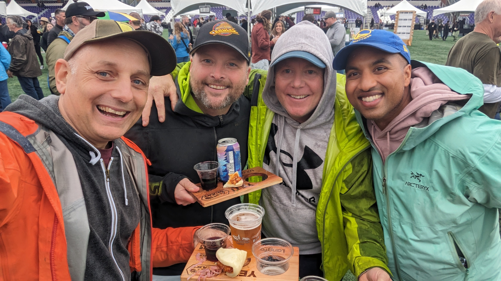

Last weekend, I had the pleasure of attending Brewery and The Beast with my buddies Dave and Jay, and let me just say, it was a carnivore's paradise. Held in the heart of Victoria, BC, this festival is the ultimate celebration of all things meat and beer – a combination that's hard to beat.

**Grill Masters in Action**

The event was a showcase of culinary expertise, with over 50 local chefs from Victoria's top restaurants, including familiar names like Bin 4 Burger Lounge and The Local, wielding their tongs and knives over open flames. It was a sight to behold: whole animal roasts, expertly smoked ribs, and a variety of charcuterie, all prepared right before our eyes.

**Sips to Complement the Grub**

To wash down the smorgasbord of meats, local breweries like Driftwood and Parallel 49 poured their best brews. There was also a fine selection of local wines and spirits, ensuring that for every type of meat, there was a perfect beverage pairing.

**More Than Just Eating**

But Brewery and The Beast isn’t just about stuffing your face with delicious barbecue. It's an educational experience, too. The festival highlights the importance of being conscientious consumers, focusing on locally sourced and responsibly raised meats. It’s a chance to learn about where your food comes from while you're eating it.

**All About the Atmosphere**

The atmosphere at the festival was as vibrant as the grill flames, with live music providing a killer soundtrack to the day. From award-winning artists to local bands, the tunes kept the vibe upbeat and toe-tappingly good.

**The Takeaway**

As the day wound down and we took our final bites of succulent meat, it was clear that Brewery and The Beast isn't just an event; it's a feast for all the senses. Full bellies, happy hearts, and a newfound appreciation for the craft of cooking with fire – it's safe to say we'll be back next year. And perhaps, next time, I'll remember to bring a bigger appetite.
