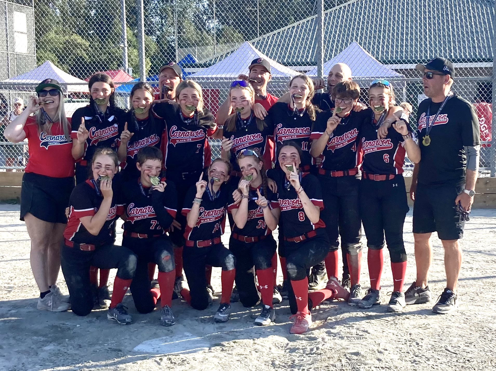
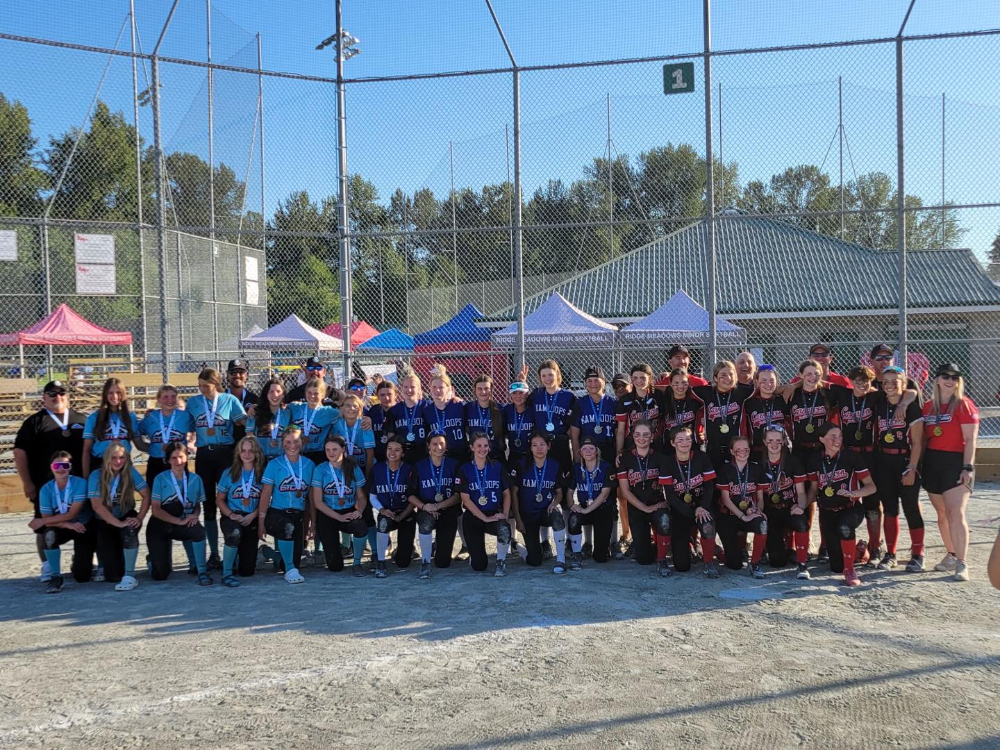

In addition to writing software, managing infrastructure and training large language models, I am also the director of a Softball Associations. This past weekend, one of the teams I help coach, **The Carnarvon Black Ice**, won the Provincial Championship. I'm very proud of the team and wanted to share the news.

The Carnarvon Black Ice, U17C Girls Fastball team went 8-0 on the weekend to win the provincial championship in Maple Ridge. The team went 4-0 throughout the round robin (on Friday and Saturday) and finished atop the standings placing them in the gold pool. The team continued their run on Saturday evening beating the Ridge Meadows Mad Dogs and completed the sweep on Sunday; first beating the West Kootenay Rebels, then the Kamloops Khaos and finally defeating Kamloops again in the gold medal game 8-1.

Carnarvon was a dominant force throughout the entire tournament. They outscored their opposition 67-14. Sadie Bull, Adelle Bergmann and Sophia Mazzoni combined to put out 123 of the 175 batters they faced and striking out 43.

Carnarvon plays in District 1, facing teams from Southern Vancouver Island and the Southern Gulf Islands. Carnarvon went 15-1 in league play, and won the District Championship on June 18th when they defeated Salt Spring Island.

Way to go: Sophia Mazzoni, Sofia Isbister, Sadie Bull, Taylor Wong, Kya Jackson, Jessiah Brehaut, Jessica Wagnor, Jess Ringland, Jailyn Ringland, Hazel Uppal, Daryn Buckham, Cora Neil, Adelle Bergmann, and the coaching staff: Jeff Brehaut, Lorne Neil, Paul Bergmann, Ian Bull and Lisa Rogers.

Special thanks to the hosts, RMMS for putting on such a great tournament, to all the volunteers, officials and of course “The Field Guy” and congratulations to the Kamloops Khaos and Enderby Storm who finished 2nd and 3rd.

You can read more about their remarkable run in the [Oak Bay News](https://www.oakbaynews.com/local-sports/oak-bay-based-fastball-team-sweeps-provincials-8-0-to-win-gold-661213).
