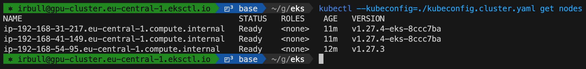
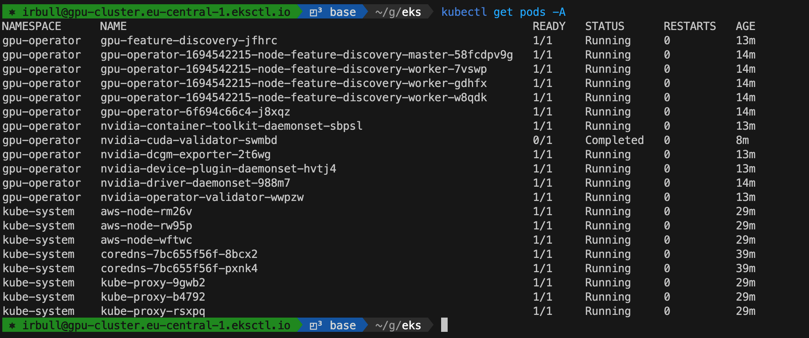
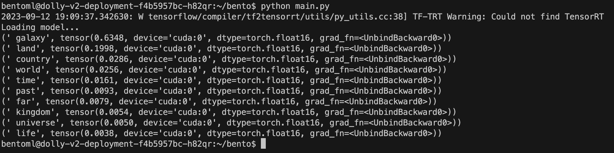

Lately, I've been directing a team involved in refining and implementing Large Language Models (LLMs) to aid patients with [scheduling appointments in the medical field](https://mediform.io/). Most of our software infrastructure operates on Kubernetes. Therefore, deploying the LLMs on the same cluster was an ideal choice.

Large language models (LLMs) are typically deployed on Graphics Processing Units (GPUs). The robust parallel processing ability and matrix multiplication functionalities of a GPU render them highly effective not only for fine-tuning but also for deploying LLMs. Numerous professionals are devoted to crafting highly optimized models that can function on Central Processing Units (CPUs) as well. However, for our current projects, we will maximize the use of NVIDIA GPUs.

In this post, I will share the technical details of configuring a Kubernetes cluster with NVIDIA GPU support. Furthermore, I will demonstrate how I successfully deployed a LLM for text prediction using this cluster. The documentation provided will serve as a comprehensive guide for others looking to replicate this setup and leverage the power of GPUs in their Kubernetes environments.

## Table of Contents

## Setting up the Cluster

There are lots of ways to configure your first Kubernetes cluster, some [harder](https://github.com/kelseyhightower/kubernetes-the-hard-way) than others. If you have never setup a Kubernetes cluster, I would encourage you to follow the [Kubernetes The Hard Way](https://github.com/kelseyhightower/kubernetes-the-hard-way) tutorial as it provides a deep dive into all the aspects that make up a cluster. It will teach you that there is _no magic, just linux_.

I've also configured clusters with [kops](https://kops.sigs.k8s.io/) and [kubeadm](https://kubernetes.io/docs/setup/production-environment/tools/kubeadm/create-cluster-kubeadm/) as well, both excellent choices if you want complete control over your nodes. In this tutorial I'm going to use [EKS](https://aws.amazon.com/eks/), the Managed Kubernetes Service from Amazon.

> If you're a beginner in using AWS, it's necessary to establish an account and manage your AWS security keys. However, guiding you through the process of setting up your AWS account exceeds the limitations of this tutorial.

The easiest way to get started with EKS is to use `eksctl`, a command line tool that interfaces with the AWS API to do all the heavy lifting. A Kubernetes cluster is more than a collection of nodes. A properly configured cluster on AWS includes networking configurations, load balancers, security groups, volumes, monitors, and more. Using [eksctl](https://eksctl.io/) makes this easy.

To setup a cluster with all the defaults, issue the command:

```bash
$ eksctl create cluster --name=cluster-1 --nodes=2
```

I wouldn't recommend creating a cluster with the default settings, as we'll need several custom configurations. However, this should at least ensure that your AWS account is configured to create EKS clusters. Once the cluster is provisioned, you can test it and eventually terminate it.

```bash
$ eksctl delete cluster --name=cluster-1
```

## Creating a Cluster with GPU Support

GPU nodes are typically more expensive than general compute nodes. Since we are running a variety of software on our cluster, it makes sense to provision both GPU nodes for deploying the LLMs and cheaper CPU nodes for other software stacks. To deploy different node types to the same cluster, we will leverage EKS "node groups".

For the NVIDIA GPU workers, we will adhere to the [instructions provided by NVIDIA](https://docs.nvidia.com/datacenter/cloud-native/gpu-operator/latest/amazon-eks.html). In this example, we will deploy an NVIDIA specific AMI image to our nodes. The AMI image is specific to the region in which you wish to deploy the cluster. In our case, we are deploying to `eu-central-1`. For other regions, please find the appropriate AMI image [here](https://cloud-images.ubuntu.com/aws-eks/). For the `gpu-workers`, we will use the `g4dn.xlarge` instance. This is the smallest NVIDIA GPU instance AWS provides.

In addition to the `gpu-workers`, we will also create a `cpu-worker` group using `m5.xlarge` instances. The complete cluster configuration is below.

```yaml
# cluster.yaml
apiVersion: eksctl.io/v1alpha5
kind: ClusterConfig

metadata:
  name: gpu-cluster
  region: eu-central-1
  version: "1.27"

nodeGroups:
  - name: gpu-workers
    instanceType: g4dn.xlarge
    ami: ami-0ff21ec7370b1f3fb
    amiFamily: Ubuntu2004
    minSize: 1
    desiredCapacity: 1
    maxSize: 1
    volumeSize: 100
    overrideBootstrapCommand: |
      #!/bin/bash
      source /var/lib/cloud/scripts/eksctl/bootstrap.helper.sh
      /etc/eks/bootstrap.sh ${CLUSTER_NAME} --container-runtime containerd --kubelet-extra-args "--node-labels=${NODE_LABELS}"
  - name: cpu-workers
    instanceType: m5.xlarge
    minSize: 1
    desiredCapacity: 2
    maxSize: 2
    volumeSize: 50
```

By storing the cluster configuration in a `.yaml` file, we can use version control to manage the changes, and more easily share it with others. To create a cluster with this configuration, use the `-f` argument with `eksctl` as follows:

```bash
$ eksctl create cluster  --config-file=./cluster.yaml --kubeconfig=./kubeconfig.cluster.yaml
```

I've also written the kubeconfig to a separate file since I'm currently managing multiple Kubernetes clusters.

## Validating the Cluster

Provisioning the Kubernetes cluster will take a while, but once it's done you should be able to see the nodes using `kubectl --kubeconfig=./kubeconfig.cluster.yaml get nodes`.



We can see that we have 3 nodes, 2 of them the CPU nodes and 1 GPU node. The GPU nodes have the label `alpha.eksctl.io/nodegroup-name=gpu-workers` and can be listed using:

```bash
$ kubectl get nodes -l alpha.eksctl.io/nodegroup-name=gpu-workers
```

So we don't need to specify the `kubeconfig.cluster.yaml` each time, export the environment variable `KUBECONFIG` as follows:

```bash
$ export KUBECONFIG=./kubeconfig.cluster.yaml
```

In some instances, `eksctl` leaves the GPU nodes with an `uninitialized` taint. This means the Kubernetes control plane will not schedule any work on these nodes until the taint is removed. Now that we're ready to start using these nodes, we'll remove this taint.

```bash
$ kubectl taint nodes -l alpha.eksctl.io/nodegroup-name=gpu-workers node.cloudprovider.kubernetes.io/uninitialized-
```

If your installation didn't set this taint, this command will merely report an error and be treated as a no-op.

## Installing the NVIDIA Operator

Configuring and managing nodes equipped with specialized hardware, like NVIDIA GPUs, necessitates the configuration of various software components, including drivers, container runtimes, and other libraries. The NVIDIA GPU Operator utilizes the operator framework within Kubernetes, simplifying and automating the management of all necessary components to maximize the efficiency of the GPUs.

The NVIDIA GPU Operator can be installed via it's Helm chart with relative ease. If you don't have Helm 3 installed, you can install it using the `get-helm-3` script:

```bash
$ curl -fsSL -o get_helm.sh https://raw.githubusercontent.com/helm/helm/master/scripts/get-helm-3 \
   && chmod 700 get_helm.sh \
   && ./get_helm.sh
```

Once installed, add the NVIDIA Helm repository:

```bash
$ helm repo add nvidia https://helm.ngc.nvidia.com/nvidia \
   && helm repo update
```

Use `helm install` to install the operator. The operator will install itself on all nodes with an NVIDIA GPU. These nodes are identified by the label `feature.node.kubernetes.io/pci-10de.present=true` where `0x10de` is the PCI vendor ID assigned to NVIDIA.

```bash
$ helm install --wait --generate-name \
     -n gpu-operator --create-namespace \
     nvidia/gpu-operator
```

It will take about 10 minutes, but you should see all the pods deployed using `kubectl get pods -A`



## Performing Model Inference on the GPU

Having established a Kubernetes cluster with GPU support, we are now in a position to deploy a container loaded with `python`, `pytorch`, and the necessary transformer dependencies to carry out model inference. Although we plan to delve deeper into model inference in a subsequent blog post, for the time being, we shall merely utilize this miniature python program to load a LLM and predict the succeeding token. This program is designed to load the model in an 8-bit format and position it on the GPU. It showcases ten tokens, providing the probability for each of these tokens.

```python
# main.py
import torch
from transformers import AutoModelForCausalLM, pipeline, AutoTokenizer

print("Loading model...")
model_name = "databricks/dolly-v2-3b"
model = AutoModelForCausalLM.from_pretrained(model_name, device_map="cuda:0", load_in_8bit=True)
tokenizer = AutoTokenizer.from_pretrained(model_name, device_map="cuda:0", load_in_8bit=True)
text = "Long long ago, in a"
input_ids = tokenizer(text, return_tensors="pt").input_ids.cuda()
reps =100
times = []

# Model inference
outputs = model(input_ids)
next_token_logits = outputs.logits[0, -1, :]
next_token_probs = torch.softmax(next_token_logits, -1)
# get the top 10
topk_next_tokens= torch.topk(next_token_probs, 10)
print(*[(tokenizer.decode(idx), prob) for idx, prob in zip(topk_next_tokens.indices, topk_next_tokens.values)], sep="\n")
```

Before we can utilize this program, we need to initiate a Kubernetes Pod on the GPU. I have constructed a Docker image with the required dependencies and uploaded it to DockerHub. Please feel free to use this image, or any other that you may have.

Here is a very simple manifest that can be used to deploy the container to our cluster. The manifest includes a `nodeSelector` to ensure that the pod is scheduled on the `gpu-workers`. There are no resource limits or requests specified, so the Pod will use as many resources as it needs.

```yaml
# manifest.yaml
apiVersion: apps/v1
kind: Deployment
metadata:
  name: dolly-v2-deployment
spec:
  replicas: 1
  selector:
    matchLabels:
      app: dolly-v2
  template:
    metadata:
      labels:
        app: dolly-v2
    spec:
      containers:
        - name: dolly
          image: irbull/dolly:0.2
      nodeSelector:
        alpha.eksctl.io/nodegroup-name: gpu-workers
```

To deploy this manifest, use `kubectl` as follows:

```bash
$ kubectl apply -f manifest.yaml
```

It will take a while to deploy this, as the Docker image is over 10Gb. Once started, you can copy the python program to the pod, and use `kubectl exec` to access the pod and run the script.

```bash
$ kubectl cp main.py dolly-v2-deployment-<unique-pod-id>:/home/b
entoml/bento/main.py
$ kubectl exec -it dolly-v2-deployment-<unique-pod-id> -- bash
```



We can see the 10 most likely tokens to complete the prompt: `"Long long ago, in a"`.

## Conclusion

In conclusion, we have successfully configured a Kubernetes cluster with NVIDIA GPU support and deployed a language model for text prediction. By leveraging EKS and the NVIDIA GPU Operator, we were able to provision GPU nodes and CPU nodes on the same cluster, allowing us to maximize the use of resources. We also demonstrated how to perform model inference on the GPU by deploying a container with the necessary dependencies. This setup opens up possibilities for using powerful language models in various applications, particularly in the healthcare industry where accurate and efficient appointment scheduling is crucial. With this infrastructure in place, we can continue to refine and optimize our language models to better serve patients and healthcare providers.
