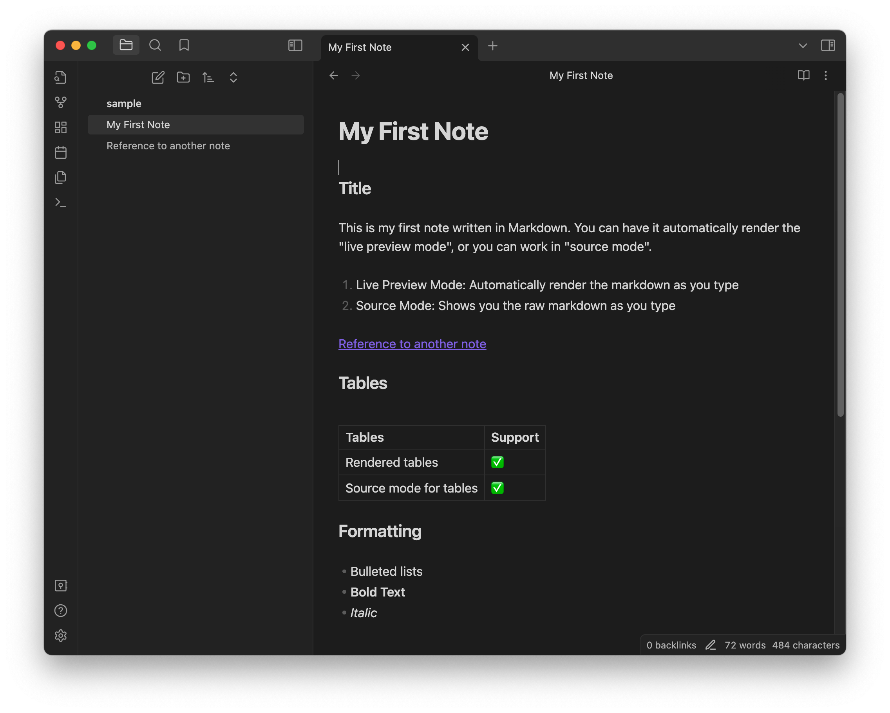

## Table of Contents

## ✏️ Overview

While discussing how and why I [built my current blogging platform](/blog/2023/astro-blog/Astro%20Blog), I mentioned that I spend my day in Obsidian. In fact, I primarily use only five applications and divide my day among them:

1. The terminal (this includes vi, git, kubectl, docker, ssh, aws cli)
2. VSCode
3. Chrome
4. Slack
5. Obsidian

In this article, I'd like to discuss the last one, [Obsidian](https://obsidian.md/).

Obsidian is a note-taking application that runs on your local machine and saves your notes on your local device. All notes are written in Markdown, and Obsidian offers one of the best in-place markdown editor available. It supports note linking, provides a speedy search capability, has a canvas for brainstorming, and offers an extensible plugin model with a vibrant ecosystem. I use nearly all of these features on a daily basis.

## 🚀 Introduction to Obsidian

In October 2021, I assumed the role of [VP of Carnarvon Fastball](https://carnarvon.ca). Suddenly, I had two jobs, and I needed to keep my life organized. I decided to maintain an notebook on my computer to document my activities, thoughts, meeting minutes, to-do items, draft emails and additional notes. I sought a tool that I could store locally, author in plain text (Markdown), and search with ease. After conducting some research, I chose to use Obsidian. In the past 20 months, I have written over 125,000 words across 645 notes.

When you first open Obsidian, you're prompted to create a vault. This is simply the location on your disk where you wish to store your files. You can place them in a Git Repository, a OneDrive folder, an NFS drive, or any location of your choice. After creating a vault, you are ready to start creating notes.



Notes can contain formatted text, images, lists, tables, URLs, and links to other notes. This final point is where Obsidian truly excels. Creating a connected graph of your notes provides an ever-expanding way to work with your thoughts. Additionally, Obsidian provides a built-in graph view that you can use to explore your notes.


Obsidian also has a powerful Command Selector (cmd+p) and a Note Open dialog (cmd+o). These two features provide quick access to everything you need without ever leaving your keyboard.


Obsidian also provides a number of additional features including a search view, bookmark view, link overview, and file navigator. There are hundreds more that can be contributed through plugins.

## 🎨 Plugins and Themes

Obsidian, in its basic form, serves as an extraordinary note-taking application. However, with the inclusion of numerous built-in extensions and access to over 1,000 community plugins, it transforms into a comprehensive productivity tool. Obsidian provides a range of features, including calendars, Kanban boards, linters, and icon kits, all of which can be tailored to your personal requirements. I leverage several plugins and themes to enhance my experience, particularly:

- [Obsidian Theme: Obsidianite](https://github.com/bennyxguo/Obsidian-Obsidianite)
- [Obsidian Banners](https://github.com/noatpad/obsidian-banners)
- [Emoi Toolbar](https://github.com/oliveryh/obsidian-emoji-toolbar)
- [Obsidian Linter](https://github.com/platers/obsidian-linter)

## 📆 My Daily Notes

While I am using Obsidian for ideas and thoughts that I have, the majority of the notes I have are "Daily Notes". These are notes I capture each day to summarize the work I am doing, the problems I encounter, and the solutions I find. From determining the exact moment I first contacted someone about my renovation, to recalling the command I used 365 days ago to rotate the certifications on our Kubernetes cluster, having immediate access to my previous thoughts has been transformative.

In order to facilitate the creation of daily notes in a consistent manner, I have devised a template. I utilize the [Periodic Notes Plugin](https://github.com/liamcain/obsidian-periodic-notes) and the [Calendar Plugin](https://github.com/liamcain/obsidian-calendar-plugin). By selecting an entry from the calendar, a daily note derived from the subsequent template is automatically generated.

```
---
Tags:
Date: {{date}}
---

# ⚡ Previous Notes

# ✅ TODOs
- [ ] Review weekly calendar (Mon)
- [ ] Water plants (Tues, Fri)
- [ ] Weekly report (Fri)
- [ ] Clean office (Fri)
- [ ] Check all 4 email boxes (Lunch time)
- [ ] Exercise
- [ ] Push-up / Sit-up

# 🚀 Work Completed

# 📅 Meetings

# 💡 Ideas

# ℹ️ Important Notes

```

I use the "To-Do" section to ensure that I complete my daily tasks, and I take a few notes in point form in the "Work Completed" section. I fill out other sections as needed, and leave references to other notes. By keeping my daily note open constantly, I can swiftly add links, commands, and other thoughts. Occasionally, I even create a future note with additional "To-Dos".

## 🗓️ Weekly and Monthly Notes

Each week, I create a summary of my notes. I used to do this by hand, but with GPT, I've semi-automated this process. I create a weekly template every Friday that references the daily notes from that week.

```
---
Prompt: Write me a 2-3 paragraph summary of the work I completed this week in the first person. The work completed is below the '# 🚀 Work Completed' section.
---

# 🚀 What Did I Do This Week {{date}}?

# 📅 Daily Notes

- [[{{monday:YYYY-MM-DD}}]]
- [[{{tuesday:YYYY-MM-DD}}]]
- [[{{wednesday:YYYY-MM-DD}}]]
- [[{{thursday:YYYY-MM-DD}}]]
- [[{{friday:YYYY-MM-DD}}]]

```

I have developed a unique [Obsidian plugin](https://github.com/irbull/obsidian-ai-summary/) that compiles all cited notes and employs the power of GPT for brief summarization, guided by the prompt in the front matter. Because each daily note is mentioned in my weekly note, GPT effectively generates a comprehensive summary for me.

I have attempted to list this plugin in Obsidian's plugin list, but it has not yet been approved. If you appreciate the concept, please [feel free to give the PR a thumbs up](https://github.com/obsidianmd/obsidian-releases/pull/1997).

I take these two steps further by summarizing my weekly notes once a month, and finally, at the end of the year, I generate a **Year in Review**.

## Conclusion

Obsidian is an invaluable tool for comprehensive note-taking and organizing tasks. Its wide range of features and flexible plugin model make it adaptable to various work and lifestyle needs. More than just a simple application for digital scribbling, Obsidian excels in creating a connected graph of notes, thus broadening the way we think and work with ideas. With the help of a vast ecosystem of built-in extensions and community plugins, Obsidian extends the bounds of an ordinary note-taking application to a complete productivity tool. My experience with Obsidian shows how it can be tailored to meet personal workflows, track daily activities, and wholeheartedly assist in managing life, tasks and thoughts. Through my use of the app, my work-life balance has significantly improved due to the smooth management of the daily tasks and challenging responsibilities I maintain. Obsidian has transformed my approach to note-taking and effectively revolutionized my productivity habits.
