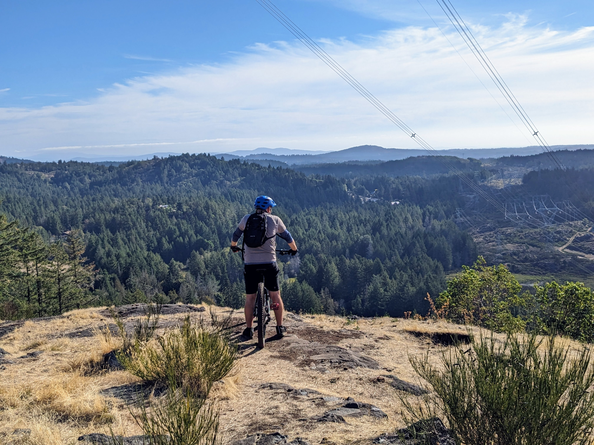

Yesterday's ride was a humbling reminder of the rugged beauty that surrounds us here in Victoria, BC. Tricia and I set out for what turned into a 2-hour journey of both cycling and bike hiking to the summit of Stewart Mountain.

It wasn't all about the cycling; honestly, there were stretches where the incline got the best of our two wheels, and we resorted to pushing our bikes up the trail. It was a real workout, but it's these hills—when you're hiking with your bike in hand, breathing heavily, and pushing forward—that you remember it's not just about the destination.

Reaching the top was a mix of relief and joy. We took our time to enjoy the views, the silence, and the satisfaction of making it despite the challenging paths. The ride down was a fun reward, with the wind in our faces and a sense of accomplishment fueling our smiles.

Here's to the humbling but rewarding experiences that come with exploring our beautiful highlands. Can't wait to share more of these adventures!
