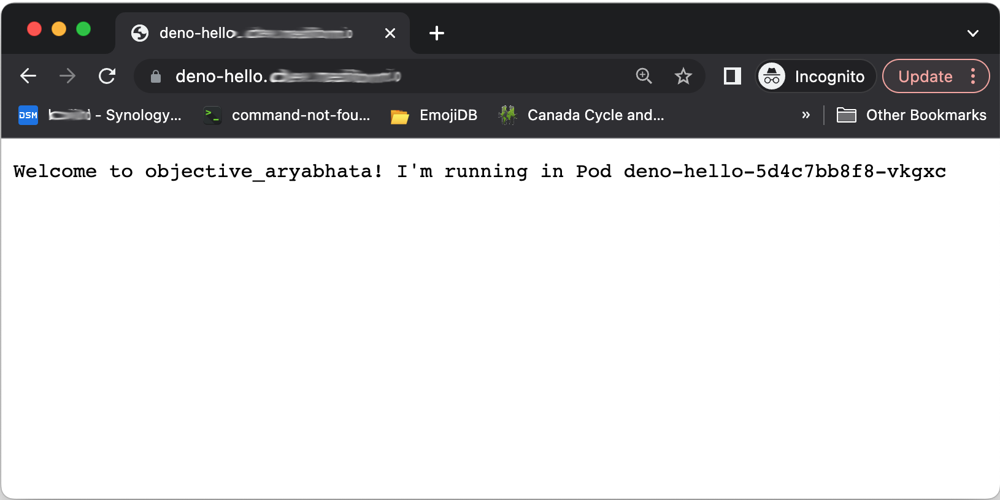

For truly stateful applications, a Kubernetes `statefulset` should be used. A `statefulset` _provides guarantees about the ordering and uniqueness of its pods._ However, many web applications and REST services do not have persistent states and we often use `deployments` to manage these applications.

Nevertheless, certain instances may benefit from instructing the router to direct the same session to the same pod. This allows for the utilization of short-term caches and other session management tools. In this short post, I will demonstrate how to configure a `deployment`, `service`, and `ingress` to use sticky sessions, _a process in which an ingress creates an affinity between a client and a specific pod._

For this example we will use a [Deno server](https://deno.land/) that prints the server name and the pod in which it is running:

```typescript
import * as dockerNames from "https://deno.land/x/docker_names@v1.1.0/mod.ts";
const serverName = dockerNames.generateName();
function handler(_req: Request): Response {
  return new Response(
    `Welcome to ${serverName}! I'm running in Pod ${Deno.env.get(
      "MY_POD_NAME"
    )}`
  );
}
Deno.serve(handler);
```

This example uses the [Kubernetes Downward API](https://kubernetes.io/docs/concepts/workloads/pods/downward-api/) to provide information about the runtime environment to the container.

The application is then packaged in a Docker container so it can be deployed on a Kubernetes Cluster:

```dockerfile
FROM denoland/deno:1.35.3
EXPOSE 8000
WORKDIR /app
USER deno
COPY . .
RUN deno cache server.ts
RUN mkdir -p /var/tmp/log
CMD ["run", "--allow-all", "server.ts"]
```

We will first create the `deployment` and `service`:

```yaml
apiVersion: apps/v1
kind: Deployment
metadata:
  name: deno-hello
  labels:
    app: deno-hello
spec:
  replicas: 5
  selector:
    matchLabels:
      app: deno-hello
  template:
    metadata:
      labels:
        app: deno-hello
    spec:
      containers:
        - name: deno-hello
          image: irbull/deno-hello:latest
          ports:
            - containerPort: 8000
          env:
            - name: MY_POD_NAME
              valueFrom:
                fieldRef:
                  fieldPath: metadata.name
---
apiVersion: v1
kind: Service
metadata:
  name: deno-hello-service
spec:
  type: NodePort
  selector:
    app: deno-hello
  ports:
    - name: deno-hello-port
      protocol: TCP
      port: 8000
      targetPort: 8000
```

And deploy it to our cluster using `kubectl apply -f application.yaml`.

We will then create an `ingress` to route the traffic. This ingress configuration assumes that you have configured the cert-manager to automatically provision a Let's Encrypt Certificate for your host. If you haven't, remove the `cert-manager` annotations.

```yaml
apiVersion: extensions/v1beta1
kind: Ingress
metadata:
  name: deno-hello-ingress
  annotations:
    kubernetes.io/ingress.class: "nginx"
    cert-manager.io/cluster-issuer: letsencrypt-wildcard
    cert-manager.io/acme-challenge-type: dns0101
spec:
  rules:
    - host: "DOMAIN"
      http:
        paths:
          - path: /
            backend:
              serviceName: deno-hello-service
              servicePort: deno-hello-port
  tls:
    - hosts:
        - "DOMAIN"
      secretName: deno-hello-tls
```

Apply this configuration using: `kubectl apply -f ingress.yaml`.

If you connect to your host using a web browser, it will show a different server name each time. This is because there are 5 replicas of the `deno-hello` Pod running, and the cluster is free to choose whichever one in wants. By default it will use a round-robin strategy.



To enable sticky sessions, we can annotate the ingress. The annotation will utilize session cookies to enable pod affinity.

```yaml
nginx.ingress.kubernetes.io/affinity: "cookie"
nginx.ingress.kubernetes.io/session-cookie-name: "deno-hello-cookie"
nginx.ingress.kubernetes.io/session-cookie-expires: "172800"
nginx.ingress.kubernetes.io/session-cookie-max-age: "172800"
nginx.ingress.kubernetes.io/ssl-redirect: "false"
nginx.ingress.kubernetes.io/affinity-mode: persistent
nginx.ingress.kubernetes.io/session-cookie-hash: sha1
```

Add these annotations to the ingress annotations and reapply the ingress configuration. Now, if you connect to your host from the same browser window, it will always route the same session to the same pod.

All the code used in this example is available on [GitHub](https://github.com/irbull/k8s-sticky-example).
