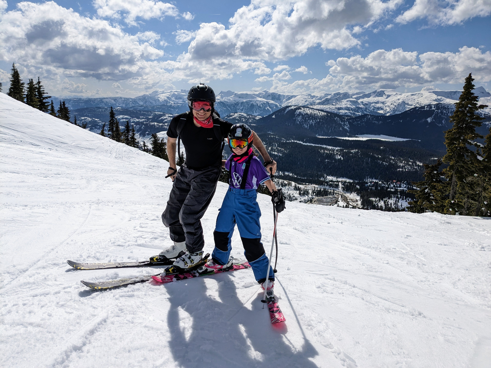

What a day to remember! The entire clan hit the slopes at Mount Washington yesterday, and let me tell you, it was a sun-drenched adventure from start to finish.

**Morning Layers and Misty Breath**

We started the day bundled up as if for a polar expedition, the morning chill convincing us we needed all those layers. As we carved our first tracks, the mountain welcomed us with open arms, and the promise of a brilliant day was clear as the sky above us.

**Maggie Takes the Lead**

Our youngest, was the star of the show, zipping down the slopes with a fearless joy that only a child knows. She was in her element, and it wasn't long before she was leading us down her favorite runs, her laughter ringing out like a bell in the crisp mountain air.

**Shedding Layers Under the Alpine Sun**

By noon, we were peeling off layers faster than a speed skier shreds down the mountain. The sun was relentless, and soon our winter gear was replaced by the casual comfort of T-shirts – a rare but welcome attire for a ski day.

**Afternoon Runs in Tees**

Skiing in T-shirts isn't something you get to do very often, but today was an exception. There’s a unique kind of freedom that comes with swooshing down the slopes, feeling the sun warming your back – it’s liberating and a bit cheeky.

**Cooling Down as the Sun Did**

As the sun began its descent, it took the day's warmth with it, reminding us why we had packed all those layers in the first place. We ended our day with a beautiful sunset that painted the sky in shades of orange and purple, a perfect curtain call for our spring ski session.

**Final Thoughts**

It’s days like these, skiing with my family under a clear blue sky, that really stick with you. When life gets busy, it's memories like skiing in T-shirts with my wife and daughters that I’ll look back on and smile.

Stay tuned for more family adventures where the sun and the snow meet!
