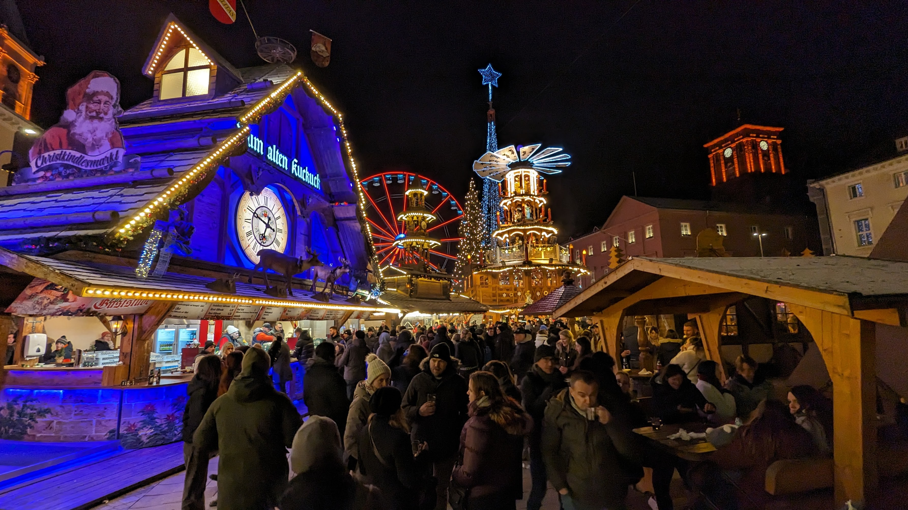
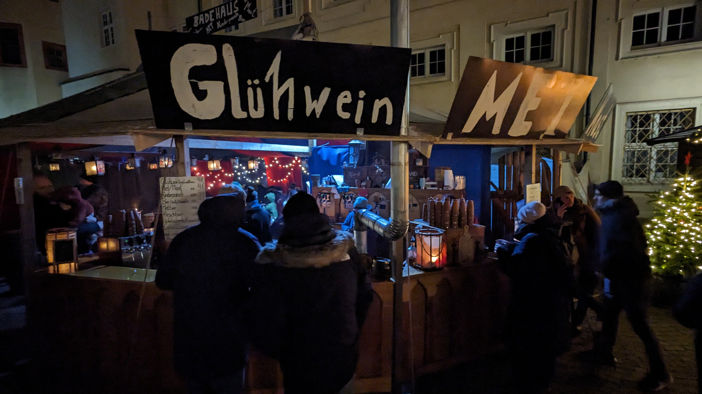
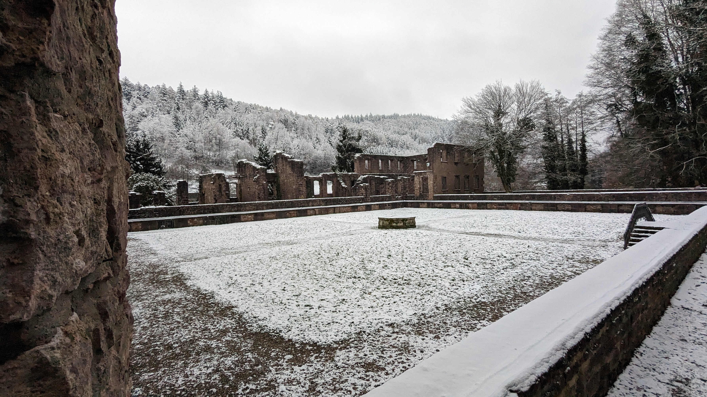
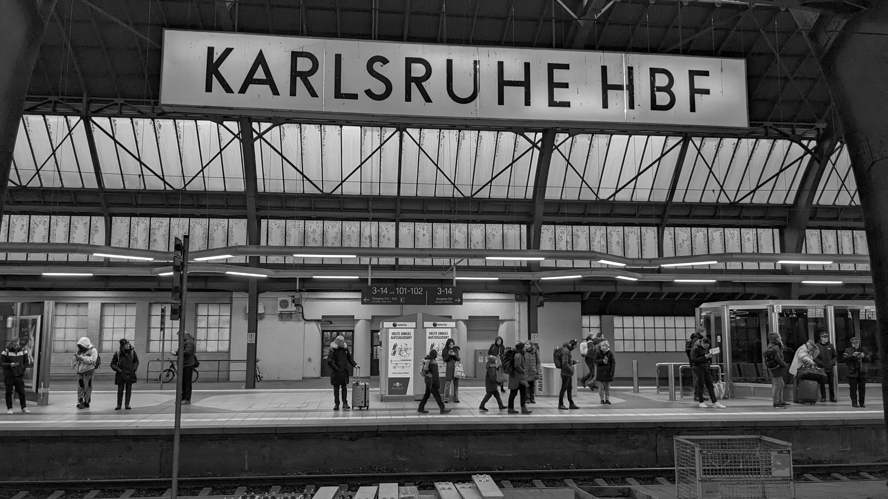

Recently, I had the fantastic opportunity to combine work and wanderlust on a trip to Karlsruhe, Germany. This visit was a blend of traditional German Christmas markets, a touch of medieval history in Durlach, a refreshing hike in the Black Forest, and some significant strides in AI development for [MediForm](https://mediform.io/).

**Magical Markets and Medieval Merriment**

Karlsruhe's Christmas markets were a wonderland of festive joy. Each market had its own unique flavor, but all were united in their twinkling lights, the aroma of spiced Glühwein, and the warmth of bustling crowds. The highlight for me was enjoying Glühwein, a traditional hot mulled wine, which truly embodies the spirit of German Christmas.

A short trip to Durlach brought me to a medieval market, a step back in time with its historical ambiance. Here, I savored mead, an age-old drink, amidst the backdrop of artisans and performers, bringing centuries-old traditions to life.

**Hiking Through the Black Forest**

An escape to the legendary Black Forest provided a much-needed respite from the bustling city. The dense woods, misty trails, and serene landscapes were therapeutic. It was a refreshing change of pace – a moment to recharge and reflect amidst nature’s tranquility.

**Advancing AI in Germany**

The core purpose of my trip was work-related, focusing on the AI Inference Engine for MediForm. My achievement in building rust bindings for Llama.cpp marked a significant milestone in the project. This advancement is a step forward in streamlining AI processes, enhancing our capability to deliver more efficient and powerful solutions.

**Teamwork and Fun Times**

The trip wasn't all work and no play. Spending time with my co-workers in a setting outside the office strengthened our bonds. Our nights out in Karlsruhe were filled with laughter, good food, and the shared experience of exploring a new culture together. These moments of camaraderie were as valuable as our work sessions, where we collectively pushed the project forward, achieving more than we could individually.

**Reflections on a Memorable Trip**

As I look back, this trip to Karlsruhe was a perfect blend of work and leisure. It reminded me how travel can enrich our professional lives, not just by providing a change of scenery but by offering new perspectives and inspirations.

Until the next adventure
