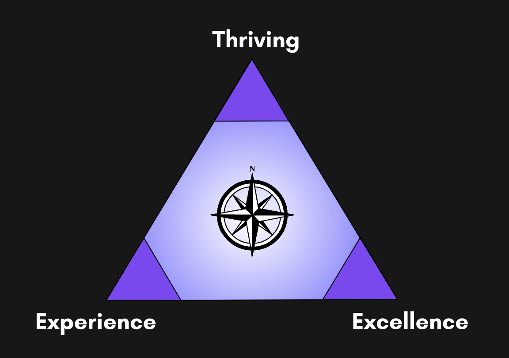

Today I had the pleasure of attending the [Bridges Summit](https://www.bridges-summit.org/), a meetup aimed at collaborating, exploring, and distilling practical wisdom related to Experience, Thriving, and Excellence.

The online summit brings together researchers, practitioners, and thought leaders into a one-of-a-kind space designed to brainstorm new ideas, spur discussion, and help the audience move from _surviving to thriving_.

The event started with an excellent talk by [Max Kanat-Alexander](https://www.linkedin.com/in/mkanat/) in which he outlined motivations within engineering leadership and the _challenges with adopting research ideas in industry_. Max outlined that while researchers may often assume that data is the primary driver for most people, this may not be true in general and data might not even tip the scale. Specifically, Max discussed the following motivations:

- Emotion
- What's best for my direct reports
- What my manager wants
- My opinion leader
- My personal cause
- Personal gain (money, status, power)
- Data

After the presentation, we had a chance to join _virtual tables_, using [Spatial Chat](https://www.spatial.chat/). Each table was given a [Miro Board](https://miro.com/) which they could use to brainstorm ideas and discuss their experiences. Spatial Chat is a powerful platform that combines multimedia into a two-dimensional space. Participants are able to see who is around them and directly communicate with those closest to them. Spatial Chat enables breakout groups, hallway tracks, and small group sessions while easily allowing everyone to join larger keynote sessions and presentations.

After 30 minutes of table discussions, each group brought their most interesting ideas back to the _garden_ for everyone to see. Small groups of participants were able to gather around the ideas and discuss them further.

The session wrapped up with a short panel discussion and some final thoughts by Max.

Thank you Max and [The Chisel Group](https://thechiselgroup.org/) for hosting a wonderful event.
