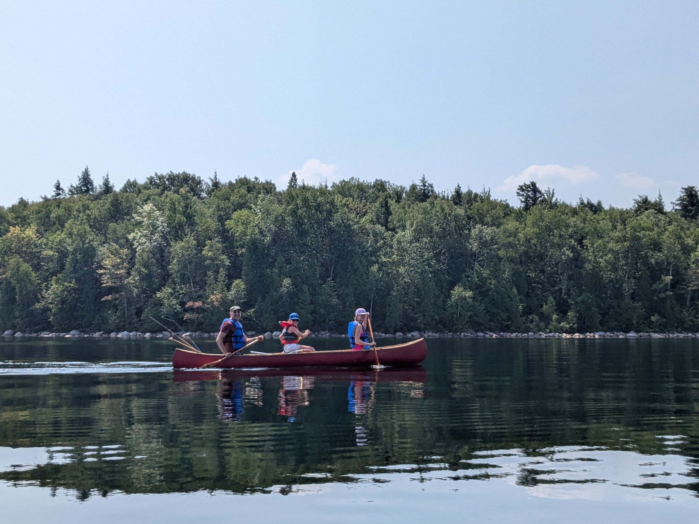
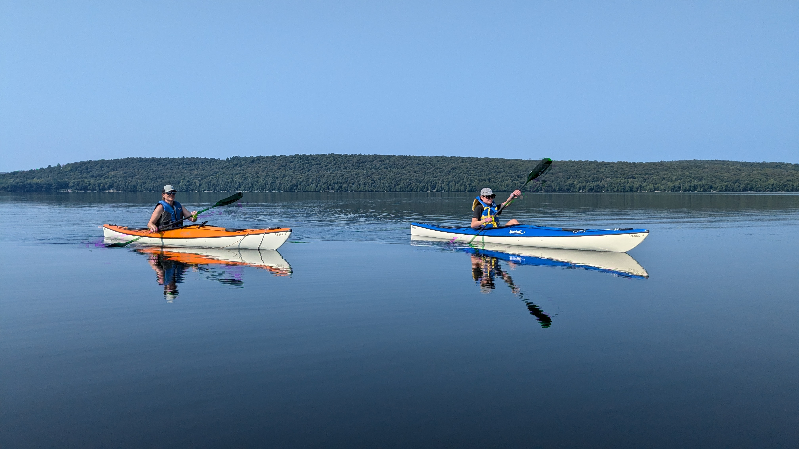
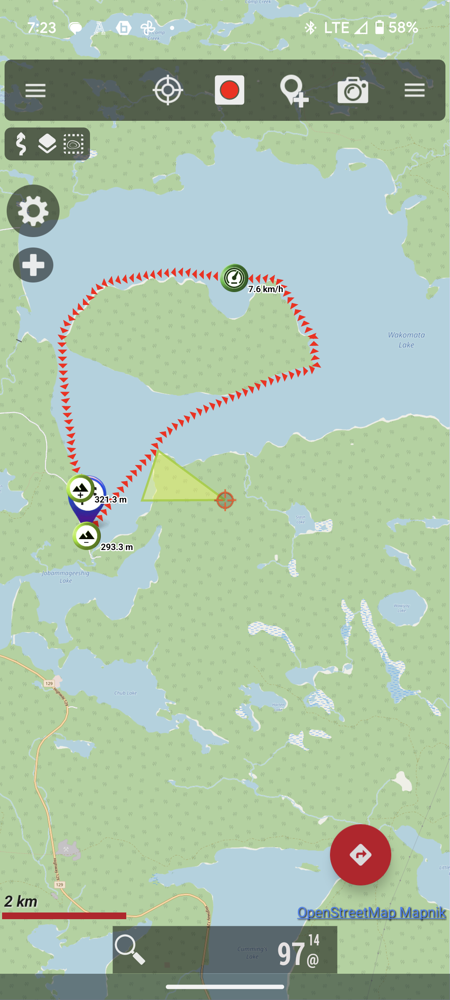

While we live on the West Coast in Victoria, BC, both my wife and I are originally from Ontario. Each summer, we take the family back to Ontario and spend at least one week **at camp**. In Southern Ontario, folks often refer to a cabin by the lake as "a cottage"; but in Northern Ontario, this same place is often called "[a camp](https://www.cbc.ca/news/canada/sudbury/northern-ontario-dialects-1.6513559)".

My in-laws own a camp north of Blind River on the Chapleau Highway (Highway 129), located on Wakomata Lake. Wakomata Lake spans over 6,000 acres and features a large island at its center. There are two small businesses that rent out cabins on the lake: [Snowshoe Camp Resort](https://snowshoecamp.com/) and [Wakomata Lake Cottages](https://www.wakomatalakecottages.com/). Besides these cabins, there is also a handful of privately-owned camps, including the one owned by my in-laws.

I built a canoe in my 20s, and I haven't managed to ship it to Victoria, so it lives at camp. This year, Tricia and I and our three teenage children decided to take the canoe and paddle around the island.

After a lazy morning of sipping coffee on the dock, we decided to wake up the teenagers, pack a lunch, and by 10:30 a.m., we were all on the water. Tricia and Sadie took the kayaks, while Lily, Maggie, and I took my canoe.

While Wakomata is known for the large winds that can blow, this was an unusually calm morning. We left the dock and went straight across the open water to the island. We continued along the shore of the island, heading east. Once we hit the tip of the island, we pulled into shore for a snack. We know this part of the lake well, as we often fish at this spot. Lily caught a beautiful bass here yesterday.

The kids went for a swim, and we had a light shore lunch; by 12:30, we were back on the water. We decided to continue around the island instead of returning back the way we came. We followed the shore of the island west towards the public boat launch. Off the westernmost tip of the island, the water is very shallow. At one point, the island was connected to the mainland here, but Ontario Hydro dammed up the lake in the '50s, raising the water level.

We passed by Wakomata Lake Cottages and headed south back to camp. The total trip was 13.65 km, and it took us just under 4 h (2 h 35 m moving time). The kids were pretty tired when we got home, but after 25 years of visiting camp, this was a trip I always wanted to do.
