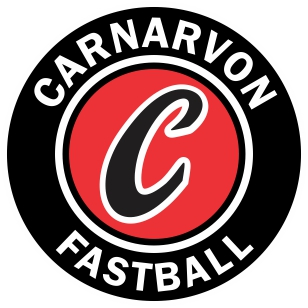

Carnarvon Fastball had another successful year both on and off the field. Five of our teams were classified as LTP, and the other five teams played in tournaments across the South and Mid Island. From those five teams, Carnarvon earned medals in three championships: Our U13 team finished 3rd (Bronze) at the Regional (Island) championships. Our U11C team won a silver medal in the black pool at the Celebration of Softball, and the U11B team won the gold medal at the SVI District Championship.

Our registration numbers were up this year with 104 players.

As the fastball diamond at Firefighters Park can only accommodate about 8-9 teams, we had to utilize several other backstops around town, especially for our younger players. I want to thank David Godfrey and Anisa Montgomery for organizing our registrations and Geoff Welham for organizing our coaches.

We also trained and employed 11 youth umpires (and 3 senior umpires). This is one of the larger umpire groups in the city. Fastball is required to supply umpires at all their home games, and many other clubs contacted us when they didn’t have umpires. Over $2,500 was invested into our community through the employment of youth umpires. I want to thank Lorne Neil for organizing our umpires.

Carnarvon Fastball continues to support younger players from around the community. More than 50% of our registrations were for players under 11 years old. We will be offering winter clinics this year for U9, U11, and U13/U15 teams. Clinics are offered when parents/coaches offer to organize them. I want to thank Jane Kucherawy for helping to organize Fall fastball and Ryan Davis for organizing all our equipment.

After ten years of involvement with Carnarvon, and three years as the VP of Softball, I am stepping down from this role. I will stay on the board as a "Director-at-Large: Past Director of Softball" to help with the transition. Thank you to everyone who has helped make this program such a great success over the years. I've had a chance to help with other clubs as well, and we have something very special here at Carnarvon Softball. We are small enough not to drown in bureaucracy yet big enough to create a competitive, successful program. On the field, the highlight was winning the Provincial Championship([[carnarvon-champions]]) last year; off the field, it was working with all the great parents and their wonderful children.
