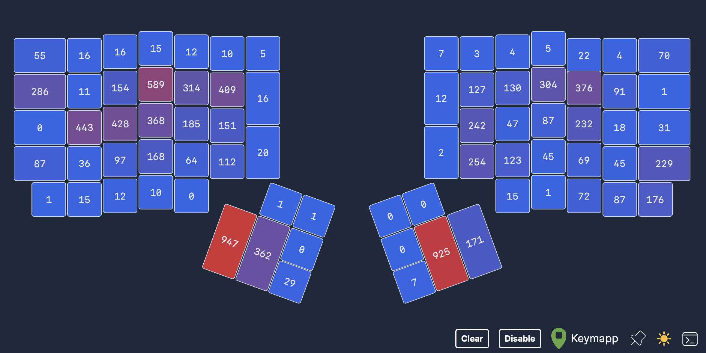
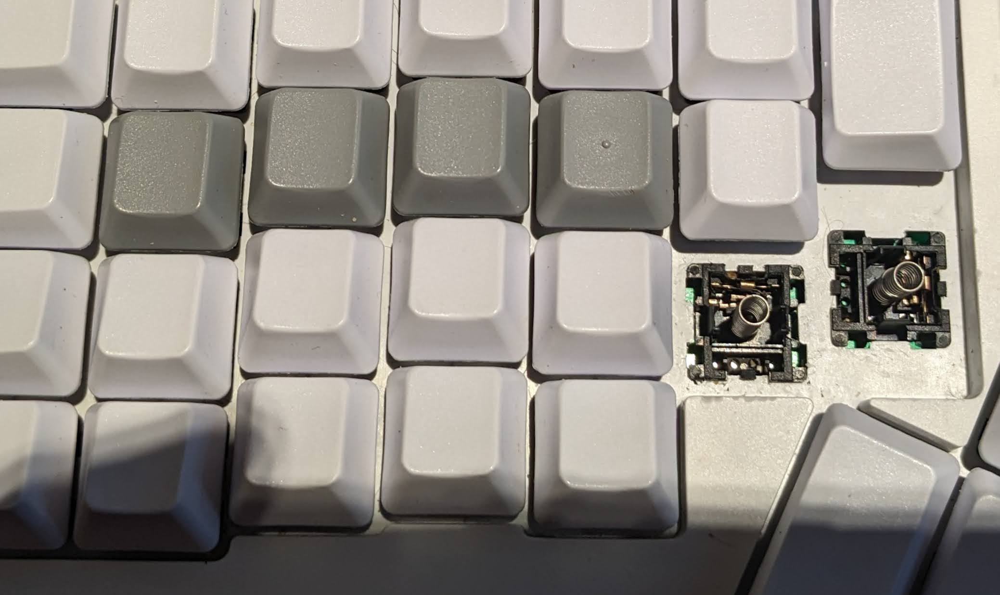
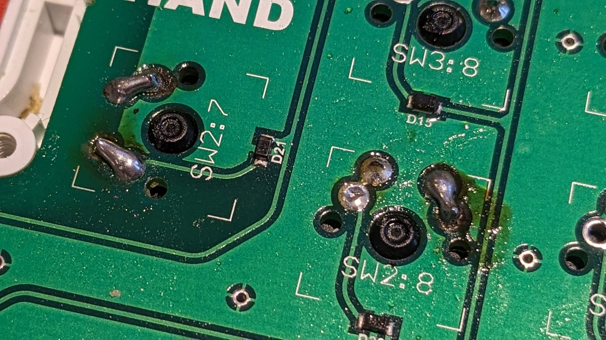
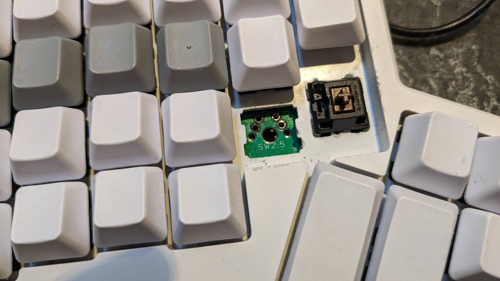

I spend a lot of time hacking on things. I go through cheap keyboards like a child goes through packaging on Christmas morning, and my wrists hate me for it. In 2017, I decided to invest in an ergonomic mechanical keyboard. I chose the [ErgoDox EZ](https://ergodox-ez.com/) because the split keyboard allowed me to position my hands in line with my shoulders, and I could move it throughout the day. I knew I could build the keyboard myself and save some money, but I also knew it would take me a while to finish the build, and my arms were desperate for relief. The customizability of the order and the direct shipping made this purchase a no-brainer.

For six years, the keyboard has been a workhorse. The online configurator allows me to customize the keyboard for my use. I have experimented with custom layers for VSCode, Obsidian, and Excel. The recent [Keymap](https://www.zsa.io/flash/) app has a Heatmap feature that allows me to see which keys I use the most and how I can optimize my layout.

In November, I decided to clean my keyboard and I pulled a bit too hard on two of the keycaps and pulled the key right out.

This led me through a wonderful journey with the tech support at [ZSA](https://www.zsa.io/).

At first, I thought I was destined to buy a new keyboard. Maybe, I thought, I could buy half a keyboard, so I emailed the support team at ZSA and Robin convinced me to try fixing the board myself. Robin has a great post on how to [desolder and replace a switch](https://blog.zsa.io/robins-repairs-replace-switch/). I had a soldering iron and decided to get a solder sucker to make it easier to remove the key.

I ordered a batch of new Cherry MX Browns. Everything arrived shortly after Christmas, giving me a small project to work on during the holidays.

Today I get to start 2024 with a clean and working ErgoDox.
