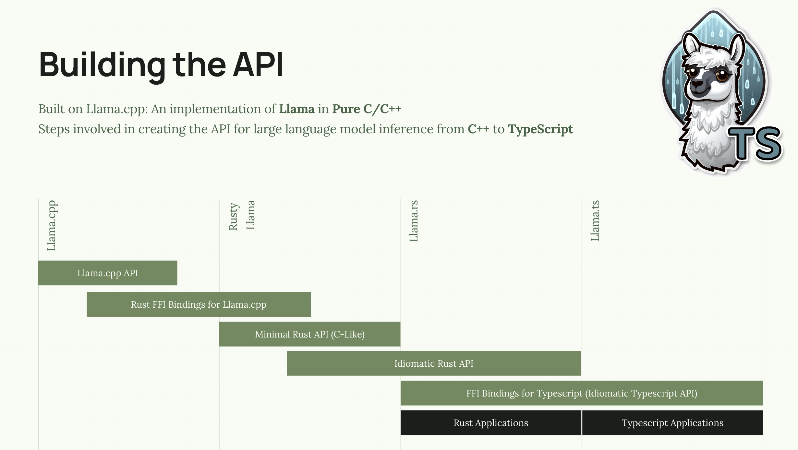
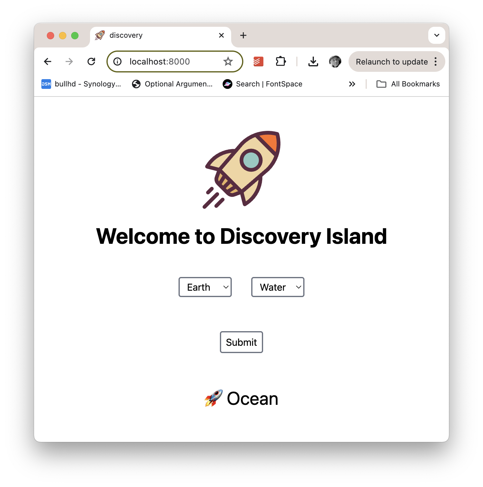
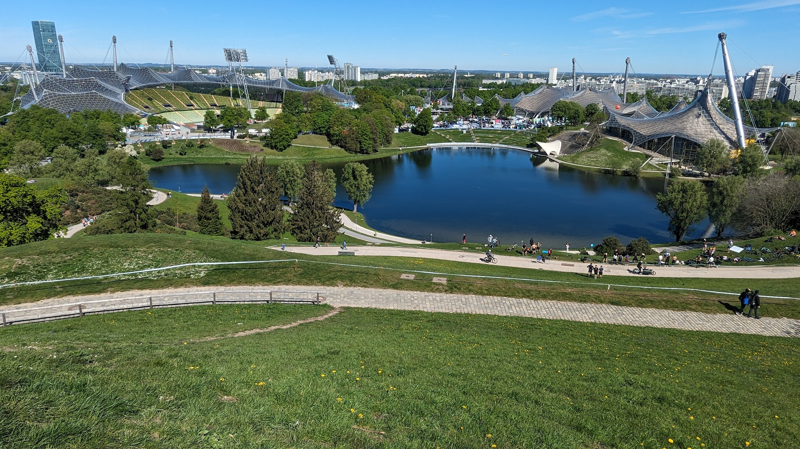

In late April, I had the pleasure of visiting Germany for 10 days. I spent time at our HQ in Karlsruhe, Germany, and attended an AI Summit in Munich. In Karlsruhe, I continued my work on [Mediform](https://mediform.io/), our AI-based medical reception desk. For the past year I've been leading the Mediform AI team and developing our inference server. While in Germany, I also attended a Bundesliga 2 game between KSC and Hertha BSC, as well as a number of other social events with the team.

At the AI Summit In Munich, I presented two talks and helped run a workshop aimed at model inference. In the first talk, I presented Llama.ts, a platform that integrates [Llama model inference](https://github.com/ggerganov/llama.cpp) with [Deno](https://deno.com/). In the second talk, I explored how we use AWS GPU nodes and Kubernetes to scale our AI solution.

## Local LLM Inference with Web APIs

Designing and building systems that make use of a Large Language Model is a complex tasks. Most platforms are designed around Python and assume access to a powerful GPU. This setup works well during the prototype stage, where researchers want to iterate quickly and have the hardware in the lab. However, during development, when reproducible builds are crucial and developers need to iterate quickly on their MacBooks, this setup isn't ideal.

To help increase developer productivity, I asked the question, _What if we could put local LLMs in the hands of web developers?_ More specifically, **I drew inspiration from Deno and Llama and explored a vision to build an API for Large Language Model Inference, combining the power of Llama with TypeScript Web APIs.**

I used [Llama.cpp](https://github.com/ggerganov/llama.cpp) as the kernel and using [Bindgen](https://github.com/rust-lang/rust-bindgen), I generated a set of Rust bindings for the API. I then created a thin Rust API that handled the `unsafe` calls and pointer arithmetic required to interface with the C++ API (I called this Rusty Llama). From there, I built an idiomatic Rust API called Llama.rs that provides a higher-level API for working with Large Language Models. Llama.rs includes functions to help manage the context window, perform grammar-based generation, and support different sampling techniques.

Armed with Llama.rs, I built a dynamic library and a set of Deno FFI bindings that allow access to the Llama Inference APIs from Deno. We could probably build Node.js bindings from this stack as well.

Since Llama.cpp is designed to leverage CPU and Mac Metal as well as GPUs, this setup enables us to use our developer machines as well as existing stacks (Express, npm, JSR, Web Streams, Fetch, Serve, etc.) to build systems that include LLMs. I even built a small game using Deno Fresh backed by a Large Language Model for content generation.

The game, called **Discovery Island**, starts with a few basic elements (Water, Earth, Fire, Wind, Plants) and allows the user to pick two and create a new word. The LLM is responsible for _thinking up a noun that combines the two selected elements_. If nobody else has _discovered_ that noun, it's added to the list. We use the Deno KV Store to store the discoveries and Deno Fresh for the UI. The entire application was fewer than 100 lines of TypeScript.

In Mediform, we use a technology stack based on Llama.ts to serve our custom models. Our models are fine tuned Llama models aimed at medical reception desks.

## Llamas, Clusters, GPUs and **All That Jazz**

In my second talk, I described how we designed our Kubernetes cluster to scale GPU nodes for hosting our custom 7-billion-parameter large language model. The key to our setup is something we call **Scale to Zero**, which allows us to scale our model inference servers down to zero for specific models, enabling the Kubernetes AutoScaler to completely turn off unused GPU nodes. We use both time-based and load-based criteria to scale our nodes to meet the needs of our users.

Each GPU node group is configured with the [Nvidia GPU Operator](https://docs.nvidia.com/datacenter/cloud-native/gpu-operator/latest/index.html), which automatically configures the node at startup with the required drivers. Once configured, the node is flagged with the `nvidia.com/gpu` resource. This allows our Deployments and StatefulSets to request GPU resources and only start once the node is ready.

We built our cluster using EKS and used a combination of `g4dn` and `g5` nodes, both of which have an Nvidia GPU (T4 and A10). These are not particularly powerful GPUs, and unfortunately, Amazon charges a ridiculous on-demand price. However, Amazon also provides the rest of the network infrastructure (storage, DNS, load balancers, VPNs, etc.) that we need to run a scalable web application. Moving forward, we may consider a hybrid model with self-hosted GPUs and AWS infrastructure.

## Conclusion

I had a great time during my 10-day visit to Germany. It was great to reconnect with several old friends at the AI Summit and hack on my Rust/TypeScript-based LLM inference server with a few colleagues. On my last day, I enjoyed touring the Olympiastadion in Munich before catching my flight back to the West Coast of Canada.

[My slides for both talks are available on pitch.com](https://pitch.com/v/ai-building-an-api-for-large-language-model-inference-wmtxt9)

