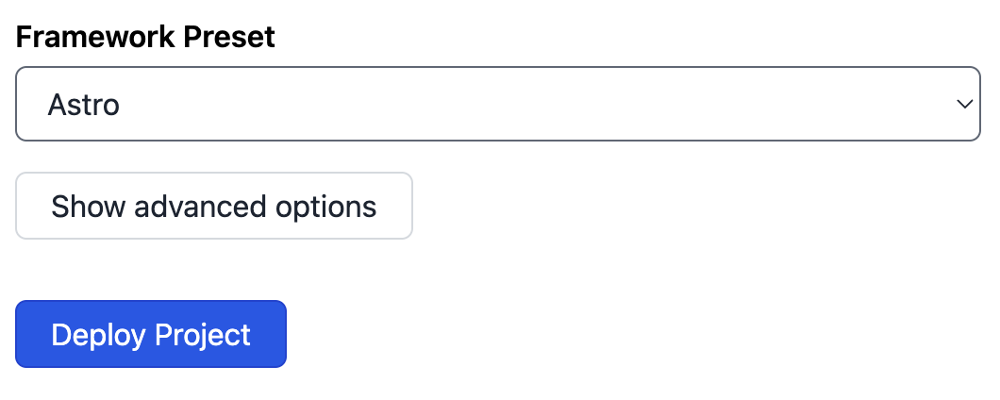
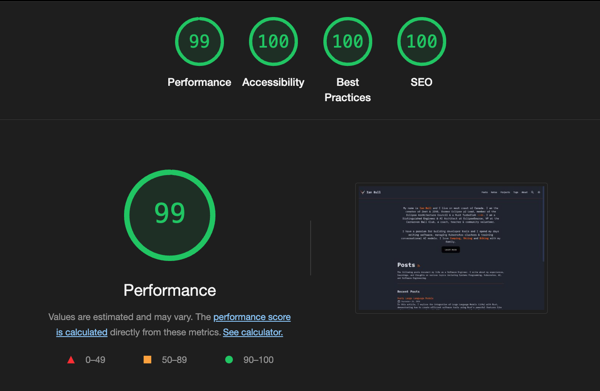
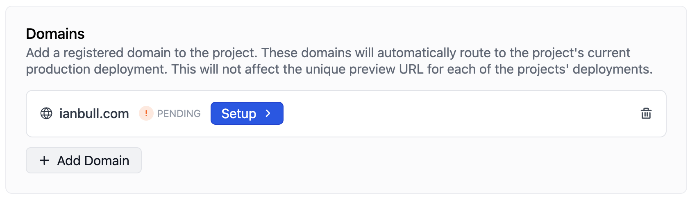
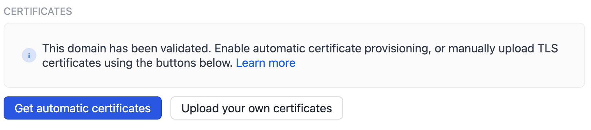

I recently moved my personal Astro-based website from [Netlify](https://www.netlify.com/) to [Deno Deploy](https://deno.com/deploy). Initially, the site was purely static, making deployment on Netlify a breeze. However, I'm planning to introduce some dynamic elements, prompting the switch to Deno Deploy for a better fit. Migrating the static site wasn't entirely smooth; several issues cropped up along the way. I'll delve into those challenges below.

[Astro](https://astro.build/) is a fantastic web framework for content-rich sites like blogs. It delivers lightning-fast page loads by pre-rendering all pages, eliminating the need for a compute server or JavaScript to display content. Astro also integrates effortlessly with popular UI frameworks like React, Vue, Preact, and Svelte.

Deno Deploy offers a seamless way to host JavaScript applications without the hassle of managing servers. When I started a project, I noticed "Astro" listed under Framework Presets. This got me excited—just link it to my Git repo, and let Deno Deploy work its magic.



Deno Deploy set up the Git hooks for my site and tried to launch it, but the deployment failed—no entry point:

```bash
Run denoland/deployctl@v1
Project: ianbull-toro-36
Error: Failed to open entrypoint file at 'file:///home/runner/work/toro/toro/dist/server/entry.mjs': ENOENT: no such file or directory, lstat '/home/runner/work/toro/toro/dist/server/entry.mjs'
```

## Servers & Adapters

[Deno Deploy can host static files](https://deno.com/blog/deploy-static-files), but you’ll need to create your own server to serve them—something Netlify handles for you. Building a fully static site with a small Deno server felt excessive, especially with Astro's server integration available. The Deno team offers a handy guide on setting up [Astro on Deno Deploy](https://deno.com/blog/astro-on-deno).

To use Astro on Deno Deploy, the team suggests using the following configuration:

```js
export default defineConfig({
  output: "server",
  adapter: deno(),
});
```

This presumes you're aiming for a fully dynamic setup, delivering all pages on-the-fly, which was not exactly what I wanted as the benefits of Astro really show when using it to generate a (mostly) static site. If I wanted a fully dynamic site, I would have likely gone with [Deno Fresh](https://fresh.deno.dev/).

Furthermore, this failed, as there are some generated [OG Images](https://ogp.me/) that rely on [`resvg-js`](https://github.com/yisibl/resvg-js), a Node module that doesn't run on Deno Deploy due to native dependencies. Instead of a fully dynamic site, I really want a _hybrid_ approach, where the static content can continue to be statically generated during the build, and the dynamic content can make use of a Deno backend.

## Hybrid Astro

When migrating to Deno Deploy, my goal was to keep the site primarily static while incorporating dynamic capabilities where needed. This is where the "hybrid" approach comes in. Astro excels at generating static content during build time, ensuring fast page loads and top-notch performance. However, for parts of the site that require dynamic updates or server-side processing, such as API endpoints or user-specific content, a serverless backend like Deno Deploy proves invaluable.

### Astro's Output Configuration

The hybrid approach relies on adjusting Astro's output configuration to use server-side functionality only where needed. The configuration I settled on specifies:

```typescript
export default defineConfig({
  output: "hybrid",
  adapter: deno(),
});
```

This setup ensures that most of the website is still pre-rendered at build time for fast page loads, while dynamic pages or features are rendered on-demand using Deno Deploy’s serverless backend. This approach retains Astro's core advantage—static site speed—while adding dynamic capabilities where needed.

### The Balance Between Static and Dynamic

In my case, I aimed to keep the bulk of my content, like blog posts and informational pages, completely static. These pages are pre-rendered for speed and hosted on Deno Deploy's globally distributed edge servers. For content that requires frequent updates or interactivity, such as forms, API-driven features, or personalized experiences, I introduced server-side logic.

### How It All Comes Together

The hybrid model allowed me to make the most of Astro while incorporating dynamic elements, all without a complete re-architecture. Rather than going fully dynamic and adding unnecessary server overhead or staying entirely static and sacrificing flexibility, this approach strikes the right balance:

- **Static** where possible for fast, lightweight pages.
- **Dynamic** where necessary, allowing for live data, personalized experiences, and more interactive features.

One part that tripped me up was 404 pages. When a 404 is returned, Deno Deploy will use the contents of `404.html` to fill the body. However, this resulted in the server re-entering Deploy to fetch the content and a `508 Loop Detected` error was returned instead. The suggestion was not to pre-render the 404 pages.

`export const prerender = false;`

I’m quite pleased with the result. Pages load with the speed you'd expect from a fully static site, while dynamic components like API calls are handled seamlessly by Deno Deploy, taking advantage of server-side processing without the extra overhead.



## Configuring the DNS

Configuring a DNS and Certificate with Deno Deploy is incredibly simple. You add your domain to the list of domains and select `Setup`.



The Deno Deploy Dashboard will provide you with a list of DNS Records you'll need to configure. Add these records to your DNS configuration. Once you've completed that, simply press the "validate button". Deno Deploy will even provide you with TLS Certificates issued by Let's Encrypt.



In addition to the apex domain, I also added a domain for `www.ianbull.com`.

## Dynamic Content

Running a content-rich Astro website on Deno Deploy doesn't really make sense if there is no need for server-side endpoints. If the entire site can be statically generated, then bundling a server seems like a make-work project. However, if some server-side endpoints are required, then Deploy is an excellent choice. The out-of-the-box TypeScript support, services such as [Deno KV](https://deno.com/kv) and [Deno Queues](https://deno.com/blog/queues), and a globally distributed edge network make Deno Deploy an ideal platform for deploying websites that could benefit from a distributed compute network.

I created a small API that returned the current time on the server:

```typescript
import type { APIRoute } from "astro";

export const prerender = false;
export const GET: APIRoute = () => {
  const currentTime = new Date().toISOString();
  return new Response(currentTime);
};
```

Because we are using `hybrid` rendering, we need to set `prerender = false;` otherwise this will be generated once and never built again.

We could then use this endpoint in our components (I'm currently using **Preact**).

```tsx
import { useEffect, useState } from "preact/hooks";

export default function ServerTime() {
  const [serverTime, setServerTime] = useState("");
  useEffect(() => {
    const getInitialTime = async () => {
	  const resp = await fetch("/api/get-time");
      setServerTime(await resp.text());
    };
    getInitialTime();
  }, []);

  return <span>{serverTime}</span>;
}
```
## Deno 2.0

[Deno 2.0](https://deno.com/blog/v2.0) was announced on October 9th, and with Deno 2.0 came better[ integration with other frameworks such as Astro](https://deno.com/blog/v2.0#backwards-compatible-forward-thinking). It was a little unclear to me what this means, so I decided to port my site to Deno 2 to find out.

Astro uses its own compiler to build the site, and when running, we've already configured the Deno Adapter. It seems that Deno 2.0 support for Astro _really_ means using Deno tooling and dependency management. Unfortunately some of the Astro tools such as `@astrojs/upgrade` and even the compiler itself, rely on a `package.json`, so converting all the dependencies to `imports` in a `deno.json` wasn't feasible. I did create a number of `tasks` for building and installing and I updated the tools to use `deno install` instead of `npm install`. There is probably little value in this right now, but as the Deno ecosystem matures, this may prove to be a win.

One of the bigger advantages is that I can use `deno lint` and `deno fmt`. This means I no longer need an `eslint` or `prettier` configuration. Deno's linter is very opinionated, which I like, however in a project that purposely includes client side code, the linter doesn't always get things right. For example, it complained about the use of `window` as Deno doesn't support this. Of course, the UI handlers won't be processed by Deno. I solved these 4 issues by adding `deno-lint-ignore` directives.

My final `deno.json` looks like this:

```json
{
  "tasks": {
    "dev": "astro check --watch & astro dev",
    "start": "astro dev",
    "build": "deno install -r --allow-scripts=npm:sharp,npm:@swc/core && astro build",
    "run" : "deno run -A dist/server/entry.mjs",
    "check" : "deno lint src/ && deno fmt src/ --check"
  },
  "fmt": {
    "exclude": ["src/content/"]
  }
}
```

I've also enabled the Deno tooling in VSCode, which again simplifies my setup.

## Summary

Migrating my Astro-based website to Deno Deploy was an insightful journey, with a balance of benefits and challenges. For purely static content, Deno Deploy works well, but it feels like overkill, as setting up a server to serve static files isn't as straightforward as with other hosts like Netlify.

However, if you need dynamic and server-side functionality, Deno Deploy shines with its seamless TypeScript support, Deno KV, serverless APIs, and globally distributed edge network—perfect for hybrid sites that require some dynamic features without sacrificing the speed of static content.

Regarding the use of Deno 2.0 for building the site, it does add some complexity, and Astro doesn’t seem fully optimized for the Deno ecosystem yet. Converting everything to fit Deno 2.0 required workarounds, and many Astro tools still depend on Node-based workflows. While using Deno lint and fmt simplified some tasks, I'd hesitate to recommend the full Deno 2.0 toolchain for Astro at this stage, as it doesn’t yet feel like a "first-class" fit.
