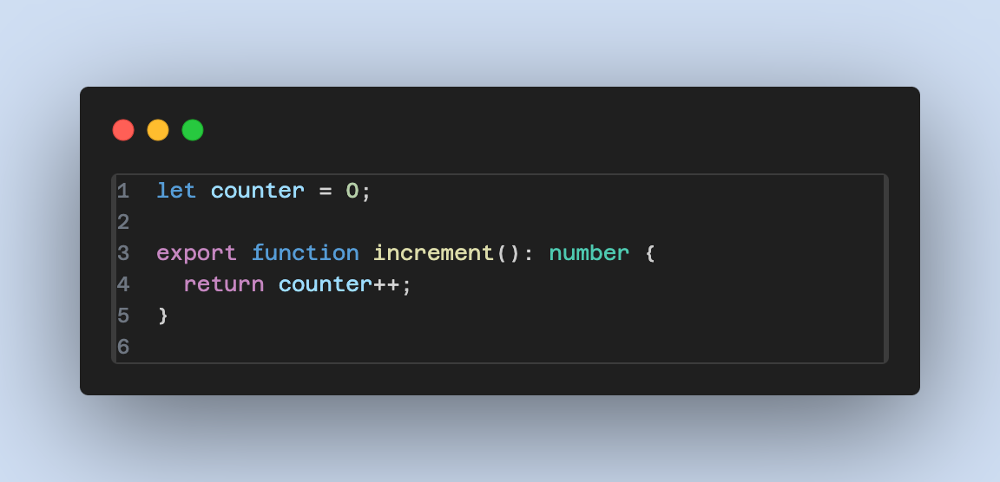
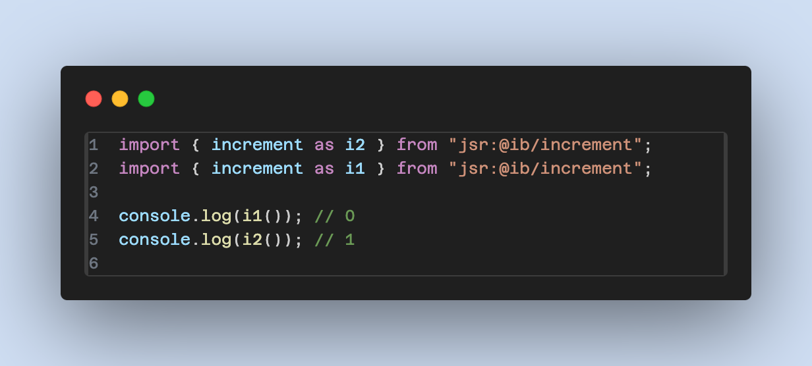
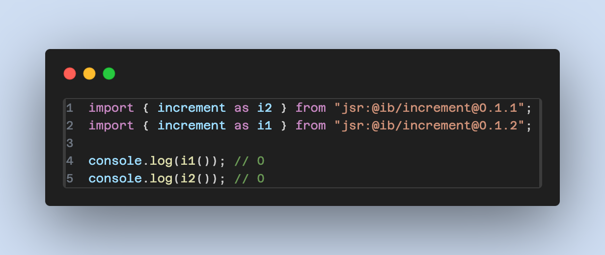
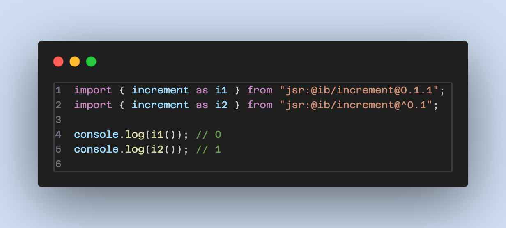

A question that has been asked, and answered several times is [What happens when a JS Module is Imported Twice?](https://dmitripavlutin.com/javascript-module-import-twice/). Here is the basic module which returns the value of a counter and then increments it. I have published this module to [jsr.io](https://jsr.io).

Now assume you import this module twice and run `deno run --lock-write -r test.ts`, this is what happens on the calls to increment:

There are lots of good resources explaining _why_ this happens, but essentially **The same module is only ever evaluated once**. So in this case, the initialization of the model happens once and both calls to `increment` will use the same shared state.

## What About Two Different Versions?

This is where most explanations end, and most people assume that the module will only ever be loaded once, meaning that you store resources (such as DB connections) in the modules state. But what happens if two different versions of the same module are loaded?

In this case, these are considered two different modules and they will each be loaded separately and have their own state. If the module acquired some resource such as a file handle or connection, that resource would be acquired twice. While this may seem easy to spot in this example, what if `increment` is transitively included from some other modules, and you are unaware of which versions they are using?

## What About Version Ranges

Now things get even more interesting if you specify version ranges. What if two different import statements include `increment` with overlapping version ranges?

In this case, the first import statement pins the import to `0.1.1`. The second statement will chose any version `[0.1.0,0.2)`, which means anything from `0.1.0` up to, but not including `0.2`. Since `0.1.1` falls in this range and it's already been selected, it will be used for the second import.

But what if you change the order of the imports?

In this case, the `^0.1` will choose the highest version it can find, which is `0.1.2` and load that. When the second import statement is evaluated, it will load `0.1.1` as it's not been loaded yet. This means that two separate versions of increment will be loaded and used. Simply changing the order of the import statements will change the behaviour of the program. This could result in very difficult and subtle bugs.

## Conclusion

- Importing a JS module twice does not re-evaluate the module; it retains shared state.
- Different versions of the same module are considered separate and maintain their own state.
- Specifying version ranges in imports can lead to different versions being loaded based on the order of import statements.
- Using overlapping version ranges may result in a single version being used if it satisfies both ranges.
- Flipping the order of imports with a range can cause different versions to load, potentially introducing subtle bugs.

The provided content explains how JavaScript modules behave when imported multiple times, with particular focus on Deno's module handling. When a module is imported more than once, it does not get re-evaluated but instead maintains a shared state across all imports. This ensures that any side effects such as incremented counters are consistent among all parts of the application using that module.

However, when dealing with different versions of the same module, each version is treated as an independent entity with its own state. This can be problematic if developers are not careful with their dependency management. Moreover, when version ranges are specified in import statements, the actual loaded version can depend on both the range specified and the order of the imports. If there's an overlap in version ranges across multiple imports, Deno may reuse an already loaded version that satisfies both ranges. Conversely, changing the import order can lead to different higher versions being selected first and thus loading multiple versions within a project. Developers must be aware that this behaviour could lead to challenging bugs due to having different code paths executed depending on which version of a module is loaded where in the application.
