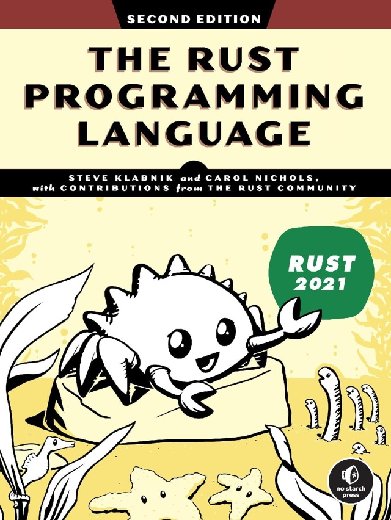

Last spring, I decided to learn Rust. In 12 months, I've gone from a [New Rustacean](https://newrustacean.com/) to a full-time Rust developer. I've built an LLM Inference Engine in Rust, spent time in the [Bindgen](https://github.com/rust-lang/rust-bindgen) weeds, and even implemented a TypeScript library in Rust which was built as a dynamically linked library and accessed via TypeScript's Foreign Function Interface (FFI). In this post, I'll cover some of what I've learned and the resources I used.

I've been programming professionally for 15 years now. Like many developers, I first learned to program in elementary school. Everyone has their war stories about how they started, and my origin story includes a grade 8 math textbook that had computer programs sketched in the margins. I first really learned to program during my undergraduate degree at the University of Waterloo. During my time there, I built a golf simulator, a real-time operating system for the x86 architecture, and a functional Ada compiler. It was the compiler work that drove my career.

I continued my computer science education at the University of Waterloo in the Master's program and eventually made my way to the West Coast to complete my Ph.D. at the University of Victoria. Both my Master's thesis and Ph.D. dissertation focused on tools for software developers. I worked on static analysis, compiler integrations, reverse engineering, and other tools to aid in program comprehension. During my Ph.D., I spent a considerable amount of time working on the Eclipse IDE—the gold standard for tool integrators in the mid-2000s.

Since graduating, I've led development on various projects but have always looked back at the question "How can we make software development easier?" It was through this lens that I decided to pick up Rust.

# Getting Started With Rust

There is no shortage of blogs and tutorials you can use to get started with Rust. You can read all you want about _Move vs. Borrow_, _Ownership_, and _Zero-Cost Abstraction_, but nothing will help you learn Rust more than actually writing code.

[Steven Donovan](https://stevedonovan.github.io/rust-gentle-intro/readme.html) has written a **Gentle Introduction To Rust** with lots of code examples, and [Rust By Example](https://doc.rust-lang.org/rust-by-example/index.html) is an excellent resource. But nothing compares to [Rustlings](https://github.com/rust-lang/rustlings).

Rustlings is an interactive tutorial that you can run on your local machine. It provides a series of exercises, each with code that you must complete. There is a CLI tool that you can use to check your results, ask for help, and move to the next exercise. Rustlings also offers some larger exercises once you've completed a few modules. These are a lot of fun to complete and teach you the subtle aspects of the language.

I worked through all the examples last summer, and with all the supplemental reading it suggested, I spent most of my three-week vacation immersed in Rust. When I returned to work, I was ready to get started.

While I didn't find simply _reading about Rust_ very effective, the one exception was [The Rust Book](https://doc.rust-lang.org/book/). I purchased a hardcopy of this book and found that reading it in the evenings and on weekends was a great way to pique my curiosity and provide more depth about idiomatic Rust.



# My First Project

Last summer, after returning from vacation, I started my first real Rust project. A [Mediform](https://mediform.io/) we've been training large language models for digital reception desks. There are a variety of data formats used in the LLM community, and we found ourselves constantly converting between them. I wrote a CLI tool that could convert between different formats. I designed an intermediate representation and built parsers for each format we needed to support. The parsers would build up the intermediate representation, and then simple graph walkers could traverse the tree and produce the desired output.

This project forced me to face the complexities of Rust head-on. I'm sure I could have built the initial version with TypeScript in half the time, but with Rust, the incremental cost of continued development dropped significantly. Rust's static checks meant that whenever I added new features, I could feel confident that the tool would continue to work.

This project also forced me to set up a proper CI/CD system for a Rust project. I used [Clippy](https://github.com/rust-lang/rust-clippy), _a collection of lints to catch common mistakes_. For new Rust developers, getting your Rust program to compile can seem like you're solving a series of puzzles, but of course, these _puzzles_ are often runtime problems that are being presented at compile time. Clippy adds a whole new level of checks. If you're coming from a dynamically typed language, this may feel like a _make-work project_. However, just like the Rust compiler, the added checks that Clippy highlights are real problems in your code. As a new Rustacean, understanding the linting errors that Clippy shows you will most certainly make you a better Rust developer. Although I can't help but think they named the tool after the Windows Office '97 ~annoying~ helpful assistant.

# Rust @ The Gym

While learning new technology, I often enjoy finding a good podcast to listen to at the gym. I find that it motivates me to go to the gym since I don't often have time at home to listen. Fifteen years ago, I listened to the [Java Posse Podcast](http://javaposse.com/) while teaching Java to university students, and six years ago, I tuned into PodCTL while learning [Kubernetes](https://open.spotify.com/show/4Bumge1mZHlEoDSckSCWs5). Last year, I started listening to old episodes of [New Rustacean](https://newrustacean.com/)—a 15- to 20-minute podcast about learning the Rust programming language. The downside of this approach was that I would often return from the gym and spend the next few hours working through the examples that Chris discussed.

# Levelling Up

At Mediform, we are training custom LLMs to support digital reception desks, and we needed a way to host those models. Python and [C++](https://github.com/ggerganov/llama.cpp) are the two most common languages used for implementing LLM inference engines. As we scale up to thousands of calls, we need a performant and stable solution.

In [December](/blog/2023/trip-to-germany/trip-to-germany), I started my journey to build an LLM inference engine in Rust with TypeScript extensions. This brought me deep into the weeds of Bindgen and the Rust Foreign Function Interface (FFI). I built a set of Rust bindings for Llama.cpp and used that as the core of my stack. The Rust FFI is a way to call C libraries from Rust. Since Llama.cpp is a C++ project, I had to build several system-level utilities to handle memory management between C++ and Rust.

Once I had a thin Rust layer that wrapped the C++ code, I built a higher-level, idiomatic Rust API for working with Large Language Models. I then used [Deno and the extension mechanisms Deno supports to provide a TypeScript layer for this project](/blog/2024/llamas-and-dinosaurs/llamas-and-dinosaurs).

Rust provides memory safety when used correctly but doesn't offer any guarantees when calling out to C/C++ code. For this reason, I followed a few simple patterns:

- Wrapped each C/C++ call in a single Rust function.
- Used a thin layer to marshal all arguments to and from C/C++.
- Wrote a set of regression tests to ensure the API works as expected.
- Wrote a set of stress tests to ensure that the API is solid.

# Next Steps

The next book on my reading list is [Rust for Rustaceans](https://www.amazon.ca/Rust-Rustaceans-Programming-Experienced-Developers-ebook).

While I have been programming in Rust for a year now, I still consider myself fairly new to the language. I've used several common crates such as `anyhow`, `thiserror`, `regex`, and `itertools`, and I've done a few deep dives into the [Deno](https://github.com/denoland/deno) codebase (over 100k lines of Rust) and the [Rust bump allocator](https://github.com/fitzgen/bumpalo). I haven't had the opportunity to build web servers in Rust yet, and although I've built multi-threaded APIs, I haven't explored the world of Asynchronous Rust Runtimes (such as Tokio) yet.

The next book on my reading list is [Rust for Rustaceans](https://www.amazon.ca/Rust-Rustaceans-Programming-Experienced-Developers-ebook).

```
+----------------------------------------------------+
|          You made it to the Fe-nish line!          |
+--------------------------  ------------------------+
                          \\/
     ▒▒          ▒▒▒▒▒▒▒▒      ▒▒▒▒▒▒▒▒          ▒▒
   ▒▒▒▒  ▒▒    ▒▒        ▒▒  ▒▒        ▒▒    ▒▒  ▒▒▒▒
   ▒▒▒▒  ▒▒  ▒▒            ▒▒            ▒▒  ▒▒  ▒▒▒▒
 ░░▒▒▒▒░░▒▒  ▒▒            ▒▒            ▒▒  ▒▒░░▒▒▒▒
   ▓▓▓▓▓▓▓▓  ▓▓      ▓▓██  ▓▓  ▓▓██      ▓▓  ▓▓▓▓▓▓▓▓
     ▒▒▒▒    ▒▒      ████  ▒▒  ████      ▒▒░░  ▒▒▒▒
       ▒▒  ▒▒▒▒▒▒        ▒▒▒▒▒▒        ▒▒▒▒▒▒  ▒▒
         ▒▒▒▒▒▒▒▒▒▒▓▓▓▓▓▓▒▒▒▒▒▒▒▒▓▓▒▒▓▓▒▒▒▒▒▒▒▒
           ▒▒▒▒▒▒▒▒▒▒▒▒▒▒▒▒▒▒▒▒▒▒▒▒▒▒▒▒▒▒▒▒▒▒
             ▒▒▒▒▒▒▒▒▒▒██▒▒▒▒▒▒██▒▒▒▒▒▒▒▒▒▒
           ▒▒  ▒▒▒▒▒▒▒▒▒▒██████▒▒▒▒▒▒▒▒▒▒  ▒▒
         ▒▒    ▒▒▒▒▒▒▒▒▒▒▒▒▒▒▒▒▒▒▒▒▒▒▒▒▒▒    ▒▒
       ▒▒    ▒▒    ▒▒▒▒▒▒▒▒▒▒▒▒▒▒▒▒▒▒    ▒▒    ▒▒
       ▒▒  ▒▒    ▒▒                  ▒▒    ▒▒  ▒▒
           ▒▒  ▒▒                      ▒▒  ▒▒
```
