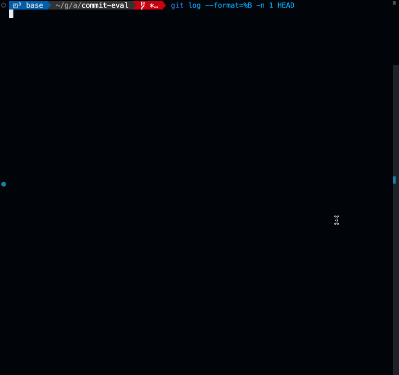

The future of Large Language Models (LLMs) is undeniably controversial, but one fact stands clear: they are revolutionizing software development. There's widespread fear that LLMs might replace Software Engineers entirely. While I don't subscribe to the belief that LLMs will take all our jobs, I am convinced that a Software Engineer proficient with LLMs will outshine one who ignores them.

Python reigns supreme among many data scientists, attracting a considerable number of AI/LLM developers into its ecosystem. Yet, while Python is valuable, it isn't the universal best fit for every task or everyone. To venture beyond Python, I’ve developed a [local LLM using TypeScript and Deno](../llamas-and-dinosaurs/llamas-and-dinosaurs), and I've created tools for [Obsidian](https://obsidian.md/) to help [summarize my notes](https://github.com/irbull/obsidian-ai-summary). More recently, I’ve delved into integrating the OpenAI API into Rust-based applications.

Rust stands out as a systems programming language that emphasizes safety, speed, and concurrency. Its unique ownership model prevents common bugs like null pointer dereferencing and buffer overflows, allowing developers to write high-performance code with zero-cost abstractions and extensive compile-time checks. Rust offers a compelling alternative to traditional languages like C and C++.

In this tutorial, I’ll walk you through integrating the OpenAI API with Rust. We’ll also look at how to construct prompts and how to constrain results using structured data that adheres to a JSON schema. Join me, and let's explore this powerful combination together.

## Commit Message Evaluator

In this tutorial, we’re building a CLI tool to evaluate Git commit messages. It will assess how well the message describes the change-set, rating it as **Excellent** or **Revisable**. It will return a reason for the score and a suggestions for an improved commit message. If the original message was written using the [Conventional Commit Style](https://www.conventionalcommits.org/en/v1.0.0/) it the results will retain this style.

To do this, we’ll extract both the commit message and Diff from a commit. If written in Conventional Commit Style, we'll use its metadata to enhance our analysis and prompt design. Overall, our prompt will look like this:

```markdown
Evaluate the following commit message and determine how well it explains the change-set.
In particular, rate the commit message as either "Excellent" or "Revisable".

1. If the commit message is clear, concise, and explains the change-set well, rate it as "Excellent".
2. If the commit message is unclear, incomplete, or does not explain the change-set well, rate it as "Revisable".

If the commit message is "Revisable" suggest a better message using the following format:


1. Use the "conventional commit" style for the title that includes `<type>[optional scope]: <description>`
2. Use proper sentences in the body and use paragraph breaks where needed.

The existing message had the following conventional commit properties:

- Commit Type: {{ conventional_commit.commit_type }}
- Description: {{ conventional_commit.commit_type }}
- Body: {{ conventional_commit.body|display_some }}
  

1. Split the suggested commit message into a `Title` that completes the sense `If applied, this commit will <title>` (maximum 52 characters long);
2. and a "Body" that explains the change-set in detail using proper sentences and paragraph breaks.
   
   Return the result as JSON.

If the commit message is rated as "Excellent", just return the existing Title and Body.
If the commit message is rated as "Revisable", return the suggested Title and Body.
```

## Prompt Templates

For the past two years, I've delved into the world of Large Language Models (LLMs), training, fine-tuning, and crafting prompts. One persistent hurdle is managing templating through string programming. Prompts often need to be dynamically generated with template variables and various conditions, and languages like Python and TypeScript can make this even trickier.

To address these challenges, I've turned to Askama—a tool that converts templates into Rust code at compile time, simplifying the process immensely. With Askama, you can structure your templates using common Rust constructs like `Options`, ensuring type safety.

Here's a glimpse of how we've harnessed this power:

```rust
pub struct ConventionalCommit {
    /// The type of the commit, e.g., "feat", "fix", "docs", etc.
    pub commit_type: String,
    /// The scope of the commit, if provided.
    pub scope: Option<String>,
    /// Indicates whether this commit introduces a breaking change.
    pub breaking_change: bool,
    /// The short description of the commit.
    pub description: String,
    /// The body of the commit message, providing additional contextual information.
    pub body: Option<String>,
    /// The footer of the commit message, often used for referencing issues.
    pub footer: Option<String>,
}

#[derive(Template)]
#[template(path = "system_prompt.md.jinja")]
struct SystemPromptTemplate {
    conventional_commit: Option<ConventionalCommit>,
}

mod filters {
    pub fn display_some<T>(value: &Option<T>) -> askama::Result<String>
    where
        T: std::fmt::Display,
    {
        Ok(match value {
            Some(value) => value.to_string(),
            None => String::new(),
        })
    }
}
```

This example highlights a few key points:

1. The template structure includes an optional `conventional_commit`. If present, it guides how conventional commits are handled.
2. We use a filter to determine how to render optional properties within `conventional_commit`.
3. If `conventional_commit` is absent, the `else` branch is executed.

By designing templates this way, we avoid surprises from `undefined` or `null` values—critical when working with LLMs that might otherwise generate unexpected outputs.

## Structured Output

Integrating Large Language Models (LLMs) into existing software systems can be tricky. Software demands structured inputs with rigid boundaries, reminiscent of dealing with the infamous [Windows-1252](https://en.wikipedia.org/wiki/Windows-1252) encoding. LLMs, being text prediction engines, can be nudged to produce specific formats but might easily stray. If you've built an LLM Inference Engine, you'll know you can [limit output to specific characters](https://github.com/ggerganov/llama.cpp/blob/master/examples/json_schema_to_grammar.py), and OpenAI offers this capability too. You can even specify a JSON Schema as a `ResponseFormat` in your [completion request](https://platform.openai.com/docs/guides/structured-outputs).

Rust simplifies this with [Serde](https://serde.rs/) and [SchemaRS](https://docs.rs/schemars/latest/schemars/). Just annotate your structures with derived traits to auto-generate a JSON Schema from a `struct` and populate it using the OpenAI Response.

```rust
use schemars::JsonSchema;
use serde::{Deserialize, Serialize};

#[derive(JsonSchema, Serialize, Deserialize, Debug, Clone, Copy)]
pub enum MessageScore {
    Excellent,
    Revisable,
}

#[derive(JsonSchema, Serialize, Deserialize, Debug, Clone)]
pub struct Evaluation {
    pub score: MessageScore,
    pub reason: String,
    pub suggested_title: String,
    pub suggested_body: String,
}
...
let mut json_schema = serde_json::to_value(schema_for!(Evaluation))?;
json_schema["additionalProperties"] = serde_json::Value::Bool(false);
let response_format = ResponseFormat::JsonSchema {
    json_schema: ResponseFormatJsonSchema {
        description: Some("Evaluation Response".to_string()),
        name: "Evaluation".to_string(),
        strict: Some(true),
        schema: Some(json_schema),
    },
};
...
Ok(serde_json::from_str(
    choice.message.content.as_ref().unwrap().as_str(),
)?)
```

By merging type-safe templates with JSON schemas generated from Rust code and structured outputs, building robust LLM tools becomes straightforward.

## Sample Usage

I have pushed the _Commit Evaluation_ tool to GitHub if you'd like to try it. You will need an OpenAI API key, and of course, Rust. You can build it for your system using `cargo build --release` or run it directly with `cargo run`. It must be run from within a current Git repository.



## Conclusion

The integration of Large Language Models (LLMs) with Rust offers a promising avenue for creating sophisticated and efficient software tools. By leveraging Rust's powerful features such as safety, concurrency, and type safety through libraries like Askama and Serde, developers can harness the capabilities of LLMs without sacrificing performance or reliability. The combination of structured outputs and robust templating ensures that developers can manage the nuances of LLMs while maintaining control over their applications' behavior. We are at an exciting time where new technology is changing the way we work. By using tools like the Rust programming language and Large Language Models (LLMs), we can work smarter and create new possibilities in software development. Whether you have a lot of experience or are just starting, combining Rust with LLMs can help you build reliable and creative solutions in our fast-changing digital world.
