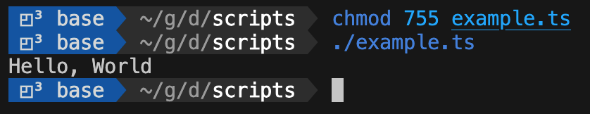

Working remotely at [Mediform](https://mediform.io/) involves juggling multiple projects and switching between various technology stacks, including Rust, C/C++, TypeScript, some Go, and managing extensive yaml files for our infrastructure. My role primarily focuses on integrating these technologies. Scripting is essential for managing builds and infrastructure, where I prioritize readability and clarity over brevity and clever shortcuts to ensure long-term efficiency and understanding.

Recently I've started developing my shell scripts in TypeScript as opposed to Bash. There are a number of reasons for this:

1. Fewer languages & technologies to manage
2. Web APIs at your fingertips
3. More readable (in my opinion)
4. Cross platform

While I'm sure you can do it with Node, the single binary approach that [Deno](https://deno.com/) provides, combined with inlined dependencies, makes scripting easy. In fact, you can even use the `deno` executable in a [shebang](<https://en.wikipedia.org/wiki/Shebang_(Unix)>).

```typescript
#!/usr/bin/env -S deno run --allow-all
console.log("Hello, World");
```

By marking the executable bit on this file, you can directly call it from your shell.



## Dax

[Dax](https://github.com/dsherret/dax) is a TypeScript library for cross platform shell scripting. Dax makes it easy to integrate common shell commands (such as `tail`, `cat`, `echo`, `mkdir`, etc...) directly into TypeScript. Several commands can be executed in parallel and their output combined using TypeScript libraries. This is particularly powerful when combined with json processing and other Web APIs.

```typescript
#!/usr/bin/env -S deno run --allow-all
import $ from "https://deno.land/x/dax/mod.ts";

const isFulfilled = <T>(
  input: PromiseSettledResult<T>
): input is PromiseFulfilledResult<T> => input.status === "fulfilled";

const blogs = await $`cat blog_entries_with_ratings.json`.json();
const requests = blogs
  .filter((b: any) => b.rating > 4)
  .map((b: any) => b.url)
  .map((u: string) => fetch(u));

const responses = await Promise.allSettled(requests);
console.log(responses.filter(isFulfilled)?.map(v => v.value.url));
```

In this example, we processed a `.json` file containing a list of blogs. For each blog with a rating > 4, we validated that the blog is currently reachable on-line. Historically I would have done this with `jq` and `curl` and then ensured that these libraries were installed everywhere.

### Web APIs

Deno also provides most Web APIs as a first class citizen. This includes APIs such as `fetch`, `crypto`, `events`, `timeout` and the Streaming API. This makes it very easy to work with a variety of resources. For example, here is a small script that follows a log file and does something whenever a 404 is emitted. This example makes use if the [Iter\*](https://github.com/BlackAsLight/IterStar), a simple library that provides a way to iterate over arrays like objects in a generator fashion.

```typescript
#!/usr/bin/env -S deno run --allow-all
import $ from "https://deno.land/x/dax/mod.ts";
import { AsyncIter } from "https://deno.land/x/iterstar@v1.1.2/mod.ts";
import { TextLineStream } from "https://deno.land/std@0.189.0/streams/mod.ts";

const tail = $`tail -F -n 0 log.txt`.stdout("piped").spawn();
new AsyncIter(
  tail
    .stdout()
    .pipeThrough(new TextDecoderStream())
    .pipeThrough(new TextLineStream())
)
  .filter(s => s.includes("404"))
  .forEach(s => doSomething(s));
```

### CronJobs

Finally, Deno CronJobs provide a way to schedule reoccurring events. While these are not very useful in CI jobs, it does play an important role in keeping our infrastructure running, from daily reminders, to automated log rotations.

By combining the on-line blog example from above, with Slack integration, we can create a CronJob that runs every 15 minutes, and lets us know if our important sites are off-line:

```typescript
#!/usr/bin/env -S deno run --allow-all --unstable-cron
import { siteCheck } from "./site-check.ts";
Deno.cron("Site Check", { minute: { every: 15 } }, siteCheck);
```

### Conclusion

Switching from Bash to TypeScript for scripting tasks at Mediform has brought about significant improvements. The key advantages are: managing fewer languages and technologies, direct access to Web APIs, improved readability, and, importantly, cross-platform compatibility. The use of TypeScript, especially with tools like the Dax library, has made scripts easier to maintain and more efficient. It allows for smooth integration of shell commands into TypeScript and offers a more structured approach with proper modules and abstraction. From processing JSON files to leveraging Web APIs for various tasks and setting up CronJobs, TypeScript has proved to be a more effective tool in our scripting arsenal. This transition not only reflects a personal preference for clearer and more maintainable code but also aligns with our broader goals at Mediform for efficient and streamlined technology management.
