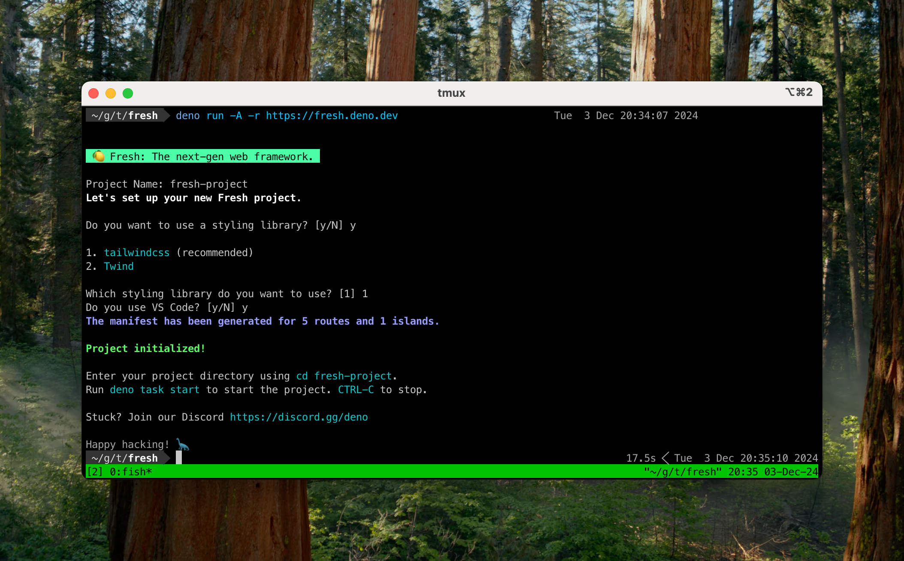
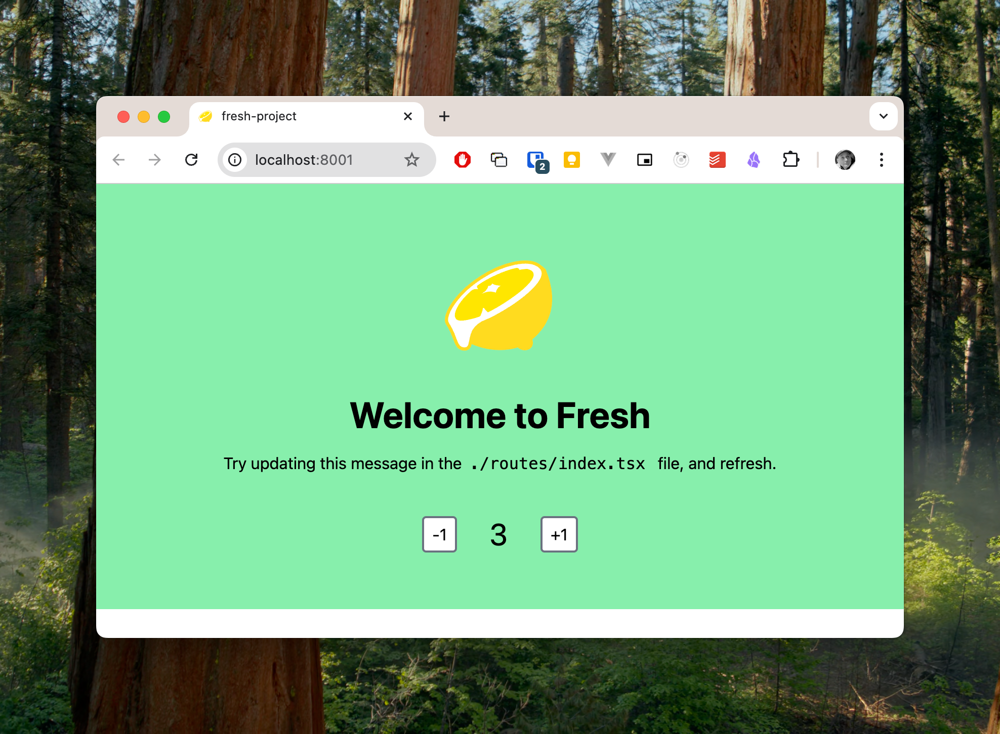

Recently, we've built a small data analysis tool that is intended to work on sensitive medical data. The medical practitioners don't feel comfortable uploading any of the medical data to a cloud service, so we must ship the code to them. We could build an Electron App or even a CLI tool, but these non-technical users just want a few data entry forms and a submit button. We have built a pretty simple web application, but this still requires us to ship them the site files (zipped), and they still need a runtime (Deno) and some know-how in order to start the entire application.

With Deno 2.1, everything has changed as you can now build a [completely self-contained executable with all the assets embedded](https://deno.com/blog/v2.1#embed-asset-files-in-deno-compile). Combined with [Deno Fresh](https://fresh.deno.dev/), this has significantly lowered the barrier for on-premises application deployment.

In this short tutorial, I'll show you how to create a simple Deno Fresh application and package it as a single executable.

## My First Fresh Application

_Deno Fresh_ is a no-overhead, just-in-time rendering web application framework with client hydration for highly interactive websites. Your entire web application can be written in TypeScript using Preact components, with simple file-based routing, and no JS is shipped to the client by default. There is a ton of information on their [website](https://fresh.deno.dev/), which, of course, is entirely built with Fresh.

To create your first Fresh site, install [Deno](https://docs.deno.com/runtime/getting_started/installation/) and run `deno run -A -r https://fresh.deno.dev`.



## Running Your Site

The setup script will setup a simple Fresh website along with a `deno.json` with a few useful tasks:

```json
  "tasks": {
    "check": "deno fmt --check && deno lint && deno check **/*.ts && deno check **/*.tsx",
    "cli": "echo \"import '\\$fresh/src/dev/cli.ts'\" | deno run --unstable -A -",
    "manifest": "deno task cli manifest $(pwd)",
    "start": "deno run -A --watch=static/,routes/ dev.ts",
    "build": "deno run -A dev.ts build",
    "preview": "deno run -A main.ts",
    "update": "deno run -A -r https://fresh.deno.dev/update ."
  },
```

You can test the website using `deno start` and when you are ready to deploy it, use `deno build`.



## Compiling the Site

To ship the site as a single executable, use the `deno compile` command. There are several command-line options, including the [target for which you wish to build](https://docs.deno.com/runtime/reference/cli/compile/).

To compile the Fresh site, use:

`deno compile --include static --include _fresh --include deno.json -A main.ts`

## Compiled the Entire Fresh Site

Finally, I decided to try _compiling_ the entire Deno Fresh website. I cloned the [Git Repository](https://github.com/denoland/fresh) and executed the following three commands:

```bash
$ cd www
$ deno task build
$ deno compile --include static --include _fresh --include deno.json -A main.ts 
```

<video controls>
  <source src="/assets/videos/fresh-site.mp4" type="video/mp4">
</video>
