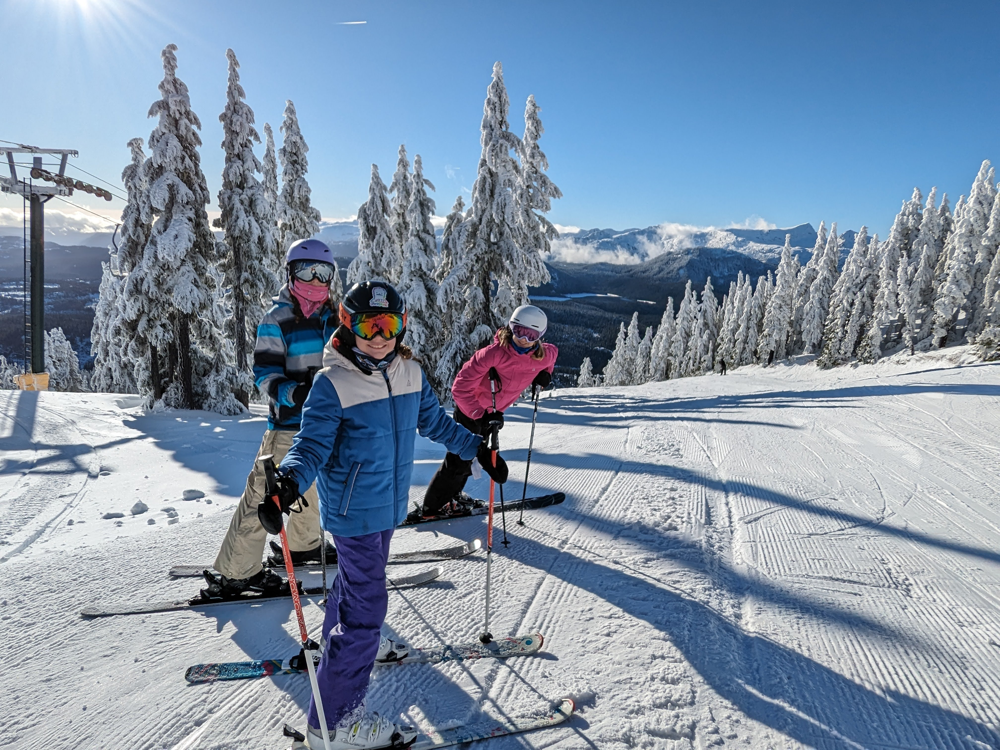

What's up, readers! Just got back from a day of skiing at Mt. Washington with the fam – my wife Tricia and our energetic daughters, Sadie, Lily, and Maggie. Let me break down how a normal family turns a day on the slopes into something pretty special.

**Morning Vibes: Blue Skies and Eager Skiers**

The day kicked off under a sky so blue, it felt like we were stepping into a postcard. The snow wasn’t super thick, but the weather more than made up for it. There’s something about that crisp mountain air that gets you pumped right from the start.

**Skiing with the Squad**

Tricia, who's always up for a challenge, and the girls hit the slopes with a mix of excitement and a touch of competitive spirit. Sadie’s got a knack for speed, Lily’s all about perfecting her turns, and Maggie? She’s just there to have a blast. We took on a bunch of trails, each offering its own thrill.

**Lunch Time: Catching Our Breath**

Lunch was a chill affair – hot chocolates all around and a chance to share our morning adventures. It’s these moments, laughing over spilled cocoa and shared ski stories, that really make these trips worth it.

**Afternoon Runs: Keeping the Energy High**

Post-lunch, we were back at it. The girls, full of energy, were raring to go. We hit some more challenging slopes in the afternoon, which really tested our skills but in the best way possible. There’s something about seeing your family push their limits and succeed that’s really rewarding.

**Heading Home: Satisfied and Smiling**

As the sun started to dip, we called it a day. Everyone was tired but in that good, accomplished way. The drive home was quiet, the girls drifting off, probably dreaming about their next time on the slopes.

**Wrapping It Up**

Today wasn’t about being the best skiers on the mountain. It was about being out there together, enjoying the snow, the sun, and the company. These are the kinds of days that stick with you. Can’t wait for the next family outing!

Catch you all in the next post!
