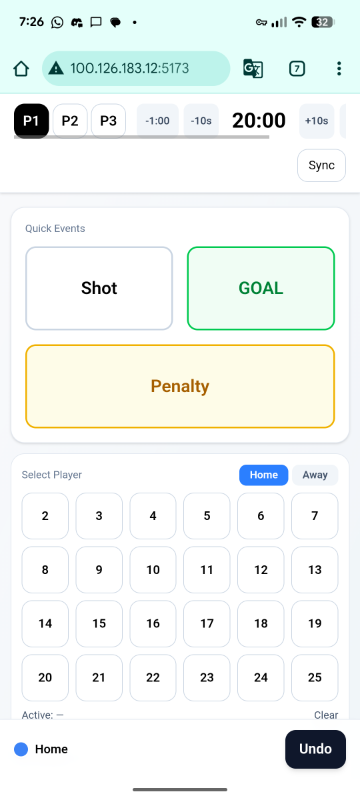
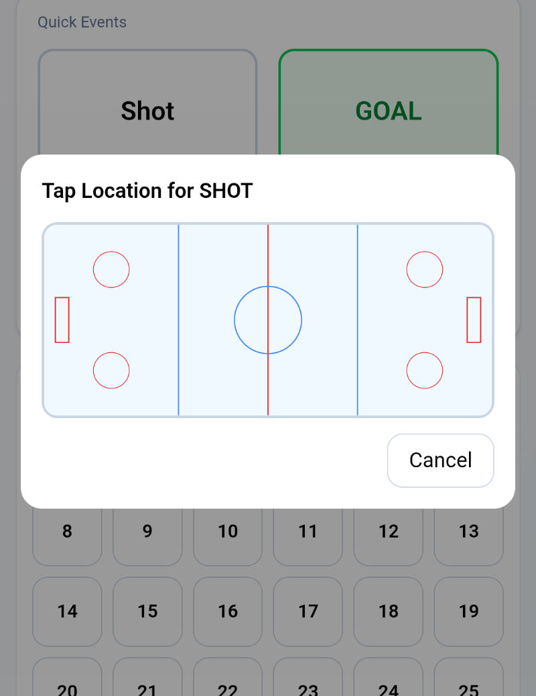
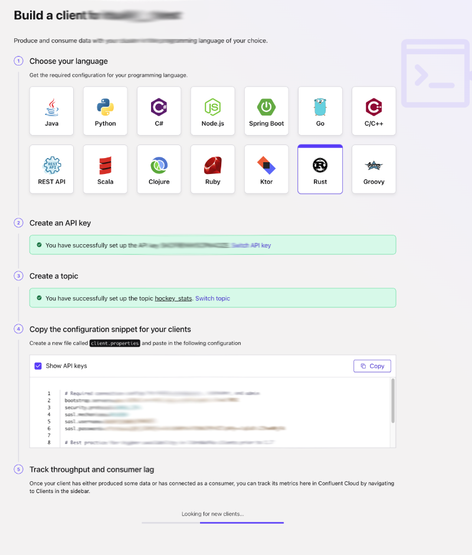
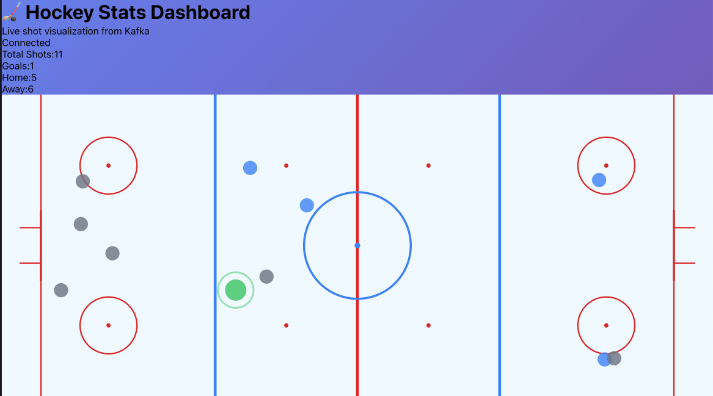

One of the things I really enjoy is coaching youth sports. I spent 3 years as the director of a softball association and led the organization to its first-ever [Provincial Championship](/blog/2023/carnarvon-champions/carnarvon-champions). Recently, my daughter has taken up hockey, so now I'm managing that too. This weekend we are hosting the [Remembrance Day Female Face-Off](http://victoriagirlshockey.ca/page.php?page_id=128445).

As a software developer, I’m always looking for ways to make my volunteer work more efficient. One ongoing challenge is tracking player statistics, so for our tournament this weekend, I built a small app to capture real-time game data and present it in meaningful ways.

The goal was to make it easy for scorekeepers to record events as they happen at different rinks. I started small by tracking shot and goal locations. I built a Progressive Web App in React + TypeScript with a mobile-first layout, big tap targets, and an interactive rink for capturing locations. It works offline by storing events in IndexedDB and syncing them automatically when the connection returns, with service workers helping keep things reliable. I also added haptic feedback so it feels like a native app, even though there’s nothing to install.

Once an event is captured, it gets synced to a Rust/Axum backend. Events include things like the ID, timestamp, period/clock, which team and player were involved, the event type, and where a shot happened. The backend has a `/api/events/batch` endpoint that pushes event batches to Confluent Cloud Kafka (via rdkafka + SASL_SSL). Everything is sent as JSON, and the event ID is used as the message key so we can naturally avoid duplicates.

I signed up for [Confluent Cloud](https://www.confluent.io/), and create a single topic to track these events. I selected Rust as my language of choice, and used the credentials provided.

To highlight Kafka’s distributed nature, I built a real-time dashboard. A Node.js backend reads events from Confluent Cloud with KafkaJS and streams them to the browser via SSE. The React UI shows an SVG hockey rink with shots and goals appearing as colored dots. With roughly 1–2 seconds of delay, you can see patterns emerge as the game plays out. Since the Rust producer and Node.js consumer only communicate through Kafka, they operate independently and can scale or fail on their own.

This project has been a great way to bring my software background into the rink. With simple event capture, real-time streaming, and lightweight visualizations, we’ve made scorekeeping smoother and more engaging for everyone. There’s lots more to explore, like tracking passes, goalie stats, or team heatmaps, but even at this early stage, it’s already proving useful. I’m looking forward to seeing where it goes next.