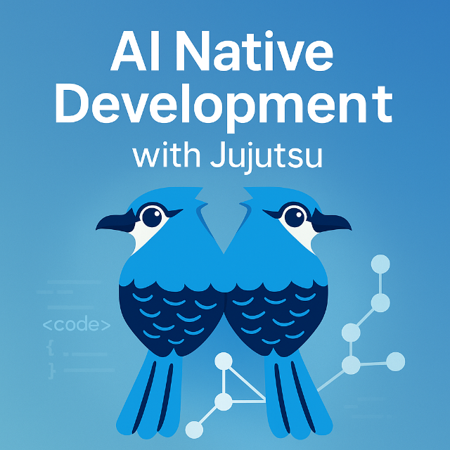

AI-assisted development is becoming mainstream, but most workflows still treat AI like a fancy autocomplete.  The missing piece is a version control model that can keep up with the speed, the non determinism, and the exploratory nature of coding with LLMs.

Traditional Git workflows were not designed for this.  [Jujutsu](https://github.com/jj-vcs/jj), with its flexible history model, cheap branching, and rewrite friendly design, turns out to be an ideal foundation for an AI native software workflow.

Over the past year I have developed a pattern where each significant interaction with the LLM corresponds to a structured change in my repository. Jujutsu acts as the backbone that keeps the human reasoning, the model contributions, and the resulting code aligned.

This post outlines what that workflow looks like, why it works, and where it might go next.

## A brief introduction to Jujutsu

[Jujutsu](https://www.jj-vcs.dev/latest/), usually written as `jj`, is a modern distributed version control system that is fully compatible with Git. It stores data in a regular Git repository, so you can keep using existing remotes, GitHub, and CI pipelines while experimenting with a [different front end for your day to day work](https://github.com/jj-vcs/jj).

The project was started by [Martin von Zweigbergk around 2019](https://lwn.net/Articles/958468/), with the goal of building a simpler, more ergonomic alternative to Git that still respects the same underlying data model. It is written in Rust and released under the Apache 2.0 license.  The official documentation describes it [simply as a version control system that helps you track changes and publish them, and that is designed to be easy to use for both small solo projects and large codebases](https://docs.jj-vcs.dev/latest/).

Conceptually, Jujutsu puts more emphasis on history editing and working with stacks of changes. Instead of a separate staging area, you work in a current change, and commands like `jj new`, `jj split`, `jj squash`, and `jj rebase` make it [natural to create, reshape, and reorder commits until you are happy with the story your history tells](https://mkaz.blog/code/jujutsu-vcs/). This aligns closely with how people actually work when they want to refine a series of changes before they are ready for the main branch.  If you have worked the [Gerrit Code Review](https://www.gerritcodereview.com/) tool, you may feel at home with Jujutsu.

Jujutsu is intentionally Git friendly rather than Git hostile. Mozilla, for example, [documents it as a modern DVCS that uses Git repositories as a storage backend while borrowing good ideas from Mercurial](https://firefox-source-docs.mozilla.org/contributing/jujutsu.html), such as bookmarks and a focus on clear workflows for evolving history. Many introductions highlight the same themes: [a cleaner mental model than Git, safer and more powerful history editing, and an incremental adoption story](https://medium.com/%40vafion/jujutsu-a-fresh-take-on-version-control-that-plays-nicely-with-git-0d1858b383e6) where you can manage an existing Git repository with `jj` without asking your entire team to switch at once.

## Why Jujutsu pairs so well with AI

Jujutsu becomes even more powerful in an AI workflow when combined with a simple convention for capturing intent during development. I maintain an `AGENTS.md` file with this instruction:

```bash
After applying each change, create a file called INTENTS-[YYYY-MM-DD-HH-mm].md that includes the prompt used to make this change.
```

Because Jujutsu auto stages new files, each in-progress change automatically includes a small `INTENTS` file that records the exact prompt that produced it. This creates a lightweight, local, development time “intent buffer” that attaches the reasoning directly to the change.

This is especially useful when I am working on multiple threads of work at once. Each change has its own intent file, and I can jump between branches without losing track of what the model was asked to do in each place.

These intent files are not permanent. Once I create the final curated commit, I delete them. They exist only to support development, commit message creation, and reorganization. The final repository history stays clean, and the temporary reasoning artifacts do not accumulate over time.

I also use a small CLI tool that reads the intent file, inspects the code delta, and helps craft a consistent commit message. This tool allows me to keep commit messages short and narrative based, while still relying on the detailed prompts I captured earlier.
### **1. Cheap, fluid branching encourages experimentation**

I can create a branch for a single idea in seconds using `jj new`.   If the idea works, great.   If it does not, I roll it back without polluting the history or breaking the narrative.

LLMs are inherently exploratory. JJ makes it safe to explore.
### **2. History is malleable before main and stable after**

Before merging, I routinely do the following tasks.
- Break apart changes
- Reorder commits
- Squash speculative ideas
- Branch mid conversation to test alternatives

This makes Jujutsu function both as a scratchpad for human AI problem solving and as a curation space where I refine the commit history into something meaningful and maintainable.

Once the code hits main, the history becomes stable.

### **3. Commit messages become prompt provenance**

One of the surprisingly powerful parts of this workflow is that I put the actual LLM prompt, or a short summary of it, directly into the commit message.

When I revisit code months later, I see the intent behind each change, not only the diff.  
This drastically reduces the confusion of wondering what I was thinking when I asked the LLM to make the change.

---

## The AI Native Development Loop: Plan, Apply, Curate

Through trial and refinement, the process now follows a clear three phase loop.

### **Phase 1: Plan**

Before generating a single line of code, I work with the LLM to clarify the problem, identify edge cases, break the solution into steps, and ask what could go wrong.  
Only once we agree on a plan do we start generating code.

This stage reduces thrash and results in better architectural decisions.

### **Phase 2: Apply**

The Apply phase now includes temporary intent capture.

For each step:

1. I run `jj new` to create an isolated change.
2. I instruct the model to implement only that step.
3. I review the diff and test.
4. I create an intent file with the name `INTENTS-YYYY-MM-DD-HH-mm.md` and paste the exact prompt into it.
5. Because Jujutsu auto stages, the intent file is recorded with the change.
6. I run my CLI tool, which uses both the code change and the intent to propose a commit message.
7. I commit the change.
8. After committing, I typically delete the intent file since its purpose is fulfilled.

If I later squash or reorder commits, I simply refer back to the intent files that were present during development. This helps me preserve meaning even when the underlying structure of the commit stack changes.

Intent files are especially helpful when multiple parallel branches are active. Each branch retains its own temporary prompt context without leaking into the others.

### **Phase 3: Curate**

Because intent files were captured along the way, curation becomes straightforward. If I need to reconstruct why a change exists or what plan step it represents, I already have the prompt that produced it.

Once the curated commit structure is complete, the intent files are removed. Only the final narrative remains, without storing raw prompts in the long term history.

This separation keeps the history clean, readable, and professional while still letting me benefit from AI driven iteration during development.

---

## What this workflow unlocks

Three benefits stand out.

### **1. Faster iteration without loss of control**

AI can accelerate the production of code, but speed often creates chaos. Jujutsu absorbs that speed by letting me shape history as quickly as the model produces changes. I can branch, reorder, and refine without friction. The temporary intent files extend this idea by giving me the exact prompt that generated each iteration, so I can freely experiment and still understand what happened. Fast iteration becomes safe iteration because the reasoning and the code remain aligned until I finalize the commit.

### **2. Semantic version control**

In this workflow, commits represent ideas, not timestamps. Each step in the plan becomes a meaningful unit of work, and Jujutsu makes it natural to sculpt the history until it matches the conceptual structure of the feature. The intent files strengthen this, since each change carries its own prompt and purpose during development. When I squash or reorder commits, I can reconstruct the meaning of each piece before shaping the final story. The end result is a version control history that reflects the design of the feature rather than the order in which files were edited.

### **3. Traceability across intent, reasoning, and code**

AI generated code is only valuable when the reasoning behind it remains visible. By capturing prompts in temporary intent files and using them to craft my commit messages, I maintain a clean trail from the original idea, to the reasoning, to the final code. Even after the intent files are deleted during curation, their influence lives on in the structured commit history. This creates a form of traceability that is lightweight during development and polished in the final result. The repository tells a clear story, and that story remains grounded in the actual decisions that led there.

---

## Where this might go next

Several ideas could evolve this into a full JJ native AI workflow.

### **Branch duels**

Create two branches, ask the LLM for two distinct designs, and later ask the model to compare the diffs.

### **Replay mode**

Take a past commit, show its diff to the LLM, and ask it to explain the change, list risks, or suggest tests as if we were in that moment in time.

### **AI aware commit templates**

Templates could capture the plan step number, the prompt used, and the model involved.

### **Session anchors**

Dedicated JJ commits could mark the beginning of an AI assisted session so the entire conversation is contextualized in history.

We seem to be moving toward a pattern where the LLM handles reasoning and patch generation, and Jujutsu handles state, structure, and narrative.  
If that is true, version control becomes a long term memory substrate for AI assisted development.

---

## Conclusion

AI assisted development needs more than a powerful model.  
It needs a workflow that can reflect the reasoning process and preserve the structure of the work.

Jujutsu is a surprisingly strong companion for this.  
It is flexible, rewrite friendly, experimentation friendly, and well suited to the way humans and LLMs collaborate.

This is still early exploration, but the combination of AI driven reasoning and Jujutsu driven history feels like a glimpse into a future where software development is AI native by design.

If you are experimenting with AI as part of your development loop, try pairing it with Jujutsu. You might discover a new and very productive gear.