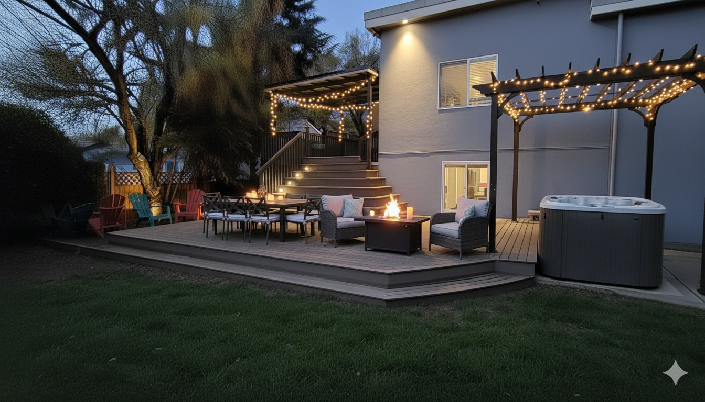
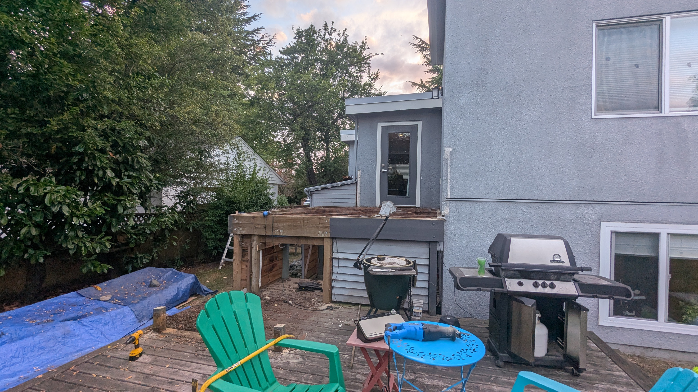
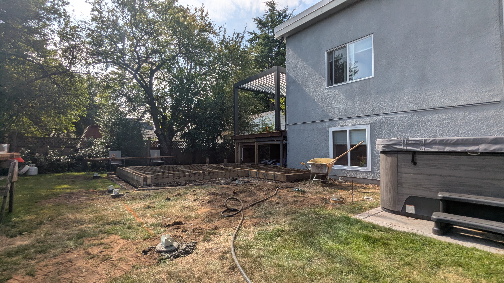
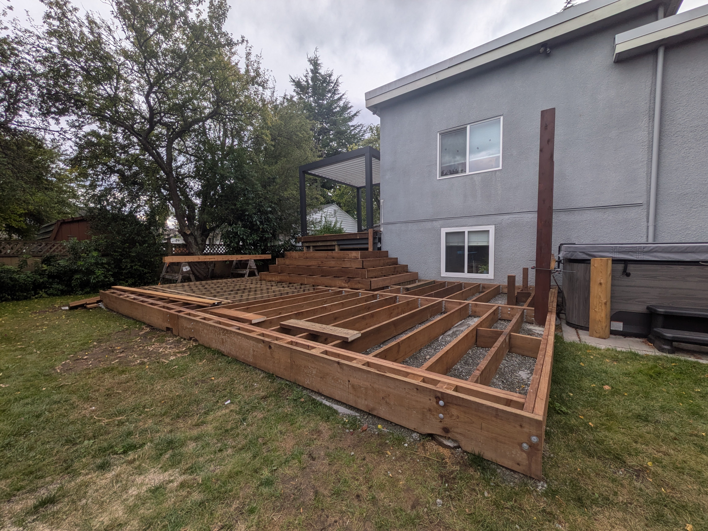
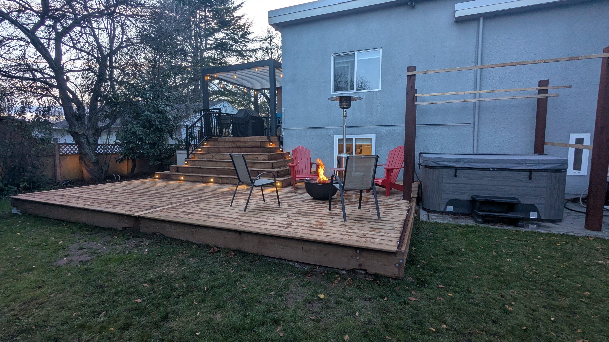
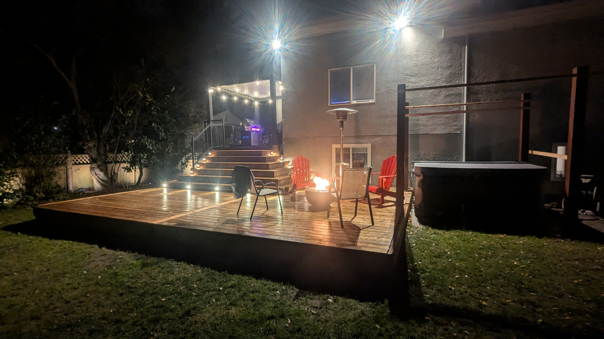

Most of my work with AI happens in the _expected_ places — writing code, reviewing pull requests, experimenting with language models, or building developer tools. It’s part of my everyday toolkit.

But this project was different.

This time, I used AI not for work, but for something _tangible_ — designing and building a deck in my backyard.

What started as a bare patch of grass turned into a hands-on experiment in **practical AI** — using tools like Midjourney and Gemini not to generate code or content, but to help imagine, communicate, and refine a real-world design.

And unlike most AI projects, this one didn’t live in a repo or a demo.

It lives in my yard.

---

## **The Starting Point: A Blank Yard and a Rough Vision**

I started with this:

A plain deck, aging boards, awkward layout, and a big patch of grass that wasn’t being used for anything interesting. I had ideas in my head—fire table, dining area, pergola, hot tub; but nothing cohesive. Traditionally, I would have sketched on paper or fired up SketchUp.  But this time, I tried something new.

---

## **Step 1: Using AI to Explore Possibilities**

I fed a photo of my yard into Midjourney and Gemini and started prompting:

> _“Create a modern deck layout with warm lighting, a fire table, a pergola, and a hot tub on the right.”_  
> _“Try a version with cascading stairs.”_  
> _“Add outdoor seating and a dining area.”_

The result?

This wasn’t a construction drawing.  It wasn’t buildable as-is.  But it did something incredibly valuable:

### **AI turned my fuzzy ideas into something my family and I could react to.**

Instead of endlessly describing possibilities…

…we could _see_ options instantly.

We could say:

- “Yes, that’s the vibe.”
- “No, that pergola isn’t what we want.”
- “The fire table looks perfect there.”
- “Move the hot tub.”

It became a rapid-feedback loop for brainstorming.

---

## **Step 2: From AI Inspiration to Real Engineering**

AI couldn’t tell me how to make the deck safe.  It couldn’t size joists or beams.  It definitely wasn’t going to get past my building inspector. Once we agreed on a design direction, I switched to my actual workflow:

- Hand-drawn plans
- Measurements
- Proper engineering diagrams
- Materials lists
- Cut sheets
- Load calculations
- And, of course… building the thing myself

The AI render wasn’t a blueprint.  It was the _vision_, not the _plan_.

But having that vision made the rest dramatically easier.

---

## **Step 3: Building the Deck — Reality vs. Render**

Fast-forward through lumber deliveries, weekends with tools, and a lot of “measure twice, cut once”…  (I cut once, then cut again, then cut a third time—AI didn’t fix that.)

Here’s the current real-world result:

It’s not completely finished yet, but it’s undeniably the same _idea_ we first saw in the render.  And that’s the magic of practical AI: it helps you see the destination early, so you can walk toward it more confidently.

---

## **What Practical AI Did—and Didn’t—Do**

### ✔️ AI **helped me:**

- Explore design ideas visually
- Communicate concepts to my family
- Test layouts before committing
- Iterate quickly
- Build momentum and excitement
- Spot opportunities (like stair lighting and layout flow)

### ✘ AI did **not**:

- Produce engineering drawings
- Tell me how to build the structure
- Choose materials
- Guarantee safety
- Solve construction problems
- Lift heavy lumber (tragically)

### **This was augmented creativity, not automated creation.**

---

## **Why This Matters**

There’s a narrative that AI will either replace everything or is useless.  **Neither is true.**

There’s a huge middle ground where AI:

- Speeds up decision-making
- Boosts creativity
- Helps you see possibilities
- Reduces the friction between idea and execution

And that’s exactly where most people can benefit; home projects, DIY renovations, landscaping, interior design, woodworking, you name it. Not as a replacement for skill or experience. But as a **superpower for the planning phase**.

---

## **Final Reflection: AI Made the Project More Fun**

The biggest surprise wasn’t the design help. It was the collaboration. My family and I could all react to the visuals.   We weren’t debating abstract ideas—we were pointing at images and saying:

- “Let’s make _this_ happen.”

That clarity kept the project moving and helped me avoid the usual DIY indecision loops. 

AI didn’t build the deck. But it helped me build the **right** deck. And for me, that’s the perfect definition of _practical_ AI.