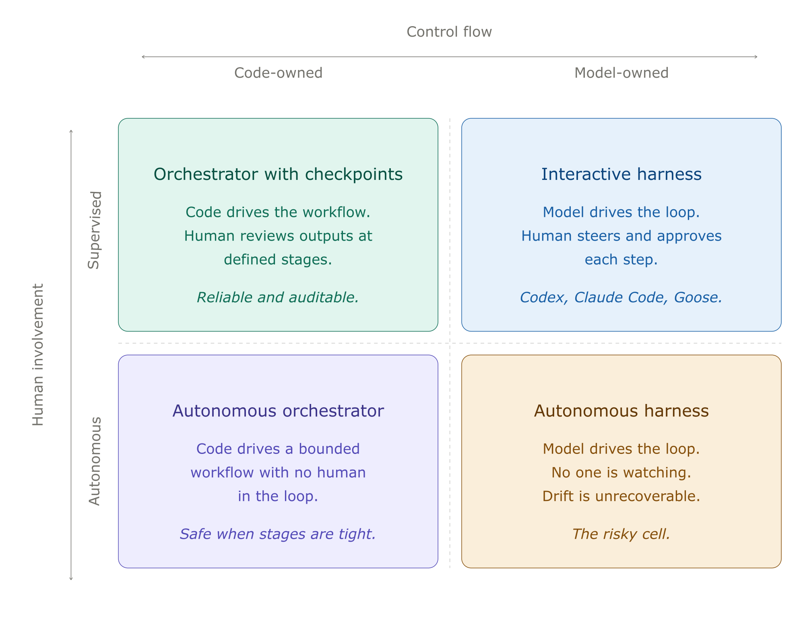

# Prompt Creep

There's a pattern emerging in LLM-integrated systems that I like to call **prompt creep**.

It starts innocently. You have an LLM agent that needs to check whether a file exists before acting on it. You could write code for that, but it's faster to just tell the agent: "check if `config.json` exists, and if it does, read it." The LLM does it. It works.

So you add another condition. "If two files exist and they differ, take path A. If only one exists, take path B. If neither exists, take path C." Still works. You add a loop: "walk each entry in the diff and apply the corresponding change." Works. You add classification logic: "compare the before and after lists, match by type and entity ID, and sort into five categories." Works. Mostly.

Then one day a step gets skipped. Or two branches get conflated. The fix is easy: make the instruction more emphatic. **IMPORTANT: you MUST run validation BEFORE making any edits.** Add some caps. Bold the key words. Underline the constraint with a "universal rule" paragraph.

This is the tell. When you're adding emphasis to compensate for unreliability, you're working against the grain of the tool. A coded `if` statement doesn't need to be told it's important. It runs every time.

## Recognizing Prompt Creep

Before going further, here's a self-diagnostic. If your prompts have any of these, deterministic logic is accumulating where it shouldn't be:

- **Emphasis as error handling.** CAPS, bold, "IMPORTANT," "MUST," "NEVER." These are retry logic for prose. If a step needs emphasis to be reliable, it needs to be code.
- **Precondition tables.** If you're writing a table of conditions and corresponding behaviours in a prompt, you've written a switch statement in markdown.
- **Before/after validation patterns.** "Run X, capture the output, do work, run X again, compare." That's a test harness, not a reasoning task.
- **Loops described in words.** "For each entry in the diff, apply the following..." If the iteration is over structured data, the loop should be in code.
- **Explicit ordering constraints.** "Do step 1 BEFORE step 2." The need to enforce ordering through emphasis means the execution model doesn't guarantee it.

## The Seduction

Prompt creep is seductive because it has no activation energy. Writing prose is faster than writing code. There's no type system to satisfy, no tests to write, no build step. The feedback loop is immediate: describe what you want, watch the agent do it, ship.

And for a while, it genuinely is the right trade-off. When you're exploring a workflow, when the steps might change tomorrow, when you're not sure which decisions are actually deterministic yet, encoding it as instructions for an LLM is a reasonable way to prototype.

The problem is that prototypes have a way of becoming permanent, and prompt creep has no natural stopping point. Each new instruction is cheap to add and works in isolation. The failure mode isn't a crash. It's a gradual, silent degradation in reliability as the prompt accumulates more procedural logic than the model can faithfully track.

## The Illusion of Robustness

A useful frame here comes from Sinha et al.'s [_Long-Horizon Execution in LLMs_](https://arxiv.org/abs/2509.09677) (2025). They isolate execution from reasoning by giving models the plan explicitly the model doesn't have to figure out what to do, only carry it out - and measure how reliably they follow through. The result is a clean exponential: small drops in per-step accuracy compound into a cliff in task length. A model that's 99% reliable per step doesn't gracefully degrade as steps accumulate; it falls off.

They also identify a self-conditioning effect: once a model has made a mistake earlier in the context, it becomes more likely to make further mistakes. Errors don't just accumulate, they accelerate. The prompt that worked at five steps doesn't degrade smoothly to "mostly works" at fifteen. It degrades to "works until it doesn't, then keeps not working."

A related result from [_The Illusion of Procedural Reasoning_](https://arxiv.org/abs/2511.14777) (2025) makes the state-machine analogy literal: when models are handed an explicit finite state machine and asked to execute it step by step, they degrade systematically as branching and horizon grow, even though no reasoning is required. Larger models help locally but stay brittle globally.

The subtle part is that these failures look like reasoning errors, not system errors. The agent doesn't throw an exception. It skips a validation step, conflates two branches, or applies a rule from paragraph 12 when it should have applied the one from paragraph 8. You debug it like a logic problem, but the real issue is architectural: you asked a statistical model to be a state machine, and gave it the state machine in prose.

## The Other Direction Has Sharp Edges Too

It would be clean to say "just put the deterministic parts in code and the reasoning parts in the LLM." In practice, that boundary is harder to draw than it sounds.

The moment you start orchestrating LLM calls from code, you take on a different kind of complexity. You need to serialize context in and out of each call. You need to decide what the LLM needs to know at each step, and what it doesn't. You're designing an API between two fundamentally different kinds of computation: one that's precise and stateless, one that's fuzzy and context-dependent. The integration surface is where bugs live.

There's also a flexibility cost. A prose-encoded workflow can handle situations the author didn't anticipate, because the LLM can reason about edge cases in the moment. A coded orchestrator handles exactly what you programmed. When the unexpected happens (a malformed file, an ambiguous mapping, a user request that doesn't fit the preconditions table) the coded path either crashes or falls through to a default that might be wrong. The prose path at least has a chance of doing something reasonable.

So the trade-off is real. Prompt creep gives you flexibility and speed at the cost of reliability. Code gives you reliability at the cost of rigidity and integration complexity.

## Where the Line Should Be

Not every decision needs to be in code. The goal isn't to eliminate LLM reasoning from workflows. It's to stop asking LLMs to do work that isn't reasoning.

A useful heuristic: if you can write a truth table for it, it should be code. File existence checks, precondition branching, date calculations, set operations on structured data, classification by key matching. These are all truth-table problems. They have defined inputs, defined outputs, and no ambiguity. Encoding them as natural language instructions is asking the LLM to re-derive a known answer every time.

The LLM should be doing the work that actually requires judgment: interpreting ambiguous inputs, making fuzzy matches, generating natural language for users, handling situations that don't fit the rules. These are the tasks where "it depends" is the honest answer, and where the model's flexibility is a feature rather than a liability.

## The Orchestrator Pattern, Concretely

The shape that emerges when you take prompt creep seriously is what I'll call an **orchestrator**: code that owns control flow and state, and calls the LLM at specific decision points where judgment is actually required.

Take a code review agent. The prose-encoded version of this looks like:

> "Read the diff. For each changed file, check whether it has tests. If it doesn't, decide whether tests are needed. If they are, comment on the MR asking for them. Skip generated files and lockfiles. Don't comment on files that already have sufficient coverage. Be concise."

Every sentence here is a candidate for prompt creep. "Skip generated files" will fail intermittently. "Decide whether tests are needed" is doing too much in one breath. "Don't comment on files that already have sufficient coverage" is asking the model to re-derive a coverage check from a diff.

The orchestrator version moves the mechanical parts into code:

```python
def review_diff(diff):
    for file in diff.changed_files:
        if is_generated_or_lockfile(file):
            continue
        if not requires_review(file):
            continue

        context = build_review_context(file, diff)
        judgment = llm.judge_test_coverage(context)

        if judgment.needs_tests:
            post_comment(file, judgment.reasoning)
```

The control flow, file filtering, and comment posting are all deterministic. The LLM is called exactly once per file, with a tightly scoped question: _given this file's changes and its existing tests, are additional tests warranted, and why?_ That's a judgment call, and the model is well-suited to it. Everything else is code.

The key shift is that the LLM no longer needs to remember the rules. It doesn't need to be told to skip lockfiles, because it never sees them. It doesn't need to be told to be concise, because the calling code asks one question and ignores anything else. The prompt becomes short, focused, and stable.

### Designing the Boundary

A few principles that hold up across orchestrators I've built:

**Each LLM call should answer one question.** If you find yourself writing "first do X, then do Y, then return both" in a prompt, that's two calls. The model is much more reliable when it has a single objective per invocation, and your code can compose the results however it needs.

**The orchestrator owns state; the LLM is stateless.** Don't ask the model to remember what step it's on or what's been done. Pass in the minimum context needed for the current decision. State that lives in code is debuggable; state that lives in a prompt is not.

**Validate LLM outputs at the boundary.** Use structured outputs (JSON schema, function calling, whatever your stack offers) and treat the response as untrusted until parsed. If the model returns something that doesn't fit the schema, that's a clear failure mode you can retry, log, or fall back from; much better than discovering a malformed response three steps deeper in the workflow.

**Make the LLM's job a question, not a task.** "Should this file have tests?" is a good prompt. "Review this file and post a comment if needed" is three jobs glued together. The first composes; the second creeps.

**Treat the prompt as an API.** When you change it, version it. Diff it. Test it. The fact that it's prose, still makes it a contract between two systems.

## How This Differs From Agent Harnesses

There's a related and increasingly common pattern that looks similar on the surface but solves a different problem: agent harnesses like Codex, Claude Code, and Goose. It's worth being explicit about how the orchestrator pattern relates to these, because conflating them leads to building the wrong thing.

An agent harness is, at heart, a while loop. It assembles a prompt (system instructions, tools, conversation history, user input), calls the model, executes any tool calls the model returns, appends results to history, and loops until the model says it's done. The OpenAI team described Codex's loop in essentially those terms when they open-sourced it; Claude Code and Goose have the same shape with different ergonomics around sandboxing, approval flows, and tool surfaces.

The defining design choice is that **the LLM owns control flow**. The harness decides _how_ the loop runs (context compaction, tool execution, sandboxing, approval gates) but the model decides _what_ happens on each iteration. Should I read another file? Run tests? Edit and verify? Stop? Those are model judgments, not harness logic.

This is the right architecture when the work is genuinely open-ended. A harness lets you point an agent at "fix this bug" or "add this feature" without specifying the steps, because the steps depend on what the agent finds. The model's flexibility _is_ the product. You can't pre-program the path through a code review of an unfamiliar repository.

The orchestrator pattern goes the other way. Control flow is in code because the workflow has a known shape: review every file in a diff, classify each entry in a list, validate each record against a schema. The work is structured, the steps are repeatable, and the LLM is doing one specific kind of judgment at one specific point. Encoding the loop in code is cheaper and more reliable than asking the model to re-derive it every time.

The two patterns also fail differently. Harness failures tend to look like wandering: the agent reads files for thirty turns, never converges, hits a token budget, gives up. Orchestrator failures tend to look like brittleness: code crashes when an LLM call returns a malformed response, or the workflow can't handle an edge case the author didn't anticipate. Knowing which failure mode you're optimizing against tells you which pattern to reach for.

There's another axis that shapes which pattern fits: how much a human is in the loop. Harnesses are usually used interactively. The human watches the model's choices unfold, redirects when it wanders, approves destructive actions before they run. That oversight is doing real work as it catches the failures the architecture itself doesn't prevent. Take the human out, and the same harness becomes much more fragile. A thirty-turn wander with no one to interrupt it isn't a recoverable failure; it's a silent budget exhaustion or, worse, a confident wrong answer committed to the world.

Orchestrators degrade more gracefully without supervision. The workflow has known stages, each LLM call is locally scoped, and a wrong answer on stage three doesn't poison stages four through ten: they either run on bounded inputs or fail loudly. This makes orchestrators the natural choice for autonomous workflows: code review bots that post to MRs, batch classification jobs, scheduled agents that run unattended. The same properties that make harnesses good interactive partners (like flexibility, model-driven exploration) make them risky when no one's watching.

A practical rule: the less a human is involved, the more control flow should be in code. Step-level approval makes harnesses safe. Output-level review makes orchestrators safe. No review makes only tightly-bounded orchestrators safe at all.



In practice, a lot of production systems end up using both. The outer shape is an orchestrator (deterministic workflow, clear stages), and one of the stages calls into a small harness for an open-ended sub-task ("explore this codebase and summarize the auth flow"). Codex's subagent feature is exactly this composition made explicit: a parent agent delegates to narrowly-scoped child agents with their own tool surfaces and instructions. The parent is closer to an orchestrator; each child is a tightly bounded harness.

The mistake to avoid is using a harness when an orchestrator would do. If your workflow has known stages and you find yourself writing a long system prompt that enumerates them, you're building an orchestrator inside a harness and paying for the harness's flexibility without using it, and inheriting its failure modes. That's prompt creep at the architectural level.

## When the Boundary is Hard to Draw

Some workflows resist this cleanly. Classification with fuzzy inputs, validation of unstructured data, decisions that depend on prior decisions; these don't split neatly into "code part" and "judgment part." Two patterns help:

_Stage the work._ Even when individual decisions are fuzzy, the sequence is usually deterministic: extract, classify, validate, act. Make each stage an LLM call with a single question, and let the orchestrator move data between them. This is slower and more expensive than one mega-prompt, but it's debuggable. You can see exactly where a workflow went wrong and replay from that point.

_Let the LLM produce structured plans, not actions._ A useful pattern for genuinely ambiguous workflows is to have the model output a plan as data as a list of operations with arguments, and then have code execute the operations. The model gets to use its judgment about _what_ to do; the code retains control over _how_ it gets done, including what's allowed.

The orchestrator pattern doesn't eliminate prompt engineering. It scopes it. Each prompt becomes small, focused, and locally testable. The reliability of the overall system stops depending on whether the model can hold twelve interleaved rules in attention, and starts depending on whether each individual judgment is sound; which is exactly the question models are good at.

## The Right Time to Refactor

Prompt creep isn't always worth fixing immediately. If the workflow is new, changing frequently, or used rarely, the flexibility of prose might outweigh the reliability of code. The refactoring point is when:

- The workflow is stable enough that the steps aren't changing week to week.
- Reliability matters more than iteration speed.
- You find yourself adding emphasis to compensate for skipped steps.
- The prompt is long enough that you're not confident the model holds all of it in attention.

At that point, the prose has served its purpose as a prototype. Extract the deterministic skeleton into code, keep the LLM for the genuinely ambiguous parts, and let each tool do what it does best.
