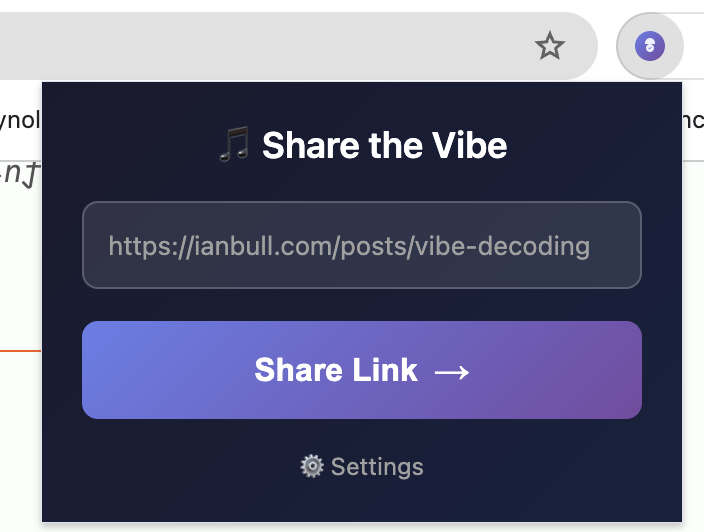
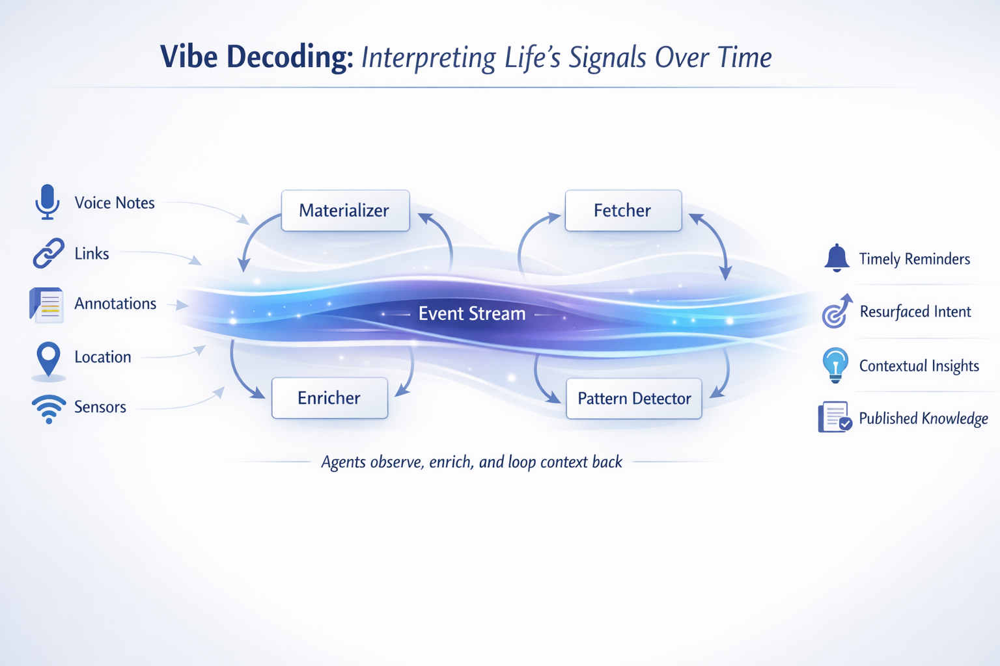

### Turning Life’s Ambient Signals into Timely Action

> **Vibe Decoding** is the practice of capturing low-friction signals from your life and letting systems interpret them over time, so the _right_ information surfaces at the _right_ moment.

---

## This Started With Saved Links

I wanted a better way to read the links I saved during the day.

Over the Christmas holidays, with a bit more breathing room, I built a small set of tools to help me save articles from my phone or browser so I could read them later. The tools did exactly what they were supposed to do.

The tools worked. The links were there when I came back to them. But when I finally sat down to read, I realized I had only solved half the problem. I could see what I saved, but I could not remember why I saved it.

The link survived.  The intent didn’t.

---

## The First Decode

My initial solution was straightforward: summarize the links.

If the system could extract a short summary and a few tags, I could quickly scan what I’d saved and decide what was worth reading in full. That helped, but it also revealed something more important.

The summary wasn’t the real win.  The _timing_ was.

Reading a summarized link later felt like picking up a conversation where I’d left off. The system wasn’t just storing content; it was restoring context.

That’s when it clicked.

This wasn’t really a link problem.  It was an interpretation problem.

---

## Links Are Just Signals

Saving a link is an inherently ambiguous act.

When I save something, I often don’t know yet whether it’s important, urgent, or even actionable. Most tools force you to decide all of that up front. Real life doesn’t.

Links, notes, highlights, voice memos, these are not commands. They’re **signals**. Weak ones, on their own, but meaningful over time.

Once I started treating saved links this way, the idea expanded naturally.

---

## From Links to Vibes

If links are signals, then so are half-formed notes, annotations, todos without deadlines, voice notes recorded while walking, or topics that keep showing up across days. Individually, they’re fuzzy. Collectively, they form intent.

That’s what I mean by a _vibe_.

Vibe Decoding is about capturing those signals without forcing premature structure, and letting systems observe, enrich, and reinterpret them as new context appears.

Capture first.  Interpret later.  Act when it makes sense.

---

## A Simple Example

Here’s a concrete scenario I’m working toward.

I record a quick voice note:  
“I need a new filter for the hot tub.”

Nothing happens immediately. The note becomes part of my life stream, alongside saved links, past notes, time of day, and location history. Agents enrich it: categorizing it, connecting it to related signals, and letting it sit.

Days later, when I walk into the store where I usually buy hot tub supplies, I get a message reminding me about the filter.

No calendar entry.  No brittle reminder.  Just the right information at the right moment.

That’s a vibe being decoded.

---

## How This Works (Conceptually)

Under the hood, this is an event-driven system.

The database is the source of truth. Every meaningful interaction such as saving a link, recording a note, or annotating an articles, written as an event. Those events are then streamed through Kafka, not as a queue to “get work done”, but as a durable, replayable log of my life’s signals.

Independent agents consume that stream. Some materialize state into tables I can query. Others enrich events with summaries, tags, or inferred meaning. Some simply watch patterns emerge over time. Their outputs are written back as new events, creating a continuous loop.

Nothing is one-and-done. Interpretation is iterative.

Kafka gives me replay, decoupling, and time as a first-class concept. Agents let meaning evolve. The database grounds everything in something concrete and inspectable.

The technology matters: but only because it supports this feedback loop.

---

## Why This Isn’t Just Another AI App

Vibe Decoding isn’t about generating more content or automating decisions blindly. It’s about reducing cognitive load by respecting how human intent actually works: incomplete, contextual, and time-dependent.

AI helps, but the real shift is architectural. Instead of systems that demand precise instructions, I’m building systems that are better listeners.

---

## Building in Public

I’m calling this project **Vibe Decoding**, and I’ve launched it at [vibedecoding.io](https://vibedecoding.io).

What began as a better way to read saved links has become an exploration of event-driven thinking, agent-based enrichment, and systems that resurface meaning when context is right.

In future posts, I’ll go deeper into the architecture: why Kafka, how the agents are structured, how events flow, and where this approach breaks down.

This isn’t a product announcement, **it’s an experiment**.

If Vibe Coding is about _producing output_,  
**Vibe Decoding is about understanding the signal first.**